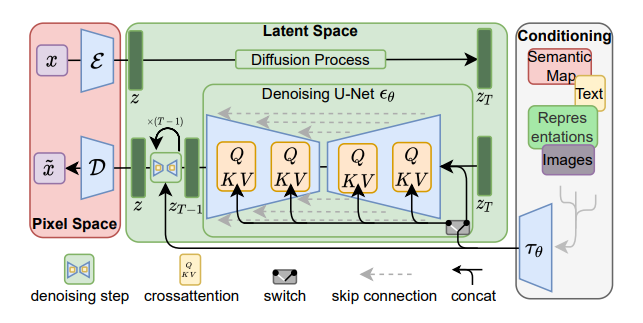

# LDM论文泛读
- 基于潜在扩散模型的高分辨率图像合成(High-Resolution Image Synthesis with Latent Diffusion Models)
- Diffusion model是一种likelihood-based的模型，相比GAN可以取得更好的生成效果。然而该模型是一种自回归模型，需要反复迭代计算，训练和推理都十分昂贵。
- LDM将扩散过程改在潜在空间中，大大减少计算复杂度，同时也能达到十分不错的生成效果。
## 4.1 模型方法
### 4.1.1 感知图像压缩
- 给定一个RGB空间中的图像 $x\in\mathbb{R}^{H{\times}W{\times}3}$，编码器 $\mathcal{E}$ 将 $x$ 映为隐变量 $z=\mathcal{E}(x)$ ($z\in\mathbb{R}^{h{\times}w{\times}c}$),解码器 $\mathcal{D}$ 从隐变量重构图像 $\tilde{x}=\mathcal{D}(z)=\mathcal{D}(\mathcal{E}(x))$。
- 编码器对图像进行下采样，来改变图像的编码维度 $f=H/h=W/w$。
- 为了降低方差，通过以下两种方法对数据进行正则化：
    - KL正则，对学习到的隐变量施加一个标准正态的KL惩罚。
    - VQ正则，在解码器内使用一个矢量量化层
- 由于后续的DM是针对学习到的潜在空间 $z=\mathcal{E}(x)$ 的二维结构进行设计的，因此我们可以使用相对温和的压缩率并实现非常好的重建。

### 4.1.2 潜在扩散模型(LDM)
#### 扩散模型(DM)
- 扩散模型是一种概率模型，学习长度为 $T$ 的马尔科夫链的逆向过程，通过逐步去噪来预测数据分布 $p(x)$。
- 去噪自编码器通过优化序列 $\epsilon_\theta(x_t,t)$，来预测 $x_t$ 去噪后的样本。其中 $x_t$ 是 $x$ 添加 $t$ 步噪声后的样本。
- 相应的目标函数可以简化为：
$$\mathcal{L}_{DM}=\mathbb{E}_{x,\epsilon\sim\mathcal{N}(0,1),t}\left[\|\epsilon-\epsilon_\theta(x_t,t)\|^2_2\right]$$

#### 潜在表示的生成式建模
- 由 $\mathcal{E}$ 和 $\mathcal{D}$ 组成的感知压缩模型，我们可以获得一个高效的、低维的潜在空间。
- 与自回归模型和基于注意力机制的transformer模型不同的是，我们可以利用模型提供的关于图像的归纳偏差，包括从2D卷积层构建底层UNet的能力，并进一步将目标集中于感知上最相关的bits上：
$$\mathcal{L}_{LDM}:=\mathbb{E}_{\mathcal{E}(x),\epsilon\sim\mathcal{N}(0,1),t}\left[\|\epsilon-\epsilon_\theta(z_t,t)\|^2_2\right]$$
- 模型的neural backbone $\epsilon_\theta(\circ,t)$ 为一个time-conditional的UNet。
- 因为前向过程是固定的，$z_t$ 能够从 $\mathcal{E}$ 中高效的获得，同时通过 $\mathcal{D}$ 可以将采样解码为图片。

### 4.1.3 调节机制
- 我们通过交叉注意力机制增强其底层UNet主干，将DM转换为更灵活的条件图像生成器，这对于学习基于注意力机制的模型是非常有效的。
- 为了从各种模型中预处理 $y$，我们引入了一个编码器 $\tau_\theta$,将 $y$ 映为一个中间表示 $\tau_\theta(y)\in\mathbb{R}^{M{\times}d_\tau}$，然后通过一个交叉注意力层映到UNet的中间层：
$${\rm{Attention}}(Q,K,V)={\rm{softmax}}(\frac{QK^T}{\sqrt{d}}){\cdot}V$$
其中 $Q=W_Q^{(i)}\cdot\phi_i(z_t),K=W_K^{(i)}\cdot\tau_\theta(y),V=W_V^{(i)}\cdot\tau_\theta(y)$。
- $\phi_i(z_t)\in\mathbb{R}^{N{\times}d^i_\epsilon}$ 表示实现 $\epsilon_\theta$ 的UNet中间层，$W_Q^{(i)},W_K^{(i)},W_V^{(i)}$是可学习的参数矩阵。

- 基于图像条件对，我们通过下式学习LDM：
$$\mathcal{L}_{LDM}:=\mathbb{E}_{\mathcal{E}(x),y,\epsilon\sim\mathcal{N}(0,1),t}\left[\|\epsilon-\epsilon_\theta(z_t,t,\tau_\theta(y))\|^2_2\right]$$
其中 $\tau_\theta$ 和 $\epsilon_\theta$ 通过上式一起优化。
- 这种调节机制是灵活的，因为 $\tau_\theta$ 可以由特定领域的专家进行调参。
