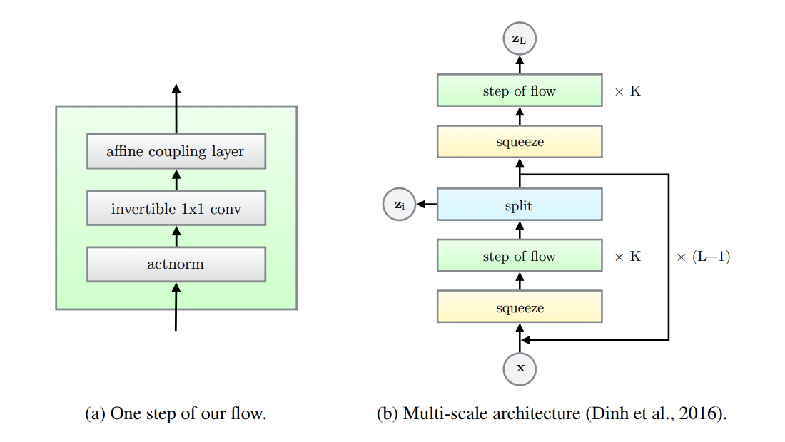
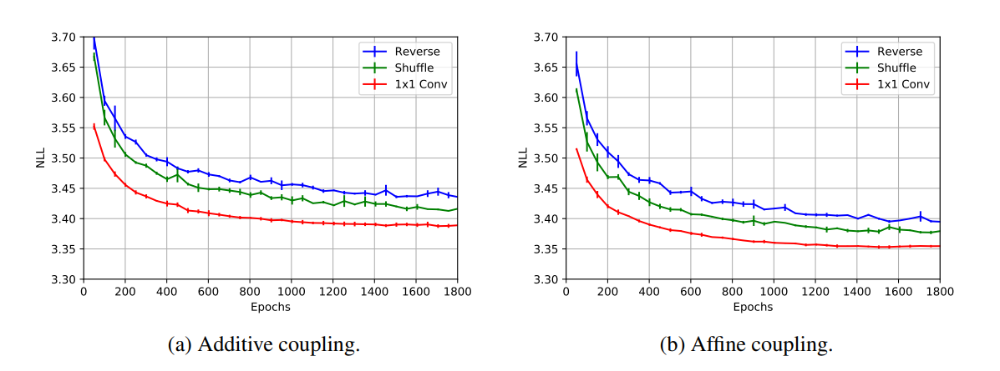
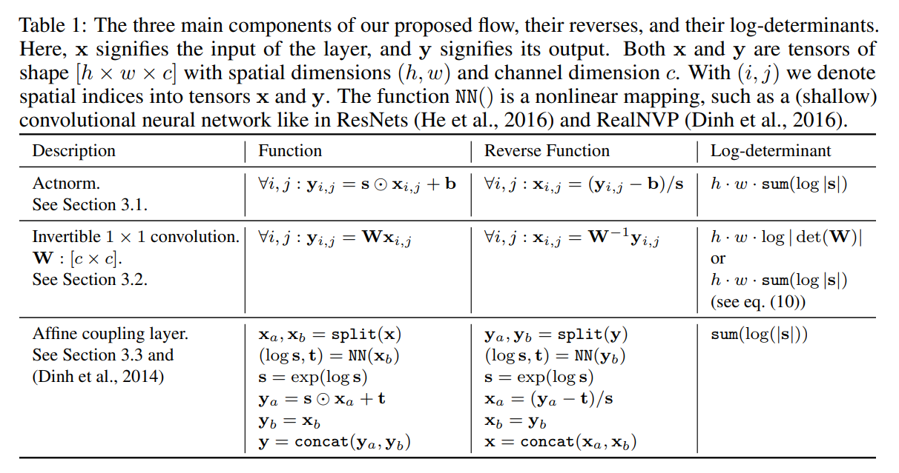

# Glow论文
## 7.1 背景：基于流的生成模型
- 令 $x$ 是一个具有未知真实分布的 $x{\sim}p^*(x)$ 高维随机向量。
- 我们收集一个数据集 $\mathcal{D}$，选择一个模型 $p_\theta(x)$，其中 $\theta$ 是参数。
- 在离散数据 $x$ 的情况下，对数似然目标函数等价于最小化以下函数：
$$\mathcal{L}(\mathcal{D})=\frac{1}{N}\sum\limits_{i=1}^N-{\rm{log}}p_\theta(x^{(i)})$$
- 在连续数据 $x$ 的情况下，我们最小化下面的函数：
$$\mathcal{L}(\mathcal{D})\simeq\frac{1}{N}\sum\limits_{i=1}^N-{\rm{log}}p_\theta(\tilde{x}^{(i)})+c$$
其中 $\tilde{x}^{(i)}=x^{(i)}+u$，$u\sim\mathcal{U}(0,a)$；另外 $c=-M\cdot{\rm{log}}a$，$a$ 由数据的离散程度决定，$M$ 为 $x$ 的维数。
- 在多数基于流的生成模型中，生成过程由下式定义：
$$z{\sim}p_\theta(z);{\quad}x=g_\theta(z)$$
其中 $z$ 是隐变量，$p_\theta(z)$ 是一个显性密度，如一个多元高斯分布 $p_\theta(z)=\mathcal{N}(z;\mathbf{0},\mathbf{I})$。
- 函数 $g_\theta$ 是可逆的，对于给定的数据点 $x$，隐变量可以由下式推断：
$$z=f_\theta(x)=g_\theta^{-1}(x)$$
- 我们关注变换 $f$ 的一系列分解 $f=f_1{\circ}f_2{\circ}\cdots{\circ}f_K$，使 $x$ 和 $z$ 有如下关系：
$$x\stackrel{f_1}{\longleftrightarrow}h_1\stackrel{f_2}{\longleftrightarrow}h_2\cdots\stackrel{f_K}{\longleftrightarrow}z$$
这样的可逆变换序列称为 normalizing flow。
- 在上述情况下，模型的概率密度函数可以由下式给出：
$$\begin{align*}
{\rm{log}}p_\theta(x)&={\rm{log}}p_\theta(z)+{\rm{log}}\left|{\rm{det}}(dz/dx)\right|\\
&={\rm{log}}p_\theta(z)+\sum\limits_{i=1}^K{\rm{log}}\left|{\rm{det}}(dh_i/dh_{i-1})\right|
\end{align*}$$
其中 $h_0:=x$，$h_K:=z$
- 选取合适的变换，我们可以令变换的雅克比矩阵为三角矩阵，这种情况下我们有：
$${\rm{log}}\left|{\rm{det}}(dh_i/dh_{i-1})\right|={\rm{sum}}\left({\rm{log}}\left|{\rm{diag}}(dh_i/dh_{i-1})\right|\right)$$

## 7.2 Glow
- Glow 由一系列Flow的步骤组成，每一步都由 Actnorm 和一个可逆的1 × 1卷积组成，然后接入耦合层。
- 该流程与多尺度架构相结合；该体系结构具有深度为 $K$ 的Flow，层数为 $L$ 的Level。

### 7.2.1 Actnorm：标量乘和偏置层
- 我们提出了一个用于归一化的Actnorm激活层，它用缩放和偏置参数来进行仿射变换，类似于批归一化。
- 在给定初始小批量数据的情况下，为了使每个通道的Actnorm激活具有零均值和单位方差，事先对这些参数进行初始化。初始化的方法就是对第一批数据来计算其均值和方差，然后计算相应的缩放和偏置，来使其均值为0方差为1。
- 这是数据依赖初始化的一种形式。初始化后，缩放和偏置被视为独立于数据的正则可训练参数。

### 7.2.2 可逆 $1{\times}1$ 卷积
- 在NICE和Real NVP中，引入了一个交替耦合层，通过改变通道的排序来消除始终不变的变量。
- 在Glow中，用一个可逆 $1{\times}1$ 卷积来代替这个操作。
- 对于一个 $h{\times}w{\times}c$ 的向量 ${\rm{h}}$，和一个 $c{\times}c$ 的权重矩阵 $W$，可逆 $1{\times}1$ 卷积的对数行列式可以通过下式直接计算：
$${\rm{log}}\left|{\rm{det}}\left(\frac{d{\rm{conv2D}({\rm{h}};{\rm{W}})}}{d{\rm{h}}}\right)\right|=h{\cdot}w{\cdot}{\rm{log}}|{\rm{det}}({\rm{W}})|$$
- ${\rm{det}}({\rm{W}})$ 的计算复杂度为 $\mathcal{O}(c^3)$，${\rm{conv2D}({\rm{h}};{\rm{W}})}$ 的计算复杂度为 $\mathcal{O}(h{\cdot}w{\cdot}c^2)$
- 权重矩阵 $W$ 初始化为一个随机的旋转矩阵，其对数行列式为0；经过一个SGD后，这些值开始偏离0。

#### LU分解
- 对 ${\rm{W}}$ 进行 LU分解可以将 ${\rm{det}}({\rm{W}})$ 的计算复杂度从 $\mathcal{O}(c^3)$ 降低到 $\mathcal{O}(c)$：
$${\rm{W}}={\rm{PL}}({\rm{U}}+{\rm{diag}}(s))$$
其中 ${\rm{P}}$ 是一个置换矩阵，${\rm{L}}$ 是一个对角线元素为1的下三角矩阵，${\rm{U}}$ 是一个对角线元素为0的上三角矩阵，$s$ 是一个向量。
- 对数行列式可以如下计算：
$${\rm{log}}|{\rm{det}}({\rm{W}})|={\rm{sum}}({\rm{log}}|s|)$$
- 在以上LU分解的条件下，我们初始化的时候，首先初始化随机旋转矩阵 ${\rm{W}}$，然后再计算其分解来分别初始化 ${\rm{P}}$、${\rm{L}}$、${\rm{U}}$ 和 $s$。

### 7.2.3 仿射耦合层
- 在NICE和Real NVP中介绍的仿射耦合层是一个强大的工具，能够使得前向函数、逆变换和对数行列式都能高效计算，
- 一个加性耦合层是仿射耦合层的特殊情况，其 $s=1$，对数行列式为0。

#### 0初始化
- 我们0初始化每个 NN.()网络(非线性映射)的最后一个卷积，使每个仿射耦合层最初执行一个恒等函数；我们发现这有助于训练非常深的网络。

#### Split and concatenation
- `split()` 函数将输入张量沿通道维度拆分为两半，而 `concat()` 操作则将多个张量串联成单个张量。
- 在Real NVP中，引入了另一种类型的分割：沿空间维度使用棋盘掩码或通道方向掩码。
- 本文中我们只沿着通道维度进行拆分，简化了整体架构。

#### 置换
- 在NICE和Real NVP中通过交替耦合层来确保每个维度之间都能够互相影响，
- 一种替代方案是执行(固定)随机置换。我们的可逆 $1{\times}1$ 卷积是这种置换的推广。在实验中我们比较了这三种方法的性能，见下图。

## 7.3 总结
- Glow操作的三个步骤：Actnorm、可逆 $1{\times}1$ 卷积、仿射耦合层，具体设计总结为下表：

