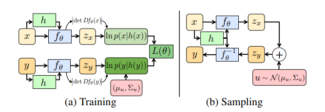

# DeFlow论文泛读
- 从非配对数据中学习随机图像退化 
(Learning Complex Image Degradations from Unpaired Data with Conditional Flows)

## 8.1 DeFlow
- 本文的目标是学习一个从源域 $\mathcal{X}=\{x_i\}^n_{i=1},x_i{\sim}p_x$ 到不相关的目标域 $\mathcal{Y}=\{y_i\}^m_{i=1},y_i{\sim}p_y$ 之间的映射。
- $x{\sim}p_x$ 表示非退化的观测，而 $y{\sim}p_y$ 是受未知退化过程 $x{\mapsto}y$ 影响的观测，映射 $x{\mapsto}y$ 构成未知的条件分布 $p(y|x)$。
- 我们在没有任何成对样本 $(x_i,y_i)$ 的条件下去学习条件分布 $p(y|x;\theta)$。

### 8.1.1 学习边缘联合分布
- 假设变量 $x$ 服从高斯分布， $x{\sim}p_x=\mathcal{N}(\mu_x,\sigma_x^2)$，均值 $\mu_x$ 和方差 $\sigma_x^2$ 是未知的。我们还假设 $y=x+u$，其中 $u{\sim}p_u=\mathcal{N}(\mu_u,\sigma_u^2)$ 是与 $x$ 无关的高斯随机变量。
- 高斯随机变量的和还是高斯的，所以有：$y{\sim}p_y=\mathcal{N}(\mu_x+\mu_u,\sigma_x^2+\sigma_u^2)$。
- 根据 $y$ 与 $x$ 的关系，很容易得到：$p(y|x)=\mathcal{N}(y;x+\mu_u,\sigma_u^2)$
- 在上述条件下，我们可以通过最小化负对数似然来估计所有的未知参数：
$$\mathcal{L}(\theta)=-\frac{1}{n}\sum\limits_{i=1}^n{\rm{ln}}p_x(x_i)-\frac{1}{m}\sum\limits_{j=1}^m{\rm{ln}}p_y(y_j) \tag{1}$$
- 这说明在这样的简单情况是可以推断 $p(x,y)$ 的，下面我们将推广到更一般的情况。

### 8.1.2 条件流的非配对学习
- 模型假设随机变量 $x{\sim}p_x$ 和 $y{\sim}p_y$ 通过一个共享的隐空间相关联。令 $z_x$ 和 $z_y$ 表示对应的隐变量。
- 特别的，我们令 $z_x{\sim}\mathcal{N}(\mathbf{0},\mathbf{I})$ 是一个标准正态分布。
- 隐变量 $z_y$ 由 $z_x$ 和另一个高斯随机变量 $u{\sim}p_u=\mathcal{N}(\mu_u,\Sigma_u)$ 共同影响：
$$z_y=z_x+u$$
- $u$ 与 $x$ 相对独立，因此也与 $z_x$ 相对独立。均值 $\mu_u$ 和方差 $\Sigma_u$ 是未知的。
- 上述潜在空间模型是8.1.1节中的例子的多元推广。
- 下一步，我们使用一个强大的深度网络，它能够将数据的复杂的模式和相关性分离到高斯潜在空间。我们用一个可逆的神经网络 $f_\theta$ 来建模观测值和潜在空间之间的关系。
- 模型总结为以下几式：
$$x=f_\theta^{-1}(z_x),{\quad}y=f_\theta^{-1}(z_y)=f_\theta^{-1}(z_x+u) \tag{2a}$$
$$z_x{\sim}\mathcal{N}(\mathbf{0},\mathbf{I}),{\quad}u{\sim}p_u=\mathcal{N}(\mu_u,\Sigma_u),{\quad}z_x{\bot}u \tag{2b}$$
其中 $\bot$ 表示随机独立。

- 我们可以直接从联合概率分布中进行采样，也可以从条件概率分布中采样 $y_{|x}{\sim}p(y|x)$。
- $f_\theta$ 是可逆的，所以 $p(y|x)=p(y|f_\theta^{-1}(z_x))=p(y|z_x)$。
- 由上述几式，我们有：
$$y_{|x}=f_\theta^{-1}(f_\theta(x)+u){\sim}p(y|x),{\quad}u{\sim}\mathcal{N}(\mu_u,\Sigma_u) \tag{3}$$
- 为了运用8.1.1节中的负对数似然来训练，我们利用概率密度 $p_x(x)$ 和 $p_y(y)$ 的可微表达式：
$$p_x(x)=|{\rm{det}}Df_\theta(x)|\cdot\mathcal{N}(f_\theta(x);\mathbf{0},\mathbf{I}) \tag{4a}$$
$$p_y(y)=|{\rm{det}}Df_\theta(y)|\cdot\mathcal{N}(f_\theta(y);\mu_u,\mathbf{I}+\Sigma_u) \tag{4b}$$
其中，两式的第一项是flow网络的雅克比矩阵的行列式，后一项分别来自 $z_x$ 和 $z_y$ 的高斯潜在空间分布。
- 由于前面对于 $p(y|x)$ 的推断，可以得到 $f_\theta(y_{|x})=f_\theta(x)+u$，再进行变量替换，可以得到：
$$p(y|x)=|{\rm{det}}Df_\theta(y)|\cdot\mathcal{N}(f_\theta(y);f_\theta(x)+\mu_u,\Sigma_u) \tag{5}$$
- 未配对样本集通过 $(4)$ 式进行训练，配对样本集通过 $(5)$ 式进行训练。

### 8.1.3 域不变条件
在上一节中，我们需要学习边缘分布 $p_x$ 和 $p_y$。对于图像数据集来说，这是一个困难的任务，需要大的模型和大的数据集。因此，我们对公式做进一步推广，有效地避免了学习边缘分布的需要，而准确地学习条件分布 $p(y|x)$。
- 我们的方法基于条件化流模型的辅助信息 $h(x)$ 或 $h(y)$。$h$ 表示从观测集到条件变量的映射。我们通过显式地将 $h(x)$ 输入到流网络 $f_\theta$ 的各个层来创建条件流。
- 因此，flow由函数 $z_x=f_\theta(x;h(x))$ 定义，其只在第一项可逆。
- 我们不需要学习 $(4)$ 式，而去学习 $p(x|h(x))$，因为 $h$ 是已知的函数，所以学习 $p(x|h(x))$ 和 $p(y|h(y))$ 不需要配对数据。
- 为了保证条件分布 $p(y|x)$ 的非配对学习，$h$ 只提取样本的域不变信息：
$$h(x)=h(y),{\quad}(x,y){\sim}p(x,y) \tag{6}$$
- $h$ 的存在性很容易证明(通过令 $h(x)=0,{\forall}x$)。我们希望找到一个函数 $h$，它在不违反域不变性条件 $(6)$ 的前提下，保留输入的大部分信息。因为联合分布 $p(x,y)$ 是未知的，很难直接确保 $(6)$ 式成立。
- 然而，在实际应用中，我们只需要 $h$ 满足域不变性，并且不能被流网络 $f_\theta$ 利用的程度。因此，条件函数 $h$ 可以通过逐步减少其保留的信息来进行设定。
- 模型训练和推断如下图：

- 通过最小化非负对数似然来训练：
$$\mathcal{L}(\theta)=-\frac{1}{n}\sum\limits_{i=1}^n{\rm{ln}}p(x_i|h(x_i))-\frac{1}{m}\sum\limits_{j=1}^m{\rm{ln}}p(y_j|h(y_j)) \tag{7}$$
- 进行推断的时候，我们通过下式采样：
$$y=f_\theta^{-1}\left(f_\theta(x;h(x))+u;h(x)\right),{\quad}u{\sim}\mathcal{N}(\mu_u,\Sigma_u) \tag{8}$$

## 8.2 使用Deflow学习图像退化
- 这一部分中我们讨论基于流的非成对学习在生成复杂图像退化问题中的应用。我们详细介绍了DeFlow所使用的模型架构，并解释了我们在此环境下获取域不变条件的方法。

### 8.2.1 模型框架
- flow模型一般由 $N$ 个可逆层组成。令 $f_\theta^n$ 表示第 $n$ 层，那么模型可以递归地表示为：
$$a^n=f_\theta^n(a^{n-1};h(x)) \tag{9}$$
其中 $x=a^0,z=a^N$，其余的 $a^n$ 表示中间的特征映射。
- 根据 $(4)$ 式以及链式法则，我们有：
$$p(x|h(x))=p(z)\cdot\prod_{n=1}^N|{\rm{det}}Df_\theta^n(a^n;h(x))| \tag{10}$$
- 在 $(2)$ 中我们对 $p_u$ 进行均值为 $\mu_u$ 和权重矩阵为 $M$ 的参数化：
$$u=M\tilde{u}+\mu_u$$
其中 $\tilde{u}{\sim}\mathcal{N}(\mathbf{0},\mathbf{I})$ 是一个标准的高斯分布。因此，协方差由 $\Sigma_u=MM^T$ 给出。
- 为了保证空间不变性，我们在隐空间的每个空间位置使用相同的参数 $\mu_u$ 和 $M$。我们将 $\mu_u$ 和 $M$ 初始化为0，确保 $p(x)$ 和 $p(y)$ 最初服从相同的分布。
- 接下来，我们对架构中的每一层进行简要描述：
#### 条件仿射耦合层
- 相比仿射耦合层扩展了条件设置。输入的特征映射 $a$ 沿着通道维度分为两部分 $(a_1,a_2)$。在子集 $a_1$ 和条件 $h(x)$ 下，通过一个神经网络计算缩放和偏置。然后应用于另一个子集 $a_2$ 上，提供了一个可逆的变换。

#### 仿射嵌入
- 在条件 $h(x)$ 下为输入的特征映射 $a$ 计算缩放和偏置。计算缩放和偏置的函数不需要是可逆的。

#### 可逆 $1{\times}1$ 卷积
- 在每个位置乘上一个可逆矩阵，可以通过LU分解来提高性能。

#### Actnorm
- 学习逐通道缩放和平移，对中间特征映射进行归一化操作。

#### Flow步骤
- 在整个网络中经常使用，每个Flow操作包含上述4个步骤：
    - 首先应用一个 Actnorm；
    - 然后连接一个 $1{\times}1$ 卷积；
    - 接入条件仿射耦合层；
    - 最后连接仿射嵌入
- 最后两层与SRFlow中的顺序和形式都相反。

#### 特征提取网络
- 我们使用SRFlow的低分辨率编码器对域不变条件信息 $h$ 进行编码。它由一个改进的残差稠密块(RRDB)模型组成。

### 8.2.2 域不变映射 $h$
- 域不变条件h的目标是向Flow网络提供图像信息，同时隐藏输入图像的域。在我们的应用中，$(6)$ 式给出的域不变性意味着映射 $h$ 需要去除能够揭示输入是干净的图像 $x$ 还是退化的图像 $y$ 的信息。另一方面，我们希望保留关于底层图像内容的信息以简化学习。
- 我们通过利用对大多数随机退化有效的一些先验假设来实现这一点。它们主要影响图像中的高频部分，而保持低频部分。
- 我们通过对图像进行足够大的下采样来构造 $h$，以去除退化的可见影响。我们发现在输出图像中添加少量的噪声以隐藏原始退化的残留痕迹是有益的。
- 因此，域不变映射由下式构建：
$$h(x)=d_\downarrow(x)+n,n{\sim}\mathcal{N}(0,\sigma^2)$$
其中 $d_\downarrow(x)$ 表示bicubic下采样。
- 注意，该操作仅用于提取域不变表示，与DeFlow学习到的退化 $x{\mapsto}y$ 无关。$h$ 的目的是去除原始退化，同时保留图像内容。