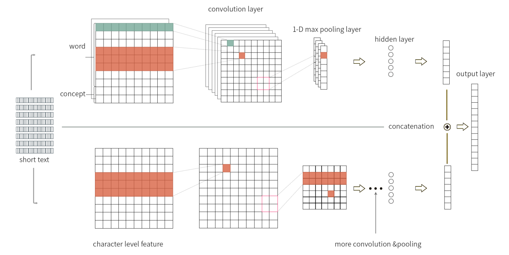

# CNN系列论文泛读
## 5.1 2014-TextCNN
- 用于句子分类的卷积神经网络 
(Convolutional Neural Networks for Sentence Classification)
#### 模型结构
- 模型是CNN结构的一个变体，下图为两通道的模型示例：

- 令 $x_i\in\mathbb{R}^k$ 对应于句子中第 $i$ 个单词的 $k$ 维词向量。一个长度为 $n$ 的句子表示为：
$$x_{1:n}=x_1{\oplus}x_2{\oplus}\cdots{\oplus}x_n$$
其中 ${\oplus}$ 是concat操作。
- 更一般的，我们令 $x_{i:i+j}$ 表示 $x_i,x_{i+1},\cdots,x_{i+j}$ 的concatation。
- 一个卷积算子包括一个过滤矩阵 $W\in\mathbb{R}^{hk}$ 和偏置项 $b\in\mathbb{R}$，使得特征 $c_i$ 由下式生成：
$$c_i=f(W{\cdot}x_{i:i+h-1}+b)$$
$f$ 是一个非线性激活函数。
- 将上述算子作用到词组成的滚动窗口 $\{x_{1:h},x_{2:h+1},\cdots,x_{n-h+1:n}\}$，得到 $c\in\mathbb{R}^{n-h+1}$ 的特征映射：
$$c=[c_1,c_2,\cdots,c_{n-h+1}]$$
- 然后在特征图上使用最大池化，取 $\^{c}={\rm{max}}\{c\}$ 作为最终的特征。
- 模型通过多种不同大小的视窗来提取多个特征，然后传给softmax分类器进行概率分布的预测。

#### 正则化
- 我们使用Dropout操作以及 $L_2$正则来进行模型训练。

## 5.2 2014-DCNN
- 用于建模句子的卷积神经网络 
(A Convolutional Neural Network for Modelling Sentences)
### 动态K-最大池化的卷积神经网络
#### 宽卷积
- 给定句子，我们通过排列句子中每个词的词嵌入 $\mathbf{w}_i\in\mathbb{R}^d$ 来构造句子矩阵 $\mathbf{s}\in\mathbb{R}^{d{\times}s}$：
$$\mathbf{s}=[\mathbf{w}_1\ \mathbf{w}_2{\cdots}\mathbf{w}_s]$$
- 矩阵 $\mathbf{m}\in\mathbb{R}^{d{\times}m}$ 的每一行 $\mathbf{m}_j$ 与矩阵 $\mathbf{s}$ 的 每一行 $\mathbf{s}_j$ 进行一维宽卷积操作，得到 $1{\times}(s+m-1)$ 维的向量 $\mathbf{c}_j$：
$$\mathbf{c}_j=\mathbf{m}_j*\mathbf{s}_j$$
再将这些向量按行堆叠为 $d{\times}(s+m-1)$ 维的矩阵 $\mathbf{c}$。
- 其中的1维宽卷积操作如下图：

- 1维窄卷积如下图：

#### k-最大池化
- 对于序列 $\mathbf{p}\in\mathbb{R}^p,p{\geq}k$，$k$ 最大池化从 $\mathbf{p}$ 中选择 $k$ 个最大的值，并保持 $\mathbb{p}$ 中的顺序关系，得到 $p_{\rm{max}}^k$。

#### 动态k-最大池化
- 动态k-最大池化操作是对不同的卷积层使用不同的k-最大池化，对于第 $l$ 层卷积使用 $k_l$ 最大池化：
$$k_l={\rm{max}}(k_{top},\lceil\frac{L-l}{L}s\rceil)$$
其中 $L$ 是网络中总的卷积层数，$k_{top}$ 是事先定义好的超参数，$s$ 是输入序列长度。

#### 非线性特征函数
- 将矩阵 $\mathbf{m}$ 重写为以下形式：
$$\mathbf{M}=[{\rm{diag}(\mathbf{m}_{:,1})},\cdots,{\rm{diag}(\mathbf{m}_{:,m})}]$$
得到一个 $m{\times}m$ 维的对角矩阵，对角线上每个元素是一个 $d{\times}d$ 维的对角矩阵。
- 通过下式得到模型的一阶特征输出的列向量：
$$a=g\left(\mathbf{M}[\mathbf{w}_j,\cdots,\mathbf{w}_{j+m-1}]^{\top}+\mathbf{b}\right)$$
其中非线性函数 $g$ 逐项作用于矩阵每个元素，$\mathbf{b}$ 是偏置矩阵。
- 将列向量合并得到一阶特征。
- 通过将 $a_j$ 替换 $\mathbf{w}_j$，应用另一个矩阵 $\mathbf{M}^\prime$ 来得到模型的二阶特征。

#### 多个特征映射
- 将上述的宽卷积、动态k-最大池化和非线性函数应用到输入序列得到一阶特征图不断重复这些操作能够得到更高阶的特征。
- 用 $\mathbf{F}^i$ 表示第 $i$ 阶特征图，同一层我们可以并行计算以得到多重特征图 $\mathbf{F}^i_1,\cdots,\mathbf{F}^i_n$，每个 $\mathbf{F}^i_j$ 都是由上一层所有的特征图跟对应的 $\mathbf{m}^i_{j,k}$ 进行卷积得到：
$$\mathbf{F}^i_j=\sum\limits_{k=1}^n\mathbf{m}^i_{j,k}*\mathbf{F}^{i-1}_k$$

#### 折叠
- 位于卷积操作之后，动态k-最大池化之前，将特征图矩阵中每两行元素进行相加，将维度从 $d$ 降到 $d/2$。

## 5.3 2015-CharCNN
- 用于文本分类的特征级卷积网络 
(Character-level Convolutional Networks for Text Classification)
- 整个模型是模块化的，通过反向传播来进行优化。

#### 关键模块
- 假定我们有一个离散的函数 $g(x)\in[1,l]\rightarrow\mathbb{R}$ 和一个离散的核函数 $f(x)\in[1,k]\rightarrow\mathbb{R}$，在 $f(x)$ 和 $g(x)$ 之间步幅为 $d$ 的卷积 $h(y)\in[1,\lfloor(l-k+1)/d\rfloor]\rightarrow\mathbb{R}$ 定义如下：
$$h(y)=\sum\limits_{x=1}^kf(x){\cdot}g(y{\cdot}d-x+c)$$
其中 $c=k-d+1$ 是一个常数。
- 与图像领域中的传统卷积一样，模型通过一系列核函数 $f_{ij}(x)$ 构成，其中 $i=1,2,\cdots,m;j=1,2,\cdots,n$，我们称 $g_i$(或 $h_j$) 为输入(或输出)特征。
- 训练深度模型的关键模块是时序最大池化。给定离散输入函数 $g(x)\in[1,l]\rightarrow\mathbb{R}$，$g(x)$ 上的最大池化函数 $h(y)\in[1,\lfloor(l-k+1)/d\rfloor]\rightarrow\mathbb{R}$ 定义如下：
$$h(y)=\mathop{\rm{max}}\limits_{x=1}^kg(y{\cdot}d-x+c)$$
其中 $c=k-d+1$ 是一个常数。这个池化模块使我们能够训练6层以上的卷积网络。
- 非线性激活函数使用ReLU，使用小批量(128)SGD动量0.9进行优化，步长0.01每3个epoches减半10次。每个epoch使用固定数量的均匀采样出的随机样本。

#### 字符量化
- 我们使用one-hot编码来编码以下70种字符，其他字符编码为全0向量：

#### 模型设计
- 我们设计了2个卷积神经网络。它们都是9层，有6个卷积层和3个全连接层。如下图所示：

- 根据字符量化方法，输入的特征数等于70，输入特征长度为1014。1014个字符似乎已经可以捕捉到大部分感兴趣的文本。我们还在3个全连接层之间插入2个0.5概率的dropout模块进行正则化。
- 下图为卷积层的配置：

- 下图为全连接层的配置：

#### 同义词数据增强
- 使用英文叙词表通过同义词替换进行数据增强

## 5.4 2016-SeqTextRCNN
- 循环和卷积神经网络的序列短文本分类 
(Sequential Short-Text Classification with Recurrent and Convolutional Neural Networks)

### 5.4.1 模型结构
模型包括两部分。
- 第一部分使用RNN或CNN架构为每个短文本生成一个向量表示：

- 第二部分根据当前短文本以及前面几个短文本的向量表示对当前短文本进行分类：

### 5.4.2 短文本表示
- 给定长度为 $l$ 的短文本，表示为一个 $m$ 维词向量序列 $\mathbf{x}_{1:l}$，通过RNN或CNN模型生成n维短文本表示 $\mathbf{s}$

#### RNN短文本表示
- 我们使用RNN变体LSTM结构。对于短文本中第 $t$ 个单词，输入 $\mathbf{x}_t,\mathbf{h}_{t-1},\mathbf{c}_{t-1}$ 到LSTM网络，通过下式输出 $\mathbf{h}_t,\mathbf{c}_t$：
$$\begin{align*}
\mathbf{i}_t&=\sigma(W_i\mathbf{x}_t+U_i\mathbf{h}_{t-1}+\mathbf{b}_i)\\
\mathbf{f}_t&=\sigma(W_f\mathbf{x}_t+U_f\mathbf{h}_{t-1}+\mathbf{b}_f)\\
\tilde{\mathbf{c}}_t&={\rm{tanh}}(W_c\mathbf{x}_t+U_c\mathbf{h}_{t-1}+\mathbf{b}_c)\\
\mathbf{c}_t&=\mathbf{f}_t\odot\mathbf{c}_{t-1}+\mathbf{i}_t\odot\tilde{\mathbf{c}}_t\\
\mathbf{o}_t&=\sigma(W_o\mathbf{x}_t+U_o\mathbf{h}_{t-1}+\mathbf{b}_o)\\
\mathbf{h}_t&=\mathbf{o}_t\odot{\rm{tanh}}(\mathbf{c}_t)
\end{align*}$$
其中 $W_j\in\mathbb{R}^{n{\times}m},U_j\in\mathbb{R}^{n{\times}n}$ 是权重矩阵，$\mathbf{b}_j\in\mathbb{R}^n$ 是偏置向量($j\in\{i,f,c,o\}$)。$\sigma(\cdot)$ 和 ${\rm{tanh}}(\cdot)$ 是逐元素sigmoid和双曲正切函数，$\odot$ 是逐元素相乘，$\mathbf{h}_0=\mathbf{c}_0=\mathbf{0}$。
- 池化层使用last、mean或max池化聚合所有RNN层的输出，last池化使用最后一个向量作为输出即 $\mathbf{s}=\mathbf{h}_l$；mean池化对所有向量均值即 $\mathbf{s}=\frac{1}{l}\sum_{t=1}^l\mathbf{h}_t$；max池化取 $\mathbf{h}_{1:l}$ 的最大值。

#### CNN短文本表示
- 使用一个高为 $h$ 的过滤器 $W_f\in\mathbb{R}^{h{\times}m}$，从第 $t$ 个词开始的 $h$ 个连续词向量通过下式进行卷积操作得到输出 $c_t$：
$$c_t=\mathbf{{\rm{ReLU}}}(W_f\mathbf{\cdot}X_{t:t+h-1}+b_f)$$
其中矩阵 $X_{t:t+h-1}\in\mathbb{R}^{h{\times}m}$ 的第 $i$ 行为 $\mathbf{x}_i\in\mathbb{R}^m$，$b_f\in\mathbb{R}$ 是偏置项，$\cdot$ 是点积操作，$\mathbf{{\rm{ReLU}}}(\cdot)$ 是逐元素的整流线性单元。
- 我们使用n个不同的过滤器进行卷积操作，并将得到的特征表示为 $\mathbf{c}_t\in\mathbb{R}^n$。对短文本中连续 $h$ 个单词的滑动窗口重复卷积操作，得到 $\mathbf{c}_{1:l-h+1}$，通过最大池化层对 $\mathbf{c}_{1:l-h+1}$ 逐个最大化得到短文本表示 $\mathbf{s}\in\mathbb{R}^n$。

### 5.4.3 序列短文本分类
- 令 $\mathbf{s}_i$ 是由RNN或CNN层得到的序列中第 $i$ 个短文本的 $n$ 维短文本表示。
- 将序列 $\mathbf{s}_{i-d_1-d_2:i}$ 放入两层前馈神经网络ANN中预测第 $i$ 个短文本的类别，超参数 $d_1,d_2$ 是第一第二层的模型尺寸。
- 输入 $\mathbf{s}_{i-d_1-d_2:i}$，第一层通过下式输出 $\mathbf{y}_{i-d_2:i}$：
$$\mathbf{y}_j={\rm{tanh}}\left(\sum\limits_{d=0}^{d_1}W_{-d}\mathbf{s}_{j-d}+\mathbf{b}_1\right),{\forall}j\in[i-d_2,i]$$
其中 $W_{-d}\in\mathbb{R}^{k{\times}n}$ 是权重矩阵，$\mathbf{b}_1\in\mathbb{R}^k$ 是偏置向量，$\mathbf{y}_j\in\mathbb{R}^k$ 是类别表示，$k$ 是分类任务的类别。
- 将类别表示 $\mathbf{y}_{i-d_2:i}$ 输入第二层，通过下式输出 $\mathbf{z}_i\in\mathbb{R}^k$：
$$\mathbf{z}_i={\rm{softmax}}\left(\sum\limits_{j=0}^{d_2}U_{-j}\mathbf{y}_{i-j}+\mathbf{b}_2\right)$$
其中 $U_{-j}\in\mathbb{R}^{k{\times}k}$ 是权重矩阵，$\mathbf{b}_2\in\mathbb{R}^k$ 是偏置向量。
- 最后输出一个概率分布，$\mathbf{z}_i$ 表示第 $i$ 个短文本的概率，$\mathbf{z}_i$ 的第 $j$ 项表示第 $i$ 个短文本属于第 $j$ 类的概率。

### 5.4.4 训练
- 训练过程使用Adadelta算法进行优化，在池化层后面应用Dropout。验证集上使用早停技术。

## 5.5 2017-XML-CNN
- 极多标签文本分类的深度学习 
(Deep Learning for Extreme Multi-label Text Classification)
- 极多标签文本分类任务，指的是一条数据可能有多个标签，每个标签可能有多个类别的文本分类问题。

### 5.5.1 极多标签分类问题
#### 目标嵌入法
- 假定训练集数据为 $n$ 对特征向量和标签：
$$\{(x_i,y_i)\}^n_{i=1},{\quad}x_i\in\mathbb{R}^D,y_i\in\{0,1\}^L$$
其中 $D$ 是特征数，$L$ 是标签数。
- 在极多标签分类(XMTC)问题中，$L$ 可以是极大的，从有限的训练数据中难以找到 $M$ 个任意的 $x$ 到相关的 $y$ 的联系。
- 如果我们可以通过线性或非线性投影将标签向量从 $L$ 维有效地压缩到 $\^{L}$ 维，那么我们就可以使用标准的分类器(例如SVM)。
- 为了对新文档进行分类，还需要将 $y$ 的预测投影回原始高维空间，目标标签向量向其低维嵌入的投影称为压缩过程，向高维空间的投影称为解压缩过程。

#### 基于树的集成方法
- 与经典的决策树学习类似，XMTC在每个非叶子节点上诱导一个递归来划分实例空间或子空间，在每个叶子节点上有一个基分类器，只关注该节点中的少量标签。
- 与传统的决策树不同的是，XMTC学习一个超平面来分割当前实例空间，而不是选择单个特征进行划分。

### 5.5.2 XML-CNN
#### 模型结构
- 模型结构如下图：

- 令 $e_i\in\mathbb{R}^k$ 是第 $i\in(1,\cdots,m)$ 个词的 $k$ 维词嵌入，整个文章由词向量的concatenation表示：
$$e_{1:m}=[e_1,\cdots,e_m]\in\mathbb{R}^{km}$$
其中第 $i$ 到 $j$ 个词序列表示为 $e_{i,j}=[e_i,\cdots,e_j]\in\mathbb{R}^{k(j-i+1)}$
- 通过在长为 $h$ 的词序列 $e_{i:i+h-1}$ 上做卷积运算，得到一个新的特征：
$$c_i=g_c(v^{\top}e_{i:j+h-1})$$
其中 $g_c$ 是非线性激活函数。我们省略了偏置项。
- 所有的 $c_i$ 一起构成特征映射：
$$c=[c_1,\cdots,c_m]\in\mathbb{R}^m$$
- 通过不同窗口大小的卷积层可以捕获丰富的语义信息。假定通过 $t$ 个卷积算子得到 $t$ 个特征映射：
$$c^{(1)},\cdots,c^{(t)}$$
- 然后通过池化算子 $P(\cdot)$ 得到 $t$ 个 $p$ 维向量 $P(c^{(i)})\in\mathbb{R}^p$
- 放入一个具有 $h$ 个隐藏单元的全连接层，然后是一个具有 $L$ 个单元的输出层，对应于 $L$ 个标签的分类分数，记为 $f\in\mathbb{R}^L$：
$$f=W_oh_h(W_h[P(c^{(1)}),\cdots,P(c^{(t)})])$$
其中，$W_h\in\mathbb{R}^{h{\times}tp},W_o\in\mathbb{R}^{L{\times}h}$ 是权重矩阵，$g_h$ 是逐元素激活函数。

#### 动态最大池化
- 最大池化的核心思想是提取最重要的特征，每个池化算子得到一个特征，因此池化层的输出为：
$$[P(c^{(1)}),\cdots,P(c^{(t)})]=[\^{c}^{(1)},\cdots,\^{c}^{(t)}]\in\mathbb{R}^t$$
- 最大池化的一个缺点是，每个批量只提取一个最大值到后续层，导致信息的丢失，在文档较长的情况尤为显著。另外，其没有提取最大值的任何位置信息。
- 因此我们采用动态最大池化，对于含有 $m$ 个单词的文档，我们将其 $m$ 维特征图均匀地划分为 $p$ 个块中，每个块取最大值，然后合并为一个特征，这样上层就可以接收到文档中不同部分的信息。我们得到一个 $p$ 维特征来捕获重要特征和位置信息：
$$P(c)=[{\rm{max}}\{c_{1:\frac{m}{p}}\},\cdots,{\rm{max}}\{c_{m-\frac{m}{p}+1:m}\}]\in\mathbb{R}^p$$

#### 损失函数
- 最小化交叉熵损失来训练：
$$\mathop{\rm{min}}\limits_{\Theta}\quad-\frac{1}{n}\sum\limits_{i=1}^n\sum\limits_{j=1}^Ly_{ij}{\rm{log}}(\^{p}_{ij})=-\frac{1}{n}\sum\limits_{i=1}^n\sum\limits_{j{\in}y_i^+}\frac{1}{|y_i^+|}{\rm{log}}(\^{p}_{ij})$$
其中 $\Theta$ 表示模型参数，$y_i^+$ 表示与样例 $i$ 相关的标签集合。
- $\^{p}_{ij}$ 是对样例 $i$ 预测为标签 $j$ 的概率，由下式给出：
$$\^{p}_{ij}=\frac{{\rm{exp}}(f_j(x_i))}{\sum_{j^\prime=1}^L{\rm{exp}}(f_{j^\prime}(x_i))}$$
- 另一种合理的损失函数是rank loss，通过最小化错序对儿的数量。但这种方法被证明不如sigmoid激活函数下的二元交叉熵损失(BCE)，我们可以通过sigmoid函数修改上式为:
$$\mathop{\rm{min}}\limits_{\Theta}\quad-\frac{1}{n}\sum\limits_{i=1}^n\sum\limits_{j=1}^L[y_{ij}{\rm{log}}(\sigma(f_{ij}))+(1-y_{ij}){\rm{log}}(1-\sigma(f_{ij}))]$$
其中 $\sigma(x)=\frac{1}{1+e^{-x}}$。
- 在实验中，我们发现BCE损失更适用于多标签问题，并且在实验中优于交叉熵损失。

#### 隐藏Bottleneck层
- 不同于很多文章中池化层和输出层直接相连，我们提出在池化层和输出层之间添加一个具有 $h$ 个隐藏单元的全连接层，称为隐藏Bottleneck层。
- 如果池化层与输出层直接相连，两层之间的参数个数为 $O(pt{\times}L)$。通过在池化层和输出层之间插入一个额外的隐藏的Bottleneck层，参数数量减少到 $O(h{\times}(pt+L))$。
- 另外，如果模型只有一个非线性的隐藏层，表达能力不足以学习到好的文档表示。实验中证实这个方法可以提升模型精度。

## 5.6 2017-DPCNN
- 文本分类的深度金字塔卷积神经网络 
(Deep Pyramid Convolutional Neural Networks for Text Categorization)

### 5.6.1 模型结构
- 模型结构如下图：

- 第一层进行文本区域的嵌入，将词嵌入推广到覆盖一个或多个词的文本区域的嵌入。紧接着将卷积块与池化层叠加进行下采样。最后的池化层将其聚合为一个向量。

#### 固定特征图数量进行下采样
- 在每个卷积块后，进行大小为3，步长为2的最大池化，将每个文档的内部表示的大小减少了一半。一些模型在进行下采样时增加了特征图的数量，导致总的计算复杂度是关于深度的函数。相比之下，我们固定特征图的数量，因为我们发现增加特征图的数量会导致计算时间的大幅增加，而不会提高准确率。
- 在特征图数量固定的情况下，每进行2步下采样时，每个卷积层的计算时间减半(由于数据规模减半)，从而形成一个"金字塔"结构。
- 此外，步长为2的下采样实质上将卷积核的有效覆盖率提高了一倍，因此，深度金字塔卷积神经网络对于表示长距离关联和更多的全局信息具有计算效率。

#### 具有预激活的残差连接
- 我们使用加性的残差连接：
$$z+f(z)$$
$f$ 是跳跃层，在DPCNN中为两个卷积层和一个预激活，预激活指的是在矩阵加权之前进行激活，而不是像通常那样在加权之后进行激活，即：
$$\mathbf{W}\sigma(x)+\mathbf{b}$$
其中 $x$ 是输入的序列文本表示，$\sigma$ 是逐元素非线性激活函数，$\mathbf{W}$ 和 $\mathbf{b}$ 是权重矩阵和偏置项。
- 在预激活的情况下，经过残差连接的是线性加权的结果。

#### 无需维度匹配
- 我们进行残差连接时，不经过下采样的池化层，因此数据的维度没有变化，不需要引入更多的参数来匹配维度。在模型上更为简单。

### 5.6.2 文本区域嵌入
- 用于文本分类的CNN通常从将文本中的每个单词转换为词向量。而我们使用文本区域嵌入(覆盖一个或多个单词的文本区域的嵌入)。

#### 基本区域嵌入
- 我们对文档中的单词计算区域嵌入：
$$\mathbf{W}x+\mathbf{b}$$
其中 $x$ 是包含 $k$ 个词的序列，激活函数推迟到预激活的部分。
- 记 $v$ 是词汇表的大小，常用的有以下三种区域表示：
    - $k$ 个独热编码向量的 $kv$ 维concatenation；
    - $v$ 维词袋向量；
    - n-gram输入向量
- $k=1$ 时上述三种方法都为单个词的词嵌入。$k>1$ 的区域嵌入层试图捕获比单词更复杂的概念，而最优的输入大小和最优的区域大小都需要实验经验来确定。实验中，独热编码不如词袋向量，n-gram输入在有监督的环境中很容易出现过拟合，这可能是由于它的高表示能力，但它作为无监督嵌入的输入是非常有用的。

#### 利用无监督嵌入增强区域嵌入
- tv嵌入训练(tv为two views)可以提高DPCNN的精度。tv嵌入需要两个视窗，文本分类任务中，我们定义一个文本区域为视窗1，相邻的区域为视窗2。使用无标签的数据，我们通过视窗1训练一个单隐藏层的网络来预测视窗2。
- 为了与DPCNN一起使用，我们以这种方式在不同的区域大小和向量表示的视窗1上训练了几个无监督嵌入。
- DPCNN的区域嵌入层计算：
$$\mathbf{W}x+\sum_{u{\in}U}\mathbf{W}^{(u)}z^{(u)}+\mathbf{b}$$
其中 $x$ 是基本区域嵌入中的离散输入，$z^{(u)}$ 是以 $u$ 为索引的无监督嵌入函数的输出。

## 5.7 2017-KPCNN
- 结合知识与深度卷积神经网络进行短文本分类 
(Combining Knowledge with Deep Convolutional Neural Networks for Short Text Classification)
- 我们提出了一个联合模型，称为Knowledge Powered Convolutional Neural Network (KPCNN)，使用两个子网络来提取文本概念和特征。

### 5.7.1 短文本概念化
- 我们工作的第一步是短文本概念化。我们利用已有的知识库，如DBpedia、Yago、Freebase和Probase，来达到这个目的。
- 本文将使用Probase .因为与其他知识库相比，Probase对词语事实概念的覆盖面要广得多。此外，Probase包含概率信息，我们可以量化短文本的许多度量，如流行度、典型性和分类。
- 通过Probase中大量的IsA关系，我们可以得到一个概念列表以及它们与短文本的相关性。
- 我们记概念向量为：
$$\mathcal{C}=\{<c_1,w_1>,<c_2,w_2>,\cdots,<c_k,w_k>\}$$
其中 $c_i$ 是知识库中的概念，$w_i$ 为权重，表示与 $c_i$ 相关的短文本的相关性。
- 给定一个短文本，我们可以利用Probase提供的概念化API获取其概念向量。它使用一种新颖的知识密集型方法计算给定短文本的概念向量。在Probase中，$k$ 的个数设置为10。如果有10个以上的概念，则返回前10个结果。

### 5.7.2 模型总体架构
- 在得到概念化的结果后，我们可以将其与短文本的预训练词嵌入相结合。但是由于没有针对字符级别的预训练词嵌入，我们应该允许在训练过程中修改字符的嵌入。这样，在训练模型的同时可以很好地调节字符嵌入。
- 为此，我们提出了下图所示的两分支模型。它有两个组成部分：上层子网络用于短文本的词和概念嵌入，下层子网络用于字符嵌入，二者均为CNNs。

- 上层子网络由7层组成，包括1个输入层、2个卷积层、2个池化层和2个隐藏层。
#### 输入层
- 将短文本变换为一个矩阵嵌入作为网络的输入，记为 $\mathbf{W}\in\mathbb{R}^{(k+n){\times}m}$，其中 $n$ 和 $k$ 是词和概念的最大个数，$m$ 是词嵌入的维数。
- 我们将词序列嵌入 $\mathbf{W}_w$ 和概念嵌入 $\mathbf{W}_c$ concat到一起得到 $\mathbf{W}$：
$$\mathbf{W}=\mathbf{W}_w\oplus\mathbf{W}_c$$
    - 词序列嵌入通过concat词嵌入得到：
    $$\mathbf{W}_w=\mathbf{v}_1^w\oplus\mathbf{v}_2^w\oplus\cdots\oplus\mathbf{v}_n^w$$
    其中 $\mathbf{v}_i^w\in\mathbb{R}^m$ 是第 $i$ 个单词的 $m$ 维词嵌入，序列共 $n$ 个单词。
    - 概念嵌入通过concat每个概念的权重嵌入向量得到：
    $$\mathbf{W}_c=w_1\mathbf{v}_1^c{\oplus}w_2\mathbf{v}_2^c\oplus\cdots{\oplus}w_k\mathbf{v}_k^c$$
    其中 $\mathbf{v}_i^c\in\mathbb{R}^m$ 是概念 $c_i$ 的嵌入，$w_i$ 是对应的权重。
- 如果短文本或者概念向量不够长，我们会使用0作为填充。

#### 卷积层
- 我们使用高度为 $h$ 宽度为 $m$ 的卷积核 $w\in\mathbb{R}^{h{\times}m}$ 来提取特征，其中 $h$ 是超参数。由一个窗口的词或概念 $[v_i:v_{i+h-1}]$ 提取的特征 $s_i$ 如下：
$$s_i=g(w\cdot[v_i:v_{i+h-1}]+b)$$
其中 $b\in\mathbb{R}$ 是偏置项，$g$ 是一个非线性激活函数。
- 卷积步骤可以重复多次来提取高维特征。

#### 池化层
- 我们使用最大池化来得到一个固定长度的特征映射。

#### 隐藏层
- 为了充分利用池化层得到的丰富特征，我们使用非线性隐藏层来组合不同的池化特征(在这里使用tanh作为激活函数)。
- 在该层中，我们还可以应用Dropout来正则化。

#### 下层子网络
- 下层子网络也由7层组成：一个输入层、两个卷积层、两个池化层和两个隐藏层。
- 该子网络的输入是短文本中经过编码的字符序列。首先生成数据集中所有字符的字母表，然后随机初始化每个字符的 $m_c$ 维嵌入。然后将字符序列转化为矩阵 $\mathbf{W}_c\in\mathbb{R}^{L{\times}m_c}$。其中 $L$ 是限制序列最大长度的超参数。忽略任何超过长度 $L$ 的字符。
- 最后，我们将两个子网络的输出向量concat到一起，放到一个输出层中转化为概率输出。

### 5.7.3 训练
- 我们记模型参数为 $\Theta$，训练集为 $\mathcal{X}$，标签类别集合为 $\mathcal{Y}$。对每个 $x\in\mathcal{X}$ 网络计算一个类别 $y$ 的得分 $s(y;x,\Theta)$。
- 通过softmax分类器得到一个概率分布：
$$p(y|x,\Theta)=\frac{{\rm{exp}}(s(y;x,\Theta))}{\sum\limits_{\forall\tau\in\mathcal{Y}}{\rm{exp}}(s(\tau;x,\Theta))}$$
- 目标函数是最大化对数似然：
$$\Theta\rightarrow\sum\limits_{x\in\mathcal{X}}{\rm{log}}p(y|x,\Theta)$$
- 我们使用Adagrad优化，每 $t$ 个epoch，参数由下式更新：
$$\Theta_t=\Theta_{t-1}-\frac{\alpha}{\sqrt{\sum_{i=1}^tg_i}}g_t$$
其中 $\alpha$ 是学习率， $g_t$ 是每个epoch的梯度。
- 所有的参数由一个均匀分布初始化。

## 5.8 2018-TextCapsule
- 用于文本分类的动态路由胶囊网络 
(Investigating Capsule Networks with Dynamic Routing for Text Classification)

### 5.8.1 模型架构
- 我们的胶囊网络，如下图所示。它由n-gram卷积层、初级胶囊层、卷积胶囊层和全连接胶囊层4层组成。此外，我们探索了两种胶囊框架，以不同的方式整合这四个组件。

#### N-gram卷积层
- 该层是标准卷积层，通过各种卷积过滤器提取句子不同位置的N-gram特征。
- 假定 $x\in\mathbb{R}^{L{\times}V}$ 是输入的句子表示，$L$ 是句子长度，$V$ 是词嵌入的长度。句子中第 $i$ 个词的 $V$ 维词向量记为 $x_i\in\mathbb{R}^V$。
- 令 $W^a\in\mathbb{R}^{K_1{\times}V}$ 是卷积算子的过滤器，其中 $K_1$ 是N-gram的长度，第 $i$ 个位置的卷积窗口为 $x_{i:i+K_1-1}$，步长为1，通过下式得到每个卷积的值 $m_i^a\in\mathbb{R}$：
$$m_i^a=f(x_{i:i+K_1-1}{\circ}W^a+b_0)$$
合并为一个向量 $m^a\in\mathbb{R}^{L-K_1+1}$。其中 $\circ$ 是逐元素相乘，$b_0$ 是偏置项，$f$ 是一个非线性激活函数。
- 对于相同大小的 $B$ 个卷积操作，$a=1,\cdots,B$，我们可以得到 $B$ 个特征映射，重写下标然后合并得到：
$$M=[m_1,m_2,\cdots,m_B]\in\mathbb{R}^{(L-K_1+1){\times}B}$$

#### 初级胶囊层
- 假定 $p_i\in\mathbb{R}^d$ 是胶囊的实例化参数，$d$ 是胶囊的维度。令 $W^b\in\mathbb{R}^{B{\times}d}$ 是不同滑动窗口共享的过滤器。对于每个矩阵乘法，我们在每个N-gram向量上的滑动窗口记为 $M_i\in\mathbb{R}^B$，那么胶囊中对应的N-gram词组为 $p_i=(W^b)^{\top}M_i$。
- $W^b$ 与N-gram向量 $\{M_i\}_{i=1}^{L-K_1+1}$ 进行步长为1的卷积得到列向量 $p\in\mathbb{R}^{(L-K_1+1){\times}d}$，每个元素 $p_i\in\mathbb{R}^d$ 为：
$$p_i=g(W^bM_i+b_1)$$
其中 $g$ 是非线性挤压激活函数，定义为：
$$g(s)=\frac{\|s\|^2}{1+\|s\|^2}\frac{s}{\|s\|}$$
- 将所有的 $C$ 个过滤合并得到胶囊特征映射：
$$P=[p_1,p_2,\cdots,p_C]\in\mathbb{R}^{(L-K_1+1){\times}C{\times}d}$$

###### 部分-整体关系
- 胶囊层允许网络自动学习不变的部分-整体关系。我们给出两个不同的变换矩阵来生成从子胶囊 $i$ 到父胶囊 $j$ 的预测向量 $\^{u}_{j|i}\in\mathbb{R}^d$。
    - 第一种在所有子胶囊上共享权重 $W^{t_1}\in\mathbb{R}^{N{\times}d{\times}d}$，其中 $N$ 是父胶囊的个数。具体计算为：
    $$\^{u}_{j|i}=W_j^{t_1}u_i+\^{b}_{j|i}\in\mathbb{R}^d$$
    其中 $u_i$ 是子胶囊，$\^{b}_{j|i}$ 是胶囊偏置项。
    - 第二种，我们不共享权重，用 $W_{i,j}^{t_2}$ 来表示，其中 $W^{t_2}\in\mathbb{R}^{H{\times}N{\times}d{\times}d}$，$H$ 是子胶囊数。

#### 动态路由
- 动态路由的基本思想是以迭代的方式构建非线性映射，确保每个胶囊的输出在后续层被发送到合适的父节点：
$$\{\^{u}_{j|i}\in\mathbb{R}^d\}_{i=1,\cdots,H,j=1,\cdots,N}\rightarrow\{v_j\in\mathbb{R}^d\}_{j=1}^N$$
- 对于每个潜在的父节点，胶囊网络可以通过动态路由来增加或减少连接强度，比最大池化等原始路由策略更加有效。
- 我们探索了三种策略，通过减少一些噪声胶囊的干扰来提高路由过程的准确性。

###### Orphan Category
- 在网络中增加一些"孤儿"类别，可以捕获文本的"背景"信息，如停用词、与特定类别无关的词，帮助胶囊网络更高效地建模部分-整体关系。

###### Leaky-Softmax
- 在更新子胶囊与其父胶囊的连接强度时，用标准softmax代替。除了最后一层胶囊中的"孤儿"类别，我们还需要在连续的两层之间使用一种轻量级的方法，将噪声子胶囊路由到额外的维度，而不需要任何额外的参数和计算消耗。

###### Coefficients Amendment
- 我们还尝试使用子胶囊的概率来迭代修正连接强度。

#### 动态路由算法
> **procedure** Routing $(\^{u}_{j|i,\^{a}_{j|i},r,l})$  
初始化耦合层参数 $b_{j|i}=0$  
**for** $r$ iterations **do**   
&emsp;&emsp;**for** all capsule $i$ in layer $l$ and capsule $j$ in layer $l+1$:  
&emsp;&emsp;&emsp;&emsp;$c_{j|i}=\^{a}_{j|i}\cdot{\rm{leaky}}\text{-}{\rm{softmax}}(b_{j|i})$  
&emsp;&emsp;**for** all capsule $j$ in layer $l+1$:  
&emsp;&emsp;&emsp;&emsp;$v_j=g(\sum_ic_{j|i}\^{u}_{j|i}),a_j=|v_j|$  
&emsp;&emsp;**for** all capsule $i$ in layer $l$ and capsule $j$ in layer $l+1$:  
&emsp;&emsp;&emsp;&emsp;$b_{j|i}=b_{j|i}+\^{u}_{j|i}{\cdot}v_j$  
**return** $v_j,a_j$

- 给定每个预测向量 $\^{u}_{j|i}$ 和概率 $\^{a}_{j|i}=\^{a}_i$，每个迭代步骤，连接强度的耦合系数 $c_{j|i}$ 通过下式更新：
$$c_{j|i}=\^{a}_{j|i}\cdot{\rm{leaky}}\text{-}{\rm{softmax}}(b_{j|i})$$ 
其中 $b_{j|i}$ 是耦合层的系数。
- 每个父胶囊 $v_j$ 是预测向量 $\^{u}_{j|i}$ 的权重和：
$$v_j=g(\sum\limits_ic_{j|i}\^{u}_{j|i}),a_j=|v_j|$$
其中 $a_j$ 是父胶囊的概率，$g$ 是非线性挤压激活函数。
- 在得到所有的父胶囊后，更新耦合层系数：
$$b_{j|i}=b_{j|i}+\^{u}_{j|i}{\cdot}v_j$$
- 将上述过程简记为：
$$v,a={\rm{Routing}}(\^{u})$$
其中 $\^{u}$ 是所有的子胶囊，$v$ 是所有的父胶囊，$a$ 是父胶囊的概率。

#### 卷积胶囊层
- 在该层中，每个胶囊仅在空间上与下一层中的局部区域 $K_2{\times}C$ 相连。区域中的胶囊乘以变换矩阵来学习部分-整体关系，然后通过动态路由来产生父胶囊。
- 假设 $W^{C_1}\in\mathbb{R}^{D{\times}d{\times}d}$ 表示共享权重，$W^{C_2}\in\mathbb{R}^{K_2{\times}C{\times}D{\times}d{\times}d}$ 表示非共享的权重，其中 $K_2{\cdot}C$ 是局部区域内子胶囊的个数，$D$ 是父胶囊的个数。
- 变换矩阵共享时，父胶囊 $\^{u}_{j|i}$ 通过下式更新：
$$\^{u}_{j|i}=W_j^{c_1}u_i+\^{b}_{j|i}$$
其中 $\^{b}_{j|i}$ 是胶囊偏置项，$u_i$ 是区域 $K_2{\times}C$ 内的子胶囊，$W_j^{c_1}$ 是 $W^{c_1}$ 的第 $j$ 个矩阵。
- 然后使用动态路由来生成 $(L-K_1-K_2+2){\times}Dd$ 维的父胶囊特征图。
- 不共享权重时，我们替换权重矩阵即可。

#### 全连接胶囊层
- 将下层胶囊展平成1维向量，送入到全连接胶囊层中，其中胶囊乘上变换矩阵 $W^{d_1}\in\mathbb{R}^{E{\times}d{\times}d}$ 或 $W^{d_2}\in\mathbb{R}^{H{\times}E{\times}d{\times}d}$，然后通过动态路由生成最终的胶囊 $v_j\in\mathbb{R}^d$ 和概率 $a_j\in\mathbb{R}$。$H$ 是子胶囊数，$E$ 是加上"孤儿"类别的总类别数。

#### 胶囊网络的结构
- 两种方式整合这几层，如下图：

- 胶囊A，首先是一个嵌入层，将语料库中的每个单词转换为300维的词向量，然后是一个3-gram的卷积层，包含32个步长为1的过滤器($C=32$)，以及一个ReLU。其他层都是胶囊层，首先是 $B{\times}d$ 的主胶囊层($C=32$)，然后是一个 $3{\times}C{\times}d{\times}d$ 的卷积胶囊层($K_2=3$,$D=16$)，最后是一个全连接胶囊层。
- 胶囊B，平行3个网络，每个都与胶囊A类似，只在N-gram卷积层的视窗大小不一样，设定为3,4,5。最后将输出送入平均池化层得到最终的结果。胶囊B可以学习到更有意义和更全面的文本表示

## 5.9 2018-HFT-CNN

## 5.10 2020-Bao et al