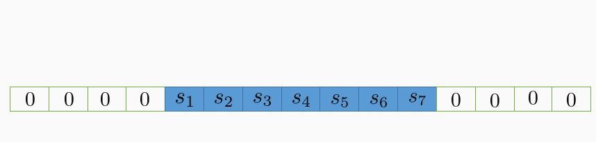
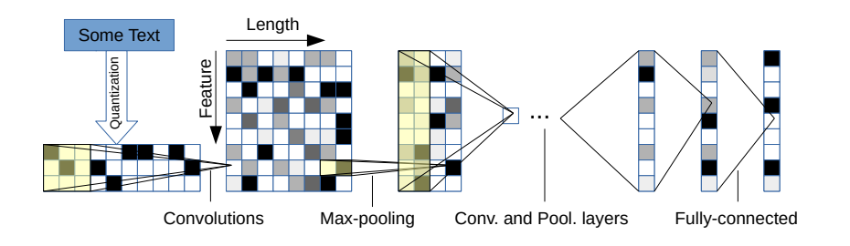
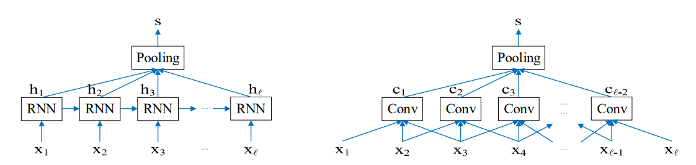
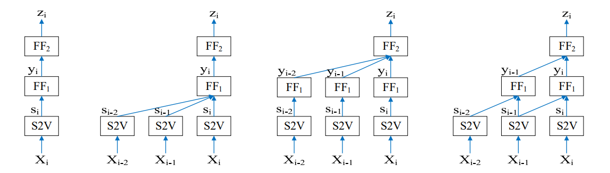

# CNN系列论文泛读
## 5.1 2014-TextCNN
- 用于句子分类的卷积神经网络 
(Convolutional Neural Networks for Sentence Classification)
#### 模型结构
- 模型是CNN结构的一个变体，下图为两通道的模型示例：

- 令 $x_i\in\mathbb{R}^k$ 对应于句子中第 $i$ 个单词的 $k$ 维词向量。一个长度为 $n$ 的句子表示为：
$$x_{1:n}=x_1{\oplus}x_2{\oplus}\cdots{\oplus}x_n$$
其中 ${\oplus}$ 是concat操作。
- 更一般的，我们令 $x_{i:i+j}$ 表示 $x_i,x_{i+1},\cdots,x_{i+j}$ 的concatation。
- 一个卷积算子包括一个过滤矩阵 $W\in\mathbb{R}^{hk}$ 和偏置项 $b\in\mathbb{R}$，使得特征 $c_i$ 由下式生成：
$$c_i=f(W{\cdot}x_{i:i+h-1}+b)$$
$f$ 是一个非线性激活函数。
- 将上述算子作用到词组成的滚动窗口 $\{x_{1:h},x_{2:h+1},\cdots,x_{n-h+1:n}\}$，得到 $c\in\mathbb{R}^{n-h+1}$ 的特征映射：
$$c=[c_1,c_2,\cdots,c_{n-h+1}]$$
- 然后在特征图上使用最大池化，取 $\^{c}={\rm{max}}\{c\}$ 作为最终的特征。
- 模型通过多种不同大小的视窗来提取多个特征，然后传给softmax分类器进行概率分布的预测。

#### 正则化
- 我们使用Dropout操作以及 $L_2$正则来进行模型训练。

## 5.2 2014-DCNN
- 用于建模句子的卷积神经网络 
(A Convolutional Neural Network for Modelling Sentences)
### 动态K-最大池化的卷积神经网络
#### 宽卷积
- 给定句子，我们通过排列句子中每个词的词嵌入 $\mathbf{w}_i\in\mathbb{R}^d$ 来构造句子矩阵 $\mathbf{s}\in\mathbb{R}^{d{\times}s}$：
$$\mathbf{s}=[\mathbf{w}_1\ \mathbf{w}_2{\cdots}\mathbf{w}_s]$$
- 矩阵 $\mathbf{m}\in\mathbb{R}^{d{\times}m}$ 的每一行 $\mathbf{m}_j$ 与矩阵 $\mathbf{s}$ 的 每一行 $\mathbf{s}_j$ 进行一维宽卷积操作，得到 $1{\times}(s+m-1)$ 维的向量 $\mathbf{c}_j$：
$$\mathbf{c}_j=\mathbf{m}_j*\mathbf{s}_j$$
再将这些向量按行堆叠为 $d{\times}(s+m-1)$ 维的矩阵 $\mathbf{c}$。
- 其中的1维宽卷积操作如下图：

- 1维窄卷积如下图：

#### k-最大池化
- 对于序列 $\mathbf{p}\in\mathbb{R}^p,p{\geq}k$，$k$ 最大池化从 $\mathbf{p}$ 中选择 $k$ 个最大的值，并保持 $\mathbb{p}$ 中的顺序关系，得到 $p_{\rm{max}}^k$。

#### 动态k-最大池化
- 动态k-最大池化操作是对不同的卷积层使用不同的k-最大池化，对于第 $l$ 层卷积使用 $k_l$ 最大池化：
$$k_l={\rm{max}}(k_{top},\lceil\frac{L-l}{L}s\rceil)$$
其中 $L$ 是网络中总的卷积层数，$k_{top}$ 是事先定义好的超参数，$s$ 是输入序列长度。

#### 非线性特征函数
- 将矩阵 $\mathbf{m}$ 重写为以下形式：
$$\mathbf{M}=[{\rm{diag}(\mathbf{m}_{:,1})},\cdots,{\rm{diag}(\mathbf{m}_{:,m})}]$$
得到一个 $m{\times}m$ 维的对角矩阵，对角线上每个元素是一个 $d{\times}d$ 维的对角矩阵。
- 通过下式得到模型的一阶特征输出的列向量：
$$a=g\left(\mathbf{M}[\mathbf{w}_j,\cdots,\mathbf{w}_{j+m-1}]^{\top}+\mathbf{b}\right)$$
其中非线性函数 $g$ 逐项作用于矩阵每个元素，$\mathbf{b}$ 是偏置矩阵。
- 将列向量合并得到一阶特征。
- 通过将 $a_j$ 替换 $\mathbf{w}_j$，应用另一个矩阵 $\mathbf{M}^\prime$ 来得到模型的二阶特征。

#### 多个特征映射
- 将上述的宽卷积、动态k-最大池化和非线性函数应用到输入序列得到一阶特征图不断重复这些操作能够得到更高阶的特征。
- 用 $\mathbf{F}^i$ 表示第 $i$ 阶特征图，同一层我们可以并行计算以得到多重特征图 $\mathbf{F}^i_1,\cdots,\mathbf{F}^i_n$，每个 $\mathbf{F}^i_j$ 都是由上一层所有的特征图跟对应的 $\mathbf{m}^i_{j,k}$ 进行卷积得到：
$$\mathbf{F}^i_j=\sum\limits_{k=1}^n\mathbf{m}^i_{j,k}*\mathbf{F}^{i-1}_k$$

#### 折叠
- 位于卷积操作之后，动态k-最大池化之前，将特征图矩阵中每两行元素进行相加，将维度从 $d$ 降到 $d/2$。

## 5.3 2015-CharCNN
- 用于文本分类的特征级卷积网络 
(Character-level Convolutional Networks for Text Classification)
- 整个模型是模块化的，通过反向传播来进行优化。

#### 关键模块
- 假定我们有一个离散的函数 $g(x)\in[1,l]\rightarrow\mathbb{R}$ 和一个离散的核函数 $f(x)\in[1,k]\rightarrow\mathbb{R}$，在 $f(x)$ 和 $g(x)$ 之间步幅为 $d$ 的卷积 $h(y)\in[1,\lfloor(l-k+1)/d\rfloor]\rightarrow\mathbb{R}$ 定义如下：
$$h(y)=\sum\limits_{x=1}^kf(x){\cdot}g(y{\cdot}d-x+c)$$
其中 $c=k-d+1$ 是一个常数。
- 与图像领域中的传统卷积一样，模型通过一系列核函数 $f_{ij}(x)$ 构成，其中 $i=1,2,\cdots,m;j=1,2,\cdots,n$，我们称 $g_i$(或 $h_j$) 为输入(或输出)特征。
- 训练深度模型的关键模块是时序最大池化。给定离散输入函数 $g(x)\in[1,l]\rightarrow\mathbb{R}$，$g(x)$ 上的最大池化函数 $h(y)\in[1,\lfloor(l-k+1)/d\rfloor]\rightarrow\mathbb{R}$ 定义如下：
$$h(y)=\mathop{\rm{max}}\limits_{x=1}^kg(y{\cdot}d-x+c)$$
其中 $c=k-d+1$ 是一个常数。这个池化模块使我们能够训练6层以上的卷积网络。
- 非线性激活函数使用ReLU，使用小批量(128)SGD动量0.9进行优化，步长0.01每3个epoches减半10次。每个epoch使用固定数量的均匀采样出的随机样本。

#### 字符量化
- 我们使用one-hot编码来编码以下70种字符，其他字符编码为全0向量：

#### 模型设计
- 我们设计了2个卷积神经网络。它们都是9层，有6个卷积层和3个全连接层。如下图所示：

- 根据字符量化方法，输入的特征数等于70，输入特征长度为1014。1014个字符似乎已经可以捕捉到大部分感兴趣的文本。我们还在3个全连接层之间插入2个0.5概率的dropout模块进行正则化。
- 下图为卷积层的配置：

- 下图为全连接层的配置：

#### 同义词数据增强
- 使用英文叙词表通过同义词替换进行数据增强

## 5.4 2016-SeqTextRCNN
- 循环和卷积神经网络的序列短文本分类 
(Sequential Short-Text Classification with Recurrent and Convolutional Neural Networks)

### 5.4.1 模型结构
模型包括两部分。
- 第一部分使用RNN或CNN架构为每个短文本生成一个向量表示：

- 第二部分根据当前短文本以及前面几个短文本的向量表示对当前短文本进行分类：

### 5.4.2 短文本表示
- 给定长度为 $l$ 的短文本，表示为一个 $m$ 维词向量序列 $\mathbf{x}_{1:l}$，通过RNN或CNN模型生成n维短文本表示 $\mathbf{s}$

#### RNN短文本表示
- 我们使用RNN变体LSTM结构。对于短文本中第 $t$ 个单词，输入 $\mathbf{x}_t,\mathbf{h}_{t-1},\mathbf{c}_{t-1}$ 到LSTM网络，通过下式输出 $\mathbf{h}_t,\mathbf{c}_t$：
$$\begin{align*}
\mathbf{i}_t&=\sigma(W_i\mathbf{x}_t+U_i\mathbf{h}_{t-1}+\mathbf{b}_i)\\
\mathbf{f}_t&=\sigma(W_f\mathbf{x}_t+U_f\mathbf{h}_{t-1}+\mathbf{b}_f)\\
\tilde{\mathbf{c}}_t&={\rm{tanh}}(W_c\mathbf{x}_t+U_c\mathbf{h}_{t-1}+\mathbf{b}_c)\\
\mathbf{c}_t&=\mathbf{f}_t\odot\mathbf{c}_{t-1}+\mathbf{i}_t\odot\tilde{\mathbf{c}}_t\\
\mathbf{o}_t&=\sigma(W_o\mathbf{x}_t+U_o\mathbf{h}_{t-1}+\mathbf{b}_o)\\
\mathbf{h}_t&=\mathbf{o}_t\odot{\rm{tanh}}(\mathbf{c}_t)
\end{align*}$$
其中 $W_j\in\mathbb{R}^{n{\times}m},U_j\in\mathbb{R}^{n{\times}n}$ 是权重矩阵，$\mathbf{b}_j\in\mathbb{R}^n$ 是偏置向量($j\in\{i,f,c,o\}$)。$\sigma(\cdot)$ 和 ${\rm{tanh}}(\cdot)$ 是逐元素sigmoid和双曲正切函数，$\odot$ 是逐元素相乘，$\mathbf{h}_0=\mathbf{c}_0=\mathbf{0}$。
- 池化层使用last、mean或max池化聚合所有RNN层的输出，last池化使用最后一个向量作为输出即 $\mathbf{s}=\mathbf{h}_l$；mean池化对所有向量均值即 $\mathbf{s}=\frac{1}{l}\sum_{t=1}^l\mathbf{h}_t$；max池化取 $\mathbf{h}_{1:l}$ 的最大值。

#### CNN短文本表示
- 使用一个高为 $h$ 的过滤器 $W_f\in\mathbb{R}^{h{\times}m}$，从第 $t$ 个词开始的 $h$ 个连续词向量通过下式进行卷积操作得到输出 $c_t$：
$$c_t=\mathbf{{\rm{ReLU}}}(W_f\mathbf{\cdot}X_{t:t+h-1}+b_f)$$
其中矩阵 $X_{t:t+h-1}\in\mathbb{R}^{h{\times}m}$ 的第 $i$ 行为 $\mathbf{x}_i\in\mathbb{R}^m$，$b_f\in\mathbb{R}$ 是偏置项，$\cdot$ 是点积操作，$\mathbf{{\rm{ReLU}}}(\cdot)$ 是逐元素的整流线性单元。
- 我们使用n个不同的过滤器进行卷积操作，并将得到的特征表示为 $\mathbf{c}_t\in\mathbb{R}^n$。对短文本中连续 $h$ 个单词的滑动窗口重复卷积操作，得到 $\mathbf{c}_{1:l-h+1}$，通过最大池化层对 $\mathbf{c}_{1:l-h+1}$ 逐个最大化得到短文本表示 $\mathbf{s}\in\mathbb{R}^n$。

### 5.4.3 序列短文本分类
- 令 $\mathbf{s}_i$ 是由RNN或CNN层得到的序列中第 $i$ 个短文本的 $n$ 维短文本表示。
- 将序列 $\mathbf{s}_{i-d_1-d_2:i}$ 放入两层前馈神经网络ANN中预测第 $i$ 个短文本的类别，超参数 $d_1,d_2$ 是第一第二层的模型尺寸。
- 输入 $\mathbf{s}_{i-d_1-d_2:i}$，第一层通过下式输出 $\mathbf{y}_{i-d_2:i}$：
$$\mathbf{y}_j={\rm{tanh}}\left(\sum\limits_{d=0}^{d_1}W_{-d}\mathbf{s}_{j-d}+\mathbf{b}_1\right),{\forall}j\in[i-d_2,i]$$
其中 $W_{-d}\in\mathbb{R}^{k{\times}n}$ 是权重矩阵，$\mathbf{b}_1\in\mathbb{R}^k$ 是偏置向量，$\mathbf{y}_j\in\mathbb{R}^k$ 是类别表示，$k$ 是分类任务的类别。
- 将类别表示 $\mathbf{y}_{i-d_2:i}$ 输入第二层，通过下式输出 $\mathbf{z}_i\in\mathbb{R}^k$：
$$\mathbf{z}_i={\rm{softmax}}\left(\sum\limits_{j=0}^{d_2}U_{-j}\mathbf{y}_{i-j}+\mathbf{b}_2\right)$$
其中 $U_{-j}\in\mathbb{R}^{k{\times}k}$ 是权重矩阵，$\mathbf{b}_2\in\mathbb{R}^k$ 是偏置向量。
- 最后输出一个概率分布，$\mathbf{z}_i$ 表示第 $i$ 个短文本的概率，$\mathbf{z}_i$ 的第 $j$ 项表示第 $i$ 个短文本属于第 $j$ 类的概率。

### 5.4.4 训练
- 训练过程使用Adadelta算法进行优化，在池化层后面应用Dropout。验证集上使用早停技术。

## 5.5 2017-XML-CNN

## 5.6 2017-DPCNN

## 5.7 2017-KPCNN