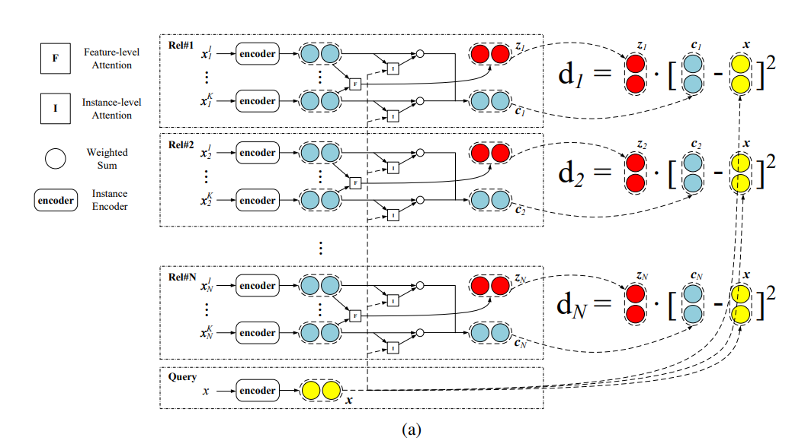

# Attention系列论文泛读
## 7.1 2016-HAN
- 用于文档分类的层次注意力网络 
(Hierarchical Attention Networks for Document Classification)
- 层次注意力网络的整体架构如图，它由几个部分组成：词序列编码器、词级注意力层、句子编码器和句子级注意力层。

### 7.1.1 基于GRU的序列编码器
- GRU使用门控机制来跟踪序列的状态，而不使用单独的记忆单元。门有两种类型：重置门 $r_t$ 和更新门 $z_t$，它们共同控制信息更新。在时间 $t$，GRU通过下式计算：
$$h_t=(1-z_t){\odot}h_{t-1}+z_t{\odot}\tilde{h}_t$$
- $z_t$ 通过下式更新：
$$z_t=\sigma(W_zx_t+U_zh_{t-1}+b_z)$$
其中 $x_t$ 是时间 $t$ 的序列向量。
- 候选状态 $\tilde{h}_t$ 由下式计算：
$$\tilde{h}_t={\rm{tanh}}(W_hx_t+r_t{\odot}(U_hh_{t-1})+b_h)$$
其中 $r_t$ 是重置门，控制过去状态对候选状态的贡献程度。如果 $r_t$ 为零，则忘记之前的状态。重置门按照下式更新：
$$r_t=\sigma(W_rx_t+U_rh_{t-1}+b_r)$$

### 7.1.2 分层注意力机制
- 我们关注文档分类任务。假定一个文档有 $L$ 个句子 $s_i$，每个句子有 $T_i$ 个单词。第 $i$ 个句子的单词为 $w_{it},t\in[1,T]$。模型输出一个向量表示，放入一个分类器来执行文档分类。
#### 词编码器
- 首先通过嵌入矩阵 $W_e$ 得到词嵌入 $x_{ij}=W_ew_{ij}$。
- 使用双向GRU，将两个方向的信息进行汇总得到单词的注释，从而将上下文信息融入到注释中。
- 双向GRU包括前向 $\mathop{f}\limits^{\rightarrow}$ 和后向 $\mathop{f}\limits ^{\leftarrow}$，从不同的方向输入句子向量：
$$\begin{align*}
x_{it}&=W_ew_{it},&t\in[1,T]\\
\mathop{h_{it}}\limits ^{\rightarrow}&=\mathop{\rm{GRU}}\limits ^{\longrightarrow}(x_{it}),&t\in[1,T]\\
\mathop{h_{it}}\limits ^{\leftarrow}&=\mathop{\rm{GRU}}\limits ^{\longleftarrow}(x_{it}),&t\in[T,1]
\end{align*}$$
- 通过将前向后向隐藏状态concat起来，得到一个注释，聚合了以 $w_{it}$为中心的整个序列的信息：
$$h_{it}=[\mathop{h_{it}}\limits ^{\rightarrow},\mathop{h_{it}}\limits ^{\leftarrow}]$$

#### 词注意力
- 对于一个句子的意义，并非所有单词都有相同的贡献。因此，我们引入注意力机制来提取对句子意义重要的词，并聚合这些词的表示，形成句子向量。
- 具体来说，我们首先将得到的词注释 $h_{it}$ 放到一个一层的MLP中得到 $u_{it}$ 作为隐藏表示，然后我们评估它和词级上下文向量 $u_w$ 的相似度，通过softmax分类器来获得一个重要性权重 $\alpha_{it}$。在这之后，我们通过权重和来计算句子向量 $s_i$：
$$\begin{align*}
u_{it}&={\rm{tanh}}(W_wh_{it}+b_w)\\
\alpha_{it}&=\frac{{\rm{exp}}(u_{it}^{\top}u_w)}{\sum_t{\rm{exp}}(u_{it}^{\top}u_w)}\\
s_i&=\sum\limits_t\alpha_{it}h_{it}
\end{align*}$$
- 上下文向量 $u_w$ 可以看作是这类固定的query "what is the informative word" 的高维表示，在训练过程中随机初始化并联合学习。

#### 句子编码器
- 给定句子向量 $s_i$，我们同样通过一个双向GRU来编码句子：
$$\begin{align*}
\mathop{h_i}\limits ^{\rightarrow}&=\mathop{\rm{GRU}}\limits ^{\longrightarrow}(s_i),&i\in[1,L]\\
\mathop{h_i}\limits ^{\leftarrow}&=\mathop{\rm{GRU}}\limits ^{\longleftarrow}(s_i),&i\in[L,1]
\end{align*}$$
- 将前向后向隐藏状态concat起来，得到一个注释，聚合了附近句子的信息，但重点仍在中心句子 $i$ 上：
$$h_i=[\mathop{h_i}\limits ^{\rightarrow},\mathop{h_i}\limits ^{\leftarrow}]$$

#### 句子注意力
- 为了奖励作为正确分类文档线索的句子，我们再次使用注意力机制并引入句子级别的上下文向量 $u_s$，并使用该向量度量句子的重要性。
- 具体来说：
$$\begin{align*}
u_i&={\rm{tanh}}(W_sh_i+b_s)\\
\alpha_i&=\frac{{\rm{exp}}(u_i^{\top}u_s)}{\sum_i{\rm{exp}}(u_i^{\top}u_s)}\\
v&=\sum\limits_i\alpha_ih_i
\end{align*}$$
- $v$ 是文档向量，它概括了文档中句子的所有信息。
- 同样，句子级别的上下文向量 $u_s$ 可以在训练过程中随机初始化并联合学习。

### 7.1.3 文档分类
- 文档向量 $v$ 是文档的高维表示，可以作为文档分类的特征，通过MLP和softmax分类器得到分类概率：
$$p={\rm{softmax}}(W_cv+b_c)$$
- 损失函数使用正确标签的负对数似然来训练：
$$L=-\sum\limits_d{\rm{log}}p_{dj}$$
其中 $j$ 是文档 $d$ 的标签，

## 7.2 2016-BI-Attention
- 用于跨语言情感分类的基于注意力机制的LSTM网络 
(Attention-based LSTM Network for Cross-Lingual Sentiment Classification)
### 7.2.1 准备工作
#### 问题定义
- 跨语言情感分类任务的目标是使用源语言的训练集数据来构建一个模型，能够适用于目标语言的测试集。
- 我们的训练集是有标签的英语数据集：
$$L_{EN}=\{x_i,y_i\}^N_{i=1}$$
其中 $x_i$ 为评论文本，$y_i$ 为情感标签向量，$(1,0)$ 为积极的，$(0,1)$ 为消极的。
- 目标语言为中文，测试集为：
$$T_{CN}=\{x_i\}^T_{i=1}$$
- 以及中文无标签数据集：
$$U_{CN}=\{x_i\}^M_{i=1}$$
- 任务是通过 $L_{EN}$ 和 $U_{CN}$ 去学习一个模型来对 $T_{CN}$ 进行情感分类。
- 我们通过在线翻译将有标签、无标签和测试数据都翻译为另一种语言。我们将一篇文档及其对应的译文称为一对平行文档。

#### LSTM
- 我们使用标准的LSTM网络，结构如下图：

### 7.2.2 模型架构
#### 模型结构
- 模型的主要结构如图所示(图中展示了中文部分的结构，英文部分结构与之相同，只是模型参数不同)：

- 对于一对平行文档 $x_{cn}$ 和 $x_{en}$，分别送入基于注意力机制的LSTM网络中(如图中的中文网络结构)。
- 整个模型分为4层。
    - 输入层中，文档被表示为词的序列，通过预训练模型得到词嵌入；
    - LSTM层中，我们由一个双向LSTM网络得到高维表示；
    - 在文档表示层，我们引入attention模型来得到最终的文档表示；
    - 在输出层，我们将平行文档的中文部分和英文部分的表示concat起来，然后使用softmax分类器来预测情感标签。
###### 输入层
- 中文或英文文档 $x$，包含了句子序列 $\{s_i\}_{i=1}^{|x|}$，每个句子包含了一些单词 $s_i=\{w_{i,j}\}_{j=1}^{|s_i|}$，我们通过一个预训练词嵌入模型来将文档中的每个词表示为一个固定大小的词向量。

###### LSTM层
- 在每种语言中，我们使用双向LSTM对输入序列进行建模。我们从前向LSTM网络中得到前向隐藏状态 ${\mathop{h}\limits^{\rightarrow}}_{i,j}$，从后向LSTM网络中得到后向隐藏状态 ${\mathop{h}\limits^{\leftarrow}}_{i,j}$。
- 将两个隐藏状态concat到一起，得到第 $i$ 个句子的第 $j$ 个单词的状态 $h_{i,j}$:
$$h_{i,j}={\mathop{h}\limits^{\rightarrow}}_{i,j}\|{\mathop{h}\limits^{\leftarrow}}_{i,j}$$
其中 $\|$ 表示concat操作。

###### 文档表示层
- 文档的不同部分对于整体情感通常具有不同的重要性。有些句子或词语可以是决定性的，而另一些句子或词语则是无关的。
- 我们使用分层注意力机制，为每个单词分配一个真实值分数，为每个句子分配一个真实值分数。
- 假定我们对每个句子 $s_i{\in}x$ 有一个注意力分数 $A_i$，对每个单词 $w_{i,j}{\in}s_i$ 有一个注意力分数 $a_{i,j}$，我们对分数进行归一化后，得到：
$$\sum\limits_iA_i=1,\quad\sum\limits_ja_{i,j}=1$$
- 句子注意力衡量的是哪个句子对整体情感更重要，而单词注意力捕捉的是每个句子中的情感信号。因此，文档 $x$ 的文档表示 $r$ 计算如下：
$$r=\sum\limits_i[A_i\cdot\sum\limits_j(a_{i,j}{\cdot}h_{i,j})]$$

###### 输出层
- 在输出层，需要对文档的整体情感进行预测。对于每一个英文文档 $x_{en}$ 及其对应的译文 $x_{cn}$，假设它们的文档表示为 $r_{en}$ 和 $r_{cn}$，我们通过concat操作来得到最终的特征向量，并使用softmax分类器预测最终的情感标签：
$$\^{y}={\rm{softmax}}(r_{cn}\|r_{en})$$

#### 分层注意力机制
- 结合双语言LSTM网络的分层注意力机制。
- 第一个层次是句子注意力模型，衡量哪些句子对文档的整体情感更重要。对每个句子 $s_i=\{w_{i,j}\}_{j=1}^{|s_i|}$，我们通过前向和后向隐藏状态来得到句子表示：
$$s_i={\mathop{h}\limits^{\rightarrow}}_{i,|s_i|}\|{\mathop{h}\limits^{\leftarrow}}_{i,1}$$
- 我们使用两层前馈神经网络 $f$ 来预测注意力分数，$\theta_s$ 是网络 $f$ 的参数：
$$\^{A}=f(s_i;\theta_s)$$
$$A_i=\frac{{\rm{exp}}(\^{A}_j)}{\sum_j{\rm{exp}}(\^{A}_j)}$$
- 在词的层次，我们通过词本身的词嵌入，以及前向后向隐藏状态来得到词表示：
$$e_{i,j}=w_{i,j}\|{\mathop{h}\limits^{\rightarrow}}_{i,j}\|{\mathop{h}\limits^{\leftarrow}}_{i,j}$$
- 同样使用两层网络 $f$ 来预测注意力分数，$\theta_w$ 是网络 $f$ 的参数：
$$\^{a}_{i,j}=f(e_{i,j};\theta_w)$$
$$a_{i,j}=\frac{{\rm{exp}}(\^{a}_{i,j})}{\sum_j{\rm{exp}}(\^{a}_{i,j})}$$

### 7.2.3 模型训练
- 模型以半监督的方式进行训练。在监督部分，我们通过最小化交叉熵损失来训练：
$$L_1=\sum\limits_{(x_{en},x_{cn})}\sum\limits_i-y_i{\rm{log}}(\^{y}_i)$$
其中 $x_{en}$ 和 $x_{cn}$ 是训练集中的平行文档，$y$ 是标签的情感向量，$\^{y}$ 是模型的预测向量。
- 无监督部分通过最小化并行数据之间的文档表示：
$$L_2=\sum\limits_{(x_{en},x_{cn})}\|r_{en}-r_{cn}\|^2$$
其中 $x_{en}$ 和 $x_{cn}$ 是有标签和无标签数据集中的并行文档。
- 最终的目标函数是两部分的权重和，$\alpha$ 是超参数：
$$L=L_1+{\alpha}L_2$$
- 模型使用Adadelta来更新参数。
- 在测试阶段，将 $T_{CN}$ 中的测试文档与 $T_{EN}$ 中对应的机器翻译文本一起发送到我们的模型中。最后的情感预测通过一个softmax分类器对双语文本的concat表示进行预测，如前所述。

## 7.3 2016-LSTMN
- 用于机器阅读的长短期记忆网络 
(Long Short-Term Memory-Networks for Machine Reading)

### 7.3.1 机器阅读
- 我们模型的核心是一个LSTM单元，它带有一个扩展的记忆磁盘，显式地模拟人类的记忆广度。
- 该模型在每一时间步以基于注意力的记忆寻址机制来执行tokens之间的隐式关系分析。

#### LSTM
- 通过在单个记忆槽中增量地添加新内容来处理可变长度序列 $x=(x_1,x_2,\cdots,x_n)$，每一时间步 $t$，记忆cell $c_t$ 和隐藏状态 $h_t$ 由下式更新：
$$\quad\left[\begin{array}{c}
i_t\\
f_t\\
o_t\\
\^{c}_t
\end{array}\right]=\left[\begin{array}{c}
\sigma\\
\sigma\\
\sigma\\
{\rm{tanh}}
\end{array}\right]W\cdot[h_{t-1},x_t]$$
$$\begin{align*}
c_t&=f_t{\odot}c_{t-1}+i_t{\odot}\^{c}_t\\
h_t&=o_t{\odot}{\rm{tanh}}(c_t)
\end{align*}$$
其中 $x_t$ 是 $t$ 步的输入，$i,f,o$ 是输入门、遗忘门和输出门，$\^{c}$ 是当前的cell状态，$\sigma$ 是sigmoid函数，$\odot$ 是哈达玛积。

#### LSTM网络
- LSTM的第一个问题是：在递归过程中，它们能够记忆序列的程度。
    - LSTMs可以产生一个状态表示列表，但是下一个状态总是从当前状态计算得到。也就是说，给定当前状态 $h_t$，下一个状态 $h_{t+1}$ 条件独立于状态 $h_1,\cdots,h_t$ 和tokens $x_1,\cdots,x_t$。
    - 当递归状态以马尔科夫方式更新时，假设LSTMs保持无界记忆(仅当前状态就很好地概括了迄今为止所看到的特征)。这种假设在实践中可能会失效，例如当序列较长或内存大小不够大时。
- LSTMs的另一个不理想的特性是关于结构化的输入。LSTM按照顺序逐个聚合信息，但没有明确的机制来推理tokens之间的结构和关系。
- 我们的模型旨在解决这两个问题。我们的解决方案是修改标准的LSTM结构，将记忆单元替换为记忆网络。由此产生的LSTMN以唯一的记忆槽存储每个输入token的上下文表示，记忆的大小随时间增长，直到达到记忆跨度的上界。
- 该设计使LSTM能够通过神经注意力层推理tokens之间的关系，然后执行非马尔科夫状态更新。具体的网络结构如下图：

- 模型维护两套向量，分别存储在用于与环境交互的隐藏状态磁盘，和用于表示实际存储内容的记忆磁盘。因此，每个token都与一个隐藏向量和一个记忆向量相关联。
- 令 $x_t$ 表示当前输入，$C_{t-1}=(c_1,\cdots,c_{t-1})$ 表示当前的记忆磁盘，$H_{t-1}=(h_1,\cdots,h_{t-1})$ 表示之前的隐藏转态磁盘。在时间 $t$，模型根据一个注意力层来进行计算：
$$a_i^t=v^T{\rm{tanh}}(W_hh_i+W_xx_t+W_{\tilde{h}}\tilde{h}_{t-1})$$
$$s_i^t={\rm{softmax}}(a_i^t)$$
- 上式给出了tokens的隐藏状态向量上的概率分布。然后，我们可以分别为之前的隐藏磁盘和记忆磁盘计算一个自适应概要向量，记为 $\tilde{h}_t$ 和 $\tilde{c}_t$：
$$\left[\begin{array}{c}
\tilde{h}_t\\
\tilde{c}_t
\end{array}\right]=\sum\limits_{i=1}^{t-1}s_i^t\cdot\left[\begin{array}{c}
h_i\\
c_i
\end{array}\right]$$
- 然后循环更新：
$$\quad\left[\begin{array}{c}
i_t\\
f_t\\
o_t\\
\^{c}_t
\end{array}\right]=\left[\begin{array}{c}
\sigma\\
\sigma\\
\sigma\\
{\rm{tanh}}
\end{array}\right]W\cdot[\tilde{h}_t,x_t]$$
$$\begin{align*}
c_t&=f_t{\odot}\tilde{c}_t+i_t{\odot}\^{c}_t\\
h_t&=o_t{\odot}{\rm{tanh}}(c_t)
\end{align*}$$
其中 $v,W_h,W_x,W_{\tilde{h}}$ 是网络的权重项。
- LSTMN背后的一个关键思想是利用注意力来诱导tokens之间的关系。这些关系是可微的，并且是一个更大的表示学习网络的组成部分。
- 通过交替堆叠多个记忆层和隐藏层，也有可能拥有更结构化的关系推理模块，类似于堆叠LSTM或多跳记忆网络。这可以通过将 $k$ 层输出 $h_t^k$ 作为 $k+1$ 层的输入，那么第 $k+1$ 层的注意力可以通过下式计算：
$$a_{i,k+1}^t=v^T{\rm{tanh}}(W_hh_i^{k+1}+W_lh_t^k+W_{\tilde{h}}\tilde{h}_{t-1}^{k+1})$$
- 也可以通过残差将 $x_t$ 送到上层。

### 7.3.2 用LSTMN建模两个序列
- 机器翻译、文本蕴涵等自然语言处理任务关注的是两个序列的建模，而不是单个序列的建模。使用循环网络建模两个序列的标准工具是编码器-解码器架构。
- 我们将两种架构结合起来，一个是应用注意力机制进行内在关系推理的LSTMN，另一个是通过注意力模块学习两个序列之间的相互关系的编码器-解码器网络。如下图：

#### 浅层注意力融合
- 浅层融合只是将LSTMN作为一个单独的模块，可以很容易地用于编码器-解码器架构，而不是标准的RNN或LSTM。如上图，编码器和解码器都被建模为具有内含注意力的LSTMNs。同时，当解码器读取目标token时，会触发相互注意力。

#### 深层注意力融合
- 深度融合在计算状态更新时结合了相互注意力和内含注意力。我们使用不同的符号来表示这两组注意力。
- $C$ 和 $H$ 分别表示目标记忆磁盘和隐藏磁盘，存储到目前为止已经处理过的目标符号的表示。内含注意力遵循上节定义的注意力的计算式。
- 我们使用 $A=[\alpha_1,\cdots,\alpha_m]$ 和 $Y=[\gamma_1,\cdots,\gamma_m]$ 来表示源内存磁盘和隐藏磁盘，其中 $m$ 是源序列的长度。
- 我们通过下式计算 $t$ 步输入和整个源序列中的tokens之间的相互注意力：
$$b_j^t=u^T{\rm{tanh}}(W_{\gamma}\gamma_j+W_xx_t+W_{\tilde{\gamma}}\tilde{\gamma}_{t-1})$$
$$p_j^t={\rm{softmax}}(b_j^t)$$
- 其中，自适应表示通过下式计算：
$$\left[\begin{array}{c}
\tilde{\gamma}_t\\
\tilde{\alpha}_t\\
\end{array}\right]=\sum\limits_{j=1}^mp_j^t\cdot\left[\begin{array}{c}
\gamma_j\\
\alpha_j
\end{array}\right]$$
- 通过另一个门操作 $r_t$ 将自适应源表示 $\tilde{\alpha}_t$ 转移到目标记忆中：
$$r_t=\sigma(W_r\cdot[\tilde{\gamma}_t,x_t])$$
最后得到新的目标记忆：
$$c_t=r_t{\odot}\tilde{\alpha}_t+f_t{\odot}\tilde{c}_t+i_t{\odot}\^{c}_t$$
$$h_t=o_t{\odot}{\rm{tanh}}(c_t)$$

## 7.4 2017-Lin et al
- 一个结构化的自注意力句子嵌入 
(a Structured Self-Attentive Sentence Embedding)

### 7.4.1 模型结构
- 模型由两部分组成。一部分是双向LSTM，另一部分是自注意力机制。
- 假定我们有一个句子序列，有 $n$ 个tokens，第 $i$ 个词的词嵌入记为 $w_i$，则句子嵌入为一个二维矩阵 $S$：
$$S=(w_1,w_2,\cdots,w_n)$$
- 我们使用双向LSTM得到句子的特征：
$$\begin{align*}
\mathop{h_t}\limits^{\rightarrow}&=\mathop{\rm{LSTM}}\limits^{\longrightarrow}(w_t,\mathop{h_{t-1}}\limits^{\longrightarrow})\\
\mathop{h_t}\limits^{\leftarrow}&=\mathop{\rm{LSTM}}\limits^{\longleftarrow}(w_t,\mathop{h_{t-1}}\limits^{\longleftarrow})
\end{align*}$$
- concat双向特征得到隐藏状态 $h_t$。所有的 $h_t$ 合并为一个特征图：
$$H=(h_1,h_2,\cdots,h_n)$$
- 将 $H$ 作为注意力机制的输入，通过下式得到一个权重向量 $a$：
$$a={\rm{softmax}}(w_{s_2}{\rm{tanh}}(W_{s_1}H^\top))$$
其中 $W_{s_1}$ 是一个 $d_a{\times}n$ 维的权重矩阵，$w_{s_2}$ 是一个 $d_a$ 维的权重向量，$d_a$ 是一个超参数。得到的 $a$ 是一个 $n$ 维向量。
- 通过权重和得到输入序列的向量表示：
$$m={\sum}aH^\top$$
- 通过多跳注意力机制来捕获长句子中的多个重要部分，我们将 $w_{s_2}$ 扩展为一个 $r{\times}d_a$ 维的矩阵，记为 $W_{s_2}$，因此我们通过下式得到一个权重矩阵 $A$：
$$A={\rm{softmax}}(W_{s_2}{\rm{tanh}}(W_{s_1}H^\top))$$
其中 ${\rm{softmax}}$ 沿着输入的第二维进行。我们可以将上式看为一个具有 $d_a$ 个隐藏单元的2层的MLP，参数为 $\{W_{s_2},W_{s_1}\}$。
- 嵌入向量 $m$ 变为一个 $r{\times}n$ 维的嵌入矩阵 $M$，具体计算为：
$$M=AH$$

### 7.4.2 惩罚项
- 如果注意力机制总是为所有 $r$ 跳提供相似的求和权重，嵌入矩阵 $M$ 可能会出现冗余问题。因此，我们需要一个惩罚项来鼓励不同注意力跳数的求和权重向量的多样性。
- 评价多样性的最好方法肯定是KL散度，但实践中并不稳定，我们猜测是因为需要优化多个KL散度的问题，在优化矩阵 $A$ 时出现很多0值使训练不稳定。另一方面，我们希望每一行关注语义的一个方面，但KL散度不能做到这一点。
- 为此我们引入一个新的惩罚项：
$$P=\|(AA^\top-I)\|_F^2$$
其中 $\|\cdot\|_F$ 是矩阵的Frobenius norm。与L2正则项类似，我们对其加上权重系数 $\lambda$ 然后与原始loss合一起来优化。

## 7.5 2018-SGM
- 多标签分类的序列生成模型 
(SGM: Sequence Generation Model for Multi-Label Classification)

### 7.5.1 模型概述
- 给定 $L$ 个标签 $\mathcal{L}=\{l_1,l_2,\cdots,l_L\}$，包含 $m$ 个单词的文本序列 $x$。任务是指定一个包含 $n$ 个标签的 $\mathcal{L}$ 的子集 $y$。
- 与传统的单标签分类中每个样本只分配一个标签不同，多标签分类(MLC)任务中的每个样本可以有多个标签。从序列生成的角度来看，MLC任务可以通过最大化条件概率 $p(y|x)$ 来寻找最优标签序列 $y^*$，其计算公式如下：
$$p(y|x)=\prod\limits_{i=1}^np(y_i|y_1,y_2,\cdots,y_{i-1},x)$$
- 模型如图所示：

- 首先，我们根据标签在训练集中出现的频率对每个样本的标签序列进行排序。此外，在标签序列的头尾分别添加 $bos$ 和 $eos$ 符号。
- 文本序列 $x$ 被编码到隐藏状态，在时间步 $t$ 通过注意力机制聚合为上下文向量 $c_t$。
- 解码器将上下文向量 $c_t$ 以及解码器的最后一个隐藏状态 $s_{t-1}$ 和嵌入向量 $g(y_{t-1})$ 作为输入，在时间步 $t$ 得到隐藏状态 $s_t$。其中，$y_{t-1}$ 为 $t-1$ 时刻标签空间 $\mathcal{L}$ 上的预测概率分布。
- 函数 $g$ 以 $y_{t-1}$ 为输入，产生嵌入向量并传递给解码器。
- 最后，利用掩码softmax层输出概率分布 $y_t$。

### 7.5.2 序列生成
- 整个序列生成模型由具有注意力机制的编码器和解码器组成。
#### 编码器
- 令 $(w_1,w_2,\cdots,w_m)$ 是具有 $m$ 个单词的句子，其中 $w_i$ 是第 $i$ 个单词的独热表示。
- 我们首先通过一个嵌入矩阵 $E\in\mathbb{R}^{k{\times}|\mathcal{V}|}$ 将 $w_i$ 变为一组稠密嵌入向量 $x_i$，其中 $|\mathcal{V}|$ 是词汇表的大小，$k$ 是嵌入向量的维度。
- 我们使用双向LSTM得到双向特征：
$$\begin{align*}
\mathop{h_i}\limits^{\rightarrow}&=\mathop{\rm{LSTM}}\limits^{\longrightarrow}(\mathop{h_{i-1}}\limits^{\longrightarrow},x_i)\\
\mathop{h_i}\limits^{\leftarrow}&=\mathop{\rm{LSTM}}\limits^{\longleftarrow}(\mathop{h_{i+1}}\limits^{\longleftarrow},x_i)
\end{align*}$$
- 通过concat操作得到最终的特征：
$$h_i=[\mathop{h_i}\limits^{\rightarrow};\mathop{h_i}\limits^{\leftarrow}]$$

#### 注意力机制
- 当模型预测不同的标签时，并不是所有的文本词都做出相同的贡献。注意力机制通过关注文本序列的不同部分并聚合这些信息词的隐藏表示来产生上下文向量。
- 在时间步 $t$ 通过下式为第 $i$ 个单词分配权重 $\alpha_{ti}$：
$$\begin{align*}
e_{ti}&=v_a^{\top}{\rm{tanh}}(W_as_t+U_ah_i)\\
\alpha_{ti}&=\frac{{\rm{exp}}(e_{ti})}{\sum_{j=1}^m{\rm{exp}}(e_{tj})}
\end{align*}$$
其中 $W_a,U_a,v_a$ 是权重参数，$s_t$ 是解码器在时间步 $t$ 的当前隐藏状态。
- 最后传入解码器的文本向量 $c_t$ 为：
$$c_t=\sum\limits_{i=1}^m\alpha_{ti}h_i$$

#### 解码器
- 解码器在时间步 $t$ 的隐藏状态 $s_t$ 计算如下： 
$$s_t={\rm{LSTM}}(s_{t-1},[g(y_{t-1});c_{t-1}])$$
其中 $[g(y_{t-1});c_{t-1}]$ 是指将 $g(y_{t-1})$ 和 $c_{t-1}$ concat起来。
- $g(y_{t-1})$ 是在分布 $y_{t-1}$ 下概率最大的标签嵌入，$y_{t-1}$ 是在时间步 $t-1$ 时的标签空间 $\mathcal{L}$ 上的概率分布，具体由下式计算：
$$\begin{align*}
o_t&=W_of(W_ds_t+V_dc_t)\\
y_t&={\rm{softmax}}(o_t+I_t)
\end{align*}$$
其中 $W_o,W_d,V_d$ 是权重参数，$f$ 是一个非线性激活函。
- $I_t\in\mathbb{R}^L$ 是掩码向量，用于防止解码器预测重复标签数：
$$(I_t)_i=\left\{\begin{array}{ll}
-\infty &\text{if the label } l_i \text{ has been predicted at previous } t-1 \text{ time steps.}\\
0 &\text{otherwise.}
\end{array}\right.$$
- 在训练阶段，损失函数为交叉熵损失函数。我们采用束搜索算法来寻找推断时排名靠前的预测路径。

### 7.5.3 全局嵌入
- $t$ 步的解码器隐藏状态向量是贪心的求得的，通过分布 $y_{t-1}$ 下概率最大的标签嵌入求得。如果在时间步 $t$ 的预测是错误的，那么我们很可能会在接下来的时间步得到一系列错误的标签预测，这也被称为曝光偏差。
- 实际上，前面所有时间步的信息都是有价值的，所以我们应该考虑所有的信息来缓解曝光偏差。
- 基于此，我们提出了一种新的解码器结构。我们引入全局嵌入。
- 令 $e$ 表示在分布 $y_{t-1}$ 下概率最大的标签嵌入，$\bar{e}$ 为 $t$ 时刻的加权平均嵌入：
$$\bar{e}=\sum\limits_{i=1}^Ly_{t-1}^{(i)}e_i$$
其中 $y_{t-1}^{(i)}$ 是 $y_{t-1}$ 的第 $i$ 个元素，$e_i$ 是第 $i$ 个标签的嵌入向量。
- 时间步 $t$ 传入解码器的全局嵌入 $g(y_{t-1})$ 为：
$$g(y_{t-1})=(1-H){\odot}e+H{\odot}\bar{e}$$
其中 $H$ 是控制加权平均嵌入比例的变换门：
$$H=W_1e+W_2\bar{e}$$
其中 $W_1,W_2\in\mathbb{R}^{L{\times}L}$ 是权重矩阵。
- 全局嵌入 $g(y_{t-1})$ 是原始嵌入和使用变换门 $H$ 的加权平均嵌入的优化组合，可以自动确定每个维度上的组合因子。通过考虑每个标签出现的概率，该模型能够减少上一时间步错误预测造成的损失。这使得模型能够更准确地预测标签序列。

## 7.6 2018-ELMo
- 深度语境化词语表示 
(Deep contextualized word representations)
- ELMo(Embeddings from Language Models)词表示是整个输入句子的函数。我们通过4个部分来介绍。
### 7.6.1 双向语言模型
- 给定 $N$ 个tokens的序列 $(t_1,t_2,\cdots,t_N)$，前向语言模型通过建模 $t_k$ 的概率来计算序列的概率：
$$p(t_1,t_2,\cdots,t_N)=\prod\limits_{k=1}^Np(t_k|t_1,t_2,\cdots,t_{k-1})$$
- 最近的神经语言模型，计算一个与上下文无关的token表示 $x_k^{LM}$，然后放入 $L$ 层前向LSTMs网络中。在每个位置 $k$，每个LSTM层输出一个上下文独立的表示 $\mathop{h_{k,j}^{LM}}\limits^{\longrightarrow}$，其中 $j=1,\cdots,L$。最上层的输出放入softmax分类器中来预测下一个token $t_{k+1}$。
- 一个后向LM与前向类似，只是逆序文本序列，通过未来的文本预测之前的token：
$$p(t_1,t_2,\cdots,t_N)=\prod\limits_{k=1}^Np(t_k|t_{k+1},t_{k+2},\cdots,t_N)$$
- 双向语言模型通过联合前向和后向过程，通过最大化对数似然来训练：
$$\sum\limits_{k=1}^N({\rm{log}}p(t_k|t_1,\cdots,t_{k-1};\Theta_x,{\mathop{\Theta}\limits^{\rightarrow}}_{\rm{LSTM}},\Theta_s)+{\rm{log}}p(t_k|t_{k+1},\cdots,t_N;\Theta_x,{\mathop{\Theta}\limits^{\leftarrow}}_{\rm{LSTM}},\Theta_s))$$
其中 $\Theta_x$ 是token表示的参数，$\Theta_s$ 是softmax层参数，我们在前向后向过程中共享这两部分参数。

### 7.6.2 ELMo
- 对于每个token $t_k$，一个 $L$ 层biLM计算了 $2L+1$ 个表示：
$$\begin{align*}
R_k&=\{x_k^{LM},\mathop{h_{k,j}^{LM}}\limits^{\longrightarrow},\mathop{h_{k,j}^{LM}}\limits^{\longleftarrow}|j=1,\cdots,L\}\\
&=\{h_{k,j}^{LM}|j=0,\cdots,L\}
\end{align*}$$
其中 $h_{k,j}^{LM}=[\mathop{h_{k,j}^{LM}}\limits^{\longrightarrow};\mathop{h_{k,j}^{LM}}\limits^{\longleftarrow}]$。
- ELMo将这些层的表示变为一个向量：
$${\rm{ELMo}}_k=E(R_k;\Theta_c)$$
    - 最简单的情况，是用最后一层的输出来作为向量：$E(R_k)=h_{k,L}^{LM}$。
    - 更一般的，我们计算所有biLM层的特定任务权重：
    $${\rm{ELMo}}_k^{task}=E(R_k;\Theta^{task})=\gamma^{task}\sum\limits_{j=0}^Ls_j^{task}h_{k,j}^{LM}$$
    其中，$s^{task}$ 是softmax-normalized权重，$\gamma^{task}$ 是标量参数，允许模型对整个ELMo向量进行缩放。

### 7.6.3 使用biLMs进行有监督的NLP任务
- 给定一个预训练的biLM和一个目标NLP任务的监督架构，使用biLM改进任务模型是一个简单的过程。我们运行biLM并记录每个单词的所有层表示。然后，我们让任务模型学习这些表示的线性组合。
- 首先考虑监督模型的最低层。多数监督NLP模型在最低层有一个共同的体系结构，使得我们能以一个统一的方式添加ELMo。
- 给定tokens序列 $(t_1,\cdots,t_N)$，使用预训练的词嵌入和可选的基于字符的表示为每个token形成一个上下文无关的token表示 $x_k$。然后，使用双向RNNs、CNNs或前馈网络形成上下文敏感的表示 $h_k$。
- 为了将ELMo添加到监督模型中，我们首先冻结biLM的权重，然后将ELMo向量与 $x_k$ concat起来得到 $[x_k;{\rm{ELMo}}_k^{task}]$，再放入任务模型中。
- 另一些任务中，我们在任务模型后引入ELMo，将 $h_k$ 替换为 $[h_k;{\rm{ELMo}}_k^{task}]$。
- 最后，Dropout操作是有效的。在损失中添加正则项 $\lambda\|w\|_2^2$ 也是有效的。

### 7.6.4 预训练的双向语言模型架构
- 最终模型使用 $L=2$ 个biLSTM层，包含4096个单元和512维投影，以及从第一层到第二层的残差连接。上下文不敏感的表示使用2048个字符的n-gram卷积滤波器，然后使用两个highway层和一个线性投影层，输出一个512维的表示。
- 在1B的单词上训练10个epochs后，前向和后向平均困惑度为39.7，而前向CNN-BIG-LSTM为30.0。总体而言，我们发现前后向困惑度近似相等，后向值略低。
- 预训练后，biLM可以为任何任务计算表示。某些情况下，在特定领域的数据上微调biLM会导致困惑度的显著下降以及下游任务性能的增加。

## 7.7 2018-BiBloSA
- 用于快速和高效的序列建模的双向块自注意力 
(Bi-Directional Block Self-Attention for Fast and Memory-Efficient Sequence Modeling)
### 7.7.1 背景知识
#### 词嵌入
- 给定tokens的序列 $w=[w_1,w_2,\cdots,w_n]\in\mathbb{R}^{N{\times}n}$，其中 $w_i$ 是独热向量，$N$ 是词汇表大小，$n$ 是序列长度。
- 预训练词嵌入模型输入 $w$，输出一个低维向量 $x=[x_1,x_2,\cdots,x_n]\in\mathbb{R}^{d_e{\times}n}$，过程由下式给出：
$$x=W^{(e)}w$$
其中 $W^{(e)}\in\mathbb{R}^{d_e{\times}N}$ 是权重矩阵，在训练中可以进行微调。

#### Vanilla Attention和多维注意力
###### Vanilla Attention：
- 给定由词嵌入组成的序列 $x=[x_1,x_2,\cdots,x_n]\in\mathbb{R}^{d_e{\times}n}$，以及一个query的向量表示 $q\in\mathbb{R}^{d_q}$。Vanilla Attention使用概率函数 $f(x_i,q)$ 来计算 $q$ 和 $x_i$ 之间的注意力分数。然后通过softmax将其变为概率分布 $p(z|x,q)$，$p(z=i|x,q)$ 越大说明 $x_i$ 对于 $q$ 越重要，整个过程如下：
$$\begin{align*}
&a=[f(x_i,q)]_{i=1}^n\\
&p(z|x,q)={\rm{softmax}}(a)
\end{align*}$$
- 输出s是对一个token按其重要性采样的期望：
$$s=\sum\limits_{i=1}^np(z=i|x,q)x_i=\mathbb{E}_{i{\sim}p(z|x,q)}(x_i)$$
- 加性注意力和乘性注意力是两种不同的注意力机制，不同点在于函数 $f(x_i,q)$ 的选择。
    - 乘性注意力使用cosine相似性：
    $$f(x_i,q)=\left<W^{(1)}x_i,W^{(2)}q\right>$$
    其中 $W^{(1)}\in\mathbb{R}^{d_h{\times}d_e},W^{(2)}\in\mathbb{R}^{d_h{\times}d_q}$ 是可学习的参数，
    - 加性注意力定义为：
    $$f(x_i,q)=w^{\top}\sigma(W^{(1)}x_i+W^{(2)}q+b^{(1)})+b$$
    其中 $w\in\mathbb{R}^{d_h}$，$b^{(1)}$ 和 $b$ 是偏置项，$\sigma(\cdot)$ 是激活函数。
- 加性注意力通常表现更好，但时间和内存需求更昂贵。
###### 多维注意力
- 与Vanilla Attention不同的是，多维注意力的分数是针对每个特征计算的，token对的分数是一个向量而不是一个标量，因此对某些特征的分数可能较大，而对另一些特征的分数可能较小。
- 多维注意力有 $d_e$ 个指示器 $z_1,\cdots,z_{d_e}$，每个指示器通过对特征对应的分数进行softmax得到一个概率分布，即对每个token $i$ 的特征 $k$，我们有：
$$P_{ki}{\triangleq}p(z_k=i|x,q)$$ 
- $P_{ki}$ 越大说明token $i$ 的特征 $k$ 对 $q$ 更重要。
- 输出的多维注意力为：
$$s=\left[\sum\limits_{i=1}^nP_{ki}x_{ki}\right]_{k=1}^{d_e}=[\mathbb{E}_{i{\sim}p(z_k|x,q)}(x_{ki})]_{k=1}^{d_e}$$
简单起见，我们可以省略角标 $k$。方程重写为：
$$s=\sum\limits_{i=1}^nP_{{\cdot}i}{\odot}x_i$$
其中 $P_{{\cdot}i}$ 是之前定义的加性注意力，其中的权重 $w^{\top}$ 由权重矩阵 $W\in\mathbb{R}^{d_h{\times}d_e}$ 代替。

#### 两类自注意力
###### token2token自注意力
- 通过探索来自同一序列x的两个token $x_i$ 和 $x_j$ 之间的依赖关系，来生成上下文感知的表示。
- 具体地，加性注意力的式子改为：
$$f(x_i,x_j)=W^{\top}\sigma(W^{(1)}x_i+W^{(2)}x_j+b^{(1)})+b$$
- 多维注意力中，每个输入token $x_j$ 与概率矩阵 $P^j$ 求相关性，所以有：
$$P_{ki}^j{\triangleq}p(z_k=i|x,x_j)$$
- $x_j$ 的输出表示为：
$$s_j=\sum\limits_{i=1}^nP_{{\cdot}i}^j{\odot}x_i$$
最后的token2token自注意力输出为：
$$s=[s_1,s_2,\cdots,s_n]$$

###### source2token自注意力
- 每个token对整个句子的相关性也是有效的。
- 为此，我们移除加性注意力中的 $q$ 一项：
$$f(x_i)=W^{\top}\sigma(W^{(1)}x_i+b^{(1)})+b$$
- 概率矩阵定义为：
$$P_{ki}{\triangleq}p(z_k=i|x)$$
最后的source2token自注意力输出为：
$$s=\sum\limits_{i=1}^nP_{{\cdot}i}{\odot}x_i$$

#### 掩码自注意力
- 在token2token自注意力中，由于分数是对称的，因此很难编码时序信息。掩码自注意力使用一个mask矩阵 $M\in\mathbb{R}^{n{\times}n}$ 应用于token2token中的分数矩阵：
$$f(x_i,x_j)=c\cdot{\rm{tanh}}\left([W^{(1)}x_i+W^{(2)}x_j+b^{(1)}]/c\right)+M_{ij}\mathbf{1}$$
其中偏置项 $b$ 用常数向量 $M_{ij}\mathbf{1}$ 替代，$W$ 由一个标量 $c$ 替代，降低了参数量，激活函数使用 ${\rm{tanh}}(\cdot/c)$，$W^{(1)}\in\mathbb{R}^{d_e{\times}d_e},W^{(2)}\in\mathbb{R}^{d_e{\times}d_q}$
- 后续计算都类似，我们用 $s=g^m(x,M)$ 来表示masked自注意力，$s=[s_1,s_2,\cdots,s_n]$ 作为输出。具体过程见下图：

- 为了对双向时序信息进行建模，将前向掩码 $M^{fw}$ 和后向掩码 $M^{bw}$ 分别代入到式中，从而产生前向和后向自注意力。这两个掩码定义为：
$$M_{ij}^{fw}=\left\{\begin{array}{ll}
0, & i<j\\
-\infty, & \text{otherwise}
\end{array}\right.{\quad}M_{ij}^{bw}=\left\{\begin{array}{ll}
0, & i>j\\
-\infty, & \text{otherwise}
\end{array}\right.$$
前后向自注意力输出记为 $s^{fw}=g^m(x,M^{fw})$ 和 $s^{bw}=g^m(x,M^{bw})$。

### 7.7.2 模型
#### 掩码块自注意力
- 掩码块自注意力(mBloSA)自下而上分为3个部分：块内自注意力；块间自注意力；上下文融合。具体见下图：

###### 块内自注意力
- 我们首先将输入序列划分为长度为 $r$ 的 $m$ 个块：
$$[x^l]_{l=1}^m=[x^1,x^2,\cdots,x^m]$$
其中：
$$x^1=[x_1,x_2,\cdots,x_r],x^2=[x_{r+1},x_{r+2},\cdots,x_{2r}],\cdots,x^m=[x_{n-r+1},x_{n-r+2},\cdots,x_n]$$
如果长度不足可以进行padding操作。
- 使用共享参数的masked自注意力 $g^m(\cdot,M)$：
$$h^l=g^m(x^l,M),{\quad}l=1,2,\cdots,m$$
其目标是捕获每个块内部的局部上下文依赖关系。
- 与 $x^l$ 类似，第 $l$ 个块中的tokens的输出表示为：
$$h^l=[h_{r(l-1)+1},h_{r(l-1)+2},\cdots,h_{r×l}]$$
注意，块长 $r$ 为超参数，且 $m=n/r$。

###### 块间自注意力
- 为了生成每个块的向量表示 $v^l$，对块内自注意力的输出 $h^l$ 应用source2token自注意力 $g^{s2t}(\cdot)$：
$$v^l=g^{s2t}(h^l),{\quad}l=1,2,\cdots,m$$
我们在不同块上共享参数。
- 这为我们提供了一个块级别的局部上下文表示序列 $v=[v^1,v^2,\cdots,v^m]$。块间自注意力再对 $v$ 施加一个掩码自注意力，以捕获块间的长范围/全局依赖关系：
$$o=g^m(v,M)$$
- 为了在块级别上结合局部和全局上下文特征，使用一个门来动态合并掩码自注意力的输入和输出。这与LSTM中的门类似。门的输出序列 $e=[e_1,\cdots,e_m]$ 由下式计算：
$$\begin{align*}
G&={\rm{sigmoid}}(W^{(g1)}o+W^{(g2)}v+b^{(g)})\\
e&=G{\odot}o+(1-G){\odot}v
\end{align*}$$

###### 上下文融合
- 给定块级别的长范围上下文表示 $e=[e_1,\cdots,e_m]\in\mathbb{R}^{d_e×m}$，重复 $r$ 次 $e_l$ 得到 $e^l=[e_l,e_l,\cdots,e_l]$，定义 $E\triangleq[e^l]_{l=1}^m\in\mathbb{R}^{d_e{\times}n}$ 为上下文特征。
- 现在，我们有词嵌入的输入序列 $x$，块内自注意力产生的局部上下文特征 $h$，块间自注意力产生的长范围/全局上下文特征 $E$。使用特征融合门对它们进行组合，生成所有tokens的最终上下文感知表示：
$$\begin{align*}
F&=\sigma\left(W^{(f1)}[x;h;E]+b^{(f1)}\right)\\
G&={\rm{sigmoid}}\left(W^{(f2)}[x;h;E]+b^{(f2)}\right)\\
u&=G{\odot}F+(1-G){\odot}x
\end{align*}$$
其中 $\sigma(\cdot)$ 是一个激活函数，$u=[u_1,u_2,\cdots,u_n]\in\mathbb{R}^{d_e{\times}n}$ 是mBloSA的输出，它由 $n$ 个tokens的上下文感知表示组成。

#### 双向块自注意力网络
- 我们提出了一种以mBloSA为主要组成部分的序列编码模型"双向块自注意力网络(Bi-BloSAN)"。其架构如图所示：

- 在Bi-BloSAN中，tokens嵌入前使用了两个全连接层。它们的输出分别放入两个mBloSA模块中，一个使用前向掩码 $M^{fw}$，另一个使用后向掩码 $M^{bw}$。将它们的输出 $u^{fw}$ 和 $u^{bw}$ concat起来：
$$u^{bi}=[u^{fw};u^{bw}]\in\mathbb{R}^{2d_e{\times}n}$$
- 具有输入 $x$ 和输出 $u^{bi}$ 的Bi-BloSAN称为"Bi-BloSA"。为了获得序列编码，再通过一个source2token自注意力层将 $u^{bi}$ 转化为向量表示 $s$，得到完整的Bi-BloSAN。

## 7.8 2019-AttentionXML
- 面向高性能极多标签文本分类的基于标签树的注意力感知深度模型 
(Label Tree-based Attention-Aware Deep Model for High-Performance Extreme Multi-Label Text Classification)
### 7.8.1 前瞻
- AttentionXML的主要步骤为：
    - (1)构建浅而宽的PLT(图中(a)(b))；
    - (2)对于给定的已构建PLT的每个级别 $d(d>0)$，使用BiLSTM和多标签注意力训练注意力感知的深度模型${\rm{AttentionXML}}_d$(图中(c))。如下图：

### 7.8.2 构建浅而宽的PLT
- PLT是一棵有 $L$ 个叶子的树，每个叶子对应一个原始标签。给定一个样本 $x$，我们为每个节点 $n$ 赋予一个标签 $z_n\in\{0,1\}$，表示节点 $n$ 的子树是否包含与该样本相关的叶子节点。
- PLT估计每个节点的条件概率 $P(z_n|z_{Pa(n)}=1,x)$，每个节点 $n$ 的边际概率 $P(z_n=1|x)$ 可以通过概率的链式法则得到：
$$P(z_n=1|x)=\prod\limits_{i{\in}Path(n)}P(z_i=1|z_{Pa(i)}=1,x)$$
其中 $Pa(n)$ 是节点 $n$ 的父节点，$Path(n)$ 是从节点 $n$ 到根节点的路径上的所有节点的集合(包括根节点)。
- 过高或过大的树都会损害性能。因此我们构建了一个浅和宽的PLT $T_H$。
    - 首先，我们通过自顶向下的层次聚类构建一个初始的PLT $T_0$，具有较小的簇大小 $M$；
    - 然后通过平衡 k-means(k=2) 将标签递归地划分为两个较小的簇，直到标签的数量小于 $M$；
    - 然后将 $T_0$ 压缩为浅而宽PLT，记为 $T_H$，它是一棵高度为 $H$ 的 $K(=2^c)$ 路树。这种压缩操作类似于一些层次多类分类方法中的剪枝策略。我们首先选择叶子的所有父节点作为 $S_0$，然后进行 $H$ 次压缩操作，得到 $T_H$。压缩操作分为三个步骤，例如在 $T_{h-1}$ 上的第 $h$ 次压缩操作中：
        - (1)选择第 $c$ 个祖先节点($h<H$)或根节点($h=H$)作为 $S_h$
        - (2)删除 $S_{h-1}$ 和 $S_h$ 之间的节点
        - (3)然后将 $S_h$ 中的节点重置为 $S_{h-1}$ 中对应节点的父节点。
    - 最终得到一个浅而宽的树 $T_H$。实际中我们取 $M=K$，使得除根节点外的每个内部节点不超过 $K$ 个子节点。

### 7.8.3 学习AttentionXML
- 给定一个构建好的PLT，针对更深层次的节点训练深度模型非常困难，因为更深层次的节点具有较少的正样本。对所有不同层次的节点共同训练一个深度模型很难优化，效果也不好，对性能的提升也很少。
- 因此，我们对AttentionXML进行逐层训练：
    - (1)AttentionXML以自顶向下的方式为给定PLT的每层训练单个深度模型。对PLT的每层进行标记仍然是一个多标记分类问题。对于第一层的节点(根节点的孩子节点)，可以直接训练AttentionXML，记为 ${\rm{AttentionXML1}}_1$。
    - (2)对于给定PLT的第 $d$ 层($d>1$)，${\rm{AttentionXML}}_d$ 仅由每个样本 $x$ 的候选 $g(x)$ 来训练。具体来说，我们按照 $z_n$ 对 $d-1$ 层节点进行排序(由正向到负向)，然后通过 ${\rm{AttentionXML}}_{d-1}$ 来预测它们的得分。我们将前 $C$ 个节点保留在 $d-1$ 层，并选择它们的子节点作为 $g(x)$。类似于一种额外的负采样，比仅使用正面的父节点能得到更精确的对数似然近似。
    - (3)在预测时，对于第 $i$ 个样本，根据概率的链式法则可以很容易地计算第 $j$ 个标签的预测得分 $\^{y}_{ij}$。对于预测效率，我们使用束搜索：对于第 $d$ 层($d>1$)，我们只预测属于 $d-1$ 层的节点且预测得分排名前 $C$ 的节点的得分。

### 7.8.4 注意力感知深度模型
- AttentionXML的注意力感知深度模型包括5层(见上文图(c))：
    - (1)词表示层；
    - (2)双向Lstm层；
    - (3)多标签注意力层；
    - (4)全连接层；
    - (5)输出层。
#### 词表示层
- AttentionXML的输入是长度为 $\^{T}$ 的原始标记文本。每个词由一个深层语义稠密向量表示，称为词嵌入。
- 在实验中，我们使用预训练的300维GloVe词嵌入作为初始词表示。
#### 双向LSTM层
- RNN是一种具有记忆状态的处理序列输入的神经网络。传统的RNN在训练过程中存在梯度消失和爆炸的问题。长短期记忆网络(LSTM)就是为了解决这一问题而提出的。
- 我们使用双向LSTM来捕获左边和右边的上下文，其中在每个时间步 $t$，输出 $\^{h}_t$ 由前向输出 $\mathop{h_t}\limits^{\rightarrow}$ 和后向输出 $\mathop{h_t}\limits^{\leftarrow}$ concat得到。
#### 多标签注意力
- 最近，神经网络中的注意力机制已成功用于许多NLP任务，如机器翻译、机器理解、关系抽取、语音识别等。
- 在XMTC中，与每个标签最相关的上下文可以是不同的。AttentionXML通过多标签注意力机制计算每个标签的上下文向量 $\^{h}_i$ 的线性组合，以捕获文本的各种信息。
- 具体来说，第 $j$ 个标签的多标签注意力层输出 $\^{m}_j\in\mathbb{R}^{2\^{N}}$ 由下式得到：
$$\^{m}_j=\sum\limits_{i=1}^{\^{T}}\alpha_{ij}\^{h}_i,{\quad}\alpha_{ij}=\frac{{\rm{exp}}(\^{h}_i\^{w}_j)}{\sum_{t=1}^{\^{T}}{\rm{exp}}(\^{h}_t\^{w}_j)}$$
其中 $\alpha_{ij}$ 是 $\^{h}_i$ 的正则化参数，$\^{w}_j\in\mathbb{R}^{2\^{N}}$ 是注意力参数。
#### 全连接和输出层
- AttentionXML有一个(或两个)全连接层和一个输出层。在全连接(和输出)层，所有的标签共享参数，来强调标签之间的注意力差异，同时可以很大程度上减少参数量，避免过拟合，保持模型规模小。
#### 损失函数
- AttentionXML采用二元交叉熵损失函数。由于每个实例的标签数量不同，我们不对多类分类中的预测概率进行归一化处理。
#### AttentionXML参数初始化
- 利用训练好的不带注意力层的 ${\rm{AttentionXML}}_{d-1}$ 的参数初始化 ${\rm{AttentionXML}}_d$($d>1$)的参数。
- 这种初始化有助于深层次模型快速收敛，从而提高精度。
#### 算法复杂度
- 没有PLT的深度模型很难处理极端规模的数据集，因为多标签注意力机制的时间和空间复杂度很高。
- 深度模型中的多标签注意力每次迭代需要 $\mathcal{O}(BL\^{N}\^{T})$ 的时间和 $\mathcal{O}(BL(\^{N}+\^{T}))$ 的空间，其中B为批次大小。
- 对于非常大量的标签($L>100{\rm{k}}$)，时间开销巨大。也不能将整个模型保存在GPU有限的内存空间中。
- 有PLT的AttentionXML的时间复杂度远小于没有PLT的AttentionXML，尽管我们需要训练 $H+1$ 个不同的深度模型。
- ${\rm{AttentionXML}}_1$ 的标签大小仅为 $L/K^H$，远小于$L$。而且 ${\rm{AttentionXML}}_d$ ($d>1$)的候选标签数仅为 $C{\times}K$，同样远小于 $L$，因此即使在有限GPU内存的情况下也可以高效运行基于标签树的AttentionXML。

## 7.9 2019-HAPN
- 少样本文本分类的层次注意力原型网络 
(Hierarchical Attention Prototypical Networks for Few-Shot Text Classification)

### 7.9.1 任务定义
- 在少样本文本分类任务中，我们的目标是学习一个函数：
$$G(D,S,x){\rightarrow}y$$
其中 $D$ 是有标签的数据集，我们将其分为3个部分 $D_{train},D_{validation},D_{text}$，我们使用 $D_{train}$ 来优化参数，用 $D_{validation}$ 来挑选最优的超参数，用 $D_{text}$ 来评估模型。
- 对于每个训练集部分，我们首先从 $D_{train}$ 中采样一个标签集 $\mathcal{L}$，然后使用 $\mathcal{L}$ 采样support set $S$ 和query set $Q$，最后将 $S$ 和 $Q$ 送入模型并最小化损失。
- 如果 $\mathcal{L}$ 包含 $N$ 个不同的类，且 $S$ 的每个类包含 $K$ 个实例，那么我们称之为N-Way K-Shot学习。本文中我们考虑 $N=5\text{ or }10,K=5\text{ or }10$。
- 精确来说，对给定的部分训练集，我们给定support set $S$：
$$\begin{align*}
S=&\{(x_1^1,l_1),(x_1^2,l_1),\cdots,(x_1^{n_1},l_1),\\
&\cdots,\\
&(x_m^1,l_m),(x_m^2,l_m),\cdots,(x_m^{n_m},l_m)\}
\end{align*}$$
其中 $l_1,l_2,\cdots,l_m\in\mathcal{L}$，每个类 $l_i\in\mathcal{L}$ 由 $n_i$ 个文本实例组成，$x_i^j$ 是属于类别 $l_i$ 的第 $j$ 个support实例，实例 $x_i^j$ 包括 $T_{i,j}$ 个单词 $\{w_1,w_2,\cdots,w_{T_{i,j}}\}$。
- $x$ 是query set $Q$ 的一个无标签实例，$y\in\mathcal{L}$ 是由 $G$ 预测的标签输出。

### 7.9.2 模型前瞻
- 分层注意力原型网络的整体架构如图所示：

#### 实例编码器
- support set或query set中的每个实例首先表示为一个向量。我们用一层CNN来实现。
#### 分层注意力
- 为了从模型得到更多的信息，我们使用分层注意力机制。
- 特征层面的注意力增强或降低了不同特征在每个类中的重要性，单词层面的注意力突出了对实例有意义的重要单词，而实例级多交叉注意力可以提取对不同query实例有重要支持的实例，这三种注意力机制共同作用提高了模型的分类性能。
#### 原型网络
- 原型网络通过计算一个原型向量来作为每个类的表示，该向量是该类的嵌入实例的均值向量。我们比较所有原型向量和一个目标query向量之间的距离，然后将这个query分类到最近的一个。

### 7.9.3 实例编码器
- 实例编码器由两层组成：嵌入层和实例编码层。
#### 嵌入层
- 给定 $T$ 个单词的实例 $\{x_1,x_2,\cdots,x_T\}$，我们使用一个嵌入矩阵 $W_E$ 来得到嵌入向量：
$$w_t=W_Ex_t$$
其中 $w_t\in\mathbb{R}^d$。
#### 编码层
- 我们使用一个CNN来编码词嵌入，通过窗口大小为 $m$ 的卷积核来得到隐藏注释：
$$h_t={\rm{CNN}}(w_{t-\frac{m-1}{2}},\cdots,w_{t-\frac{m+1}{2}})$$
- 如果单词 $x_t$ 有一个位置嵌入 $p_t$，那么我们将它们concat起来得到：
$$wp_t=[w_t{\oplus}p_t]$$
$h_t$ 则变为：
$$h_t={\rm{CNN}}(wp_{t-\frac{m-1}{2}},\cdots,wp_{t-\frac{m+1}{2}})$$
- 然后，我们聚合所有的 $h_t$ 来得到实例上的表示：
$$x=\{h_1,h_2,\cdots,h_t\}$$
- 最后，我们将这两层定义为一个综合函数：
$$x=g_{\theta}(x)$$
其中 $\theta$ 是网络中可学习的参数。

### 7.9.4 原型网络
- 原型网络的基本思想是：使用一个原型向量 $c_i$ 作为类别 $l_i$ 的特征表示，每个原型向量通过平均support set上的所有嵌入实例来得到：
$$c_i=\frac{1}{n_i}\sum\limits_{j=1}^{n_i}g_{\theta}(x_i^j)$$
- 然后通过求目标query $q$ 和原型向量的距离，再放入softmax分类器，来得到一个概率分布：
$$p_{\theta}(y=l_i|q)=\frac{{\rm{exp}}(-d(g_{\theta}(q),c_i))}{\sum_{l=1}^{|\mathcal{L}|}{\rm{exp}}(-d(g_{\theta}(q),c_l))}$$
- 距离函数可以为平方欧式距离。

### 7.9.5 分层注意力
#### 特征层面注意力
- 给定类别 $l_i$ 的support set $S_i\in\mathbb{R}^{n_i{\times}T{\times}d}$，作为实例编码器的输出：
$$S_i=\{x^1,x^2,\cdots,x^{n_i}\}$$
- 我们在 $S_i$ 上的每一个实例使用最大池化得到一个新的特征图 $S_{ci}\in\mathbb{R}^{n_i{\times}d}$。
- 然后使用3个卷积层得到类别 $l_i$ 的分数向量 $\lambda_i\in\mathbb{R}^d$。
- 根据这个分数来定义新的距离函数：
$$d(c_i,q^{\prime})=(c_i-q^{\prime})^2\cdot\lambda_i$$
其中 $q^{\prime}$ 是词层面注意力机制传递的query向量。

#### 词层面注意力
- 不同词语的重要性是不平等的。我们采用一种注意力机制来获取这些重要的单词，并将它们组成一个信息量更大的实例向量 $s^j$：
$$\begin{align*}
u_t^j&={\rm{tanh}}(W_wh_t^j+b_w)\\
v_t^j&={u_t^j}^{\top}u_w\\
\alpha_t^j&=\frac{{\rm{exp}}(v_t^j)}{\sum_t{\rm{exp}}(v_t^j)}\\
s^j&=\sum\limits_t\alpha_t^jh_t^j
\end{align*}$$
其中 $h_t^j$ 是实例 $x^j$ 的隐藏单元嵌入，由实例编码器编码。

#### 实例层次多交叉注意力
- 给定类别 $l_i$ 的support set $S_i^{\prime}\in\mathbb{R}^{n_i{\times}d}$ 和query向量 $q^{\prime}\in\mathbb{R}^d$，我们考虑 $S_i^{\prime}$ 中的support向量 $s_i^j$，每个 $s_i^j$ 有权重 $\beta_i^j$ 和query $q^{\prime}$。那么原型向量式子重写为：
$$c_i=\sum\limits_{j=1}^{n_i}\beta_i^js_i^j$$
我们定义 $r_i^j=\beta_i^js_i^j$ 作为权重原型向量，定义 $\beta_i^j$ 为：
$$\begin{align*}
\beta_i^j&=\frac{{\rm{exp}}(\gamma_i^j)}{\sum_{j=1}^{n_i}{\rm{exp}}(\gamma_i^j)}\\
\gamma_i^j&={\rm{sum}}\{\sigma(f_\varphi(mca))\}\\
mca&=[s_{i\phi}^j{\oplus}q_\phi^{\prime}{\oplus}\tau_1{\oplus}\tau_2]\\
\tau_1&=|s_{i\phi}^j-q_{\phi}^{\prime}|,\tau_2=s_{i\phi}^j{\odot}q_{\phi}^{\prime}\\
s_{i\phi}^j&=f_{\phi}(s_i^j),q_{\phi}^{\prime}=f_{\phi}(q^{\prime})
\end{align*}$$
其中 $f_\phi$ 是一个线性层，$|\cdot|$ 是逐元素绝对值，$\odot$ 是逐元素乘积，$mca$ 是得到的多交叉注意力信息。$f_\varphi(\cdot)$ 是另一个线性层，$\sigma(\cdot)$ 是 ${\rm{tanh}}$ 激活函数，$sum\{\cdot\}$ 是求和算子。得到的 $\gamma_i^j$ 是support set $s_i$ 上实例 $j$ 的权重。然后通过softmax分类器得到一个概率分布 $\beta_i^j$。
- 通过多交叉注意力机制，原型可以更加关注那些与query相关的support实例。

## 7.10 2019-Proto-HATT
- 用于噪声少样本关系分类的基于混合注意力机制的原型网络 
(Hybrid Attention-Based Prototypical Networks for Noisy Few-Shot Relation Classification)
### 7.10.1 符号和定义
- 在给定关系集 $R$ 和support set $S$ 的情况下，少样本关系分类定义为，预测query实例 $x$ 和实体对 $(h,t)$ 之间关系 $r$ 的任务。$S$ 定义如下：
$$\begin{align*}
S=&\{(x_1^1,h_1^1,t_1^1,r_1),\cdots,(x_1^{n_1},h_1^{n_1},t_1^{n_1},r_1),\\
&\cdots,\\
&(x_m^1,h_m^1,t_m^1,r_m),\cdots,(x_m^{n_m},h_m^{n_m},t_m^{n_m},r_m)\}
\end{align*}$$
其中 $r_1,r_2,\cdots,r_m\in\mathbb{R}$，$(x_i^j,h_i^j,t_i^j,r_i)$ 是指实例 $x_i^j$ 的语义表示对 $(h_i^j,t_i^j)$ 之间存在关系 $r_i$。实例 $x_i^j$ 是词嵌入 $\{w_1,w_2,\cdots\}$。
- 在少样本学习(FSL)场景中，关系 $r_i$ 的实例数 $n_i$ 通常非常小。少样本关系分类模型需要从support set $S$ 中的少量实例中学习特征，并预测任意给定的query实例和 $x$ 的关系 $r$。
- $N$ way $K$ shot的少样本关系分类设置如下：
$$N=m=|\mathcal{R}|,K=n_1=\cdots=n_m$$

### 7.10.2 模型架构
- 模型包括三部分：实例编码器、原型网络、混合注意力。结构如图所示：

#### 实例编码器
- 给定实例 $\{x_1,\cdots,x_n\}$，我们使用CNN将原始实例编码为连续的低维嵌入 $x$。实例编码器由嵌入层和编码层组成。
###### 嵌入层
- 嵌入层用于将实例中离散的词映射为连续的嵌入。我们通过预训练GloVe将实例中的每个词映射为实值嵌入 $w_i\in\mathbb{R}^{d_w}$。
- 距离越近的词语对关系判定的影响越大，因此我们采用位置嵌入。对于每个词 $x_i$，我们将其到两个实体的相对距离嵌入到两个 $d_p$ 维向量中，然后将它们concat起来作为一个统一的位置嵌入 $p_i\in\mathbb{R}^{2{\times}d_p}$。
- 可以通过将每个单词的词嵌入和位置嵌入concat起来得到最终的输入嵌入。所有嵌入合一起得到：
$$\{e_1.\cdots,e_n\}=\{[w_1;p_1],\cdots,[w_n;p_n]\}$$
$$e_i\in\mathbb{R}^{d_i},d_i=d_w+d_p{\times}2$$
###### 编码层
- 在编码层，我们选择CNN将输入嵌入 $\{e_1,\cdots,e_n\}$ 编码为最终的实例嵌入。通过一个窗口大小为 $m$ 的卷积核，来得到 $d_h$ 维的隐藏嵌入：
$$h_i={\rm{CNN}}(e_{i-\frac{m-1}{2}},\cdots,e_{i+\frac{m-1}{2}})$$
- 然后放入池化层得到实例嵌入：
$$[\mathbf{x}]_j={\rm{max}}\{[h_1]_j,\cdots,[h_n]_j\}$$
其中 $[\cdot]_j$ 是向量的第 $j$ 个值。
- 将上述编码过程简化为下式：
$$\mathbf{x}=f_\phi(x)$$
其中 $\phi$ 是实例化编码器的可学习参数。

#### 原型网络
- 原型网络的主要思想是：用一个原型向量来表示每个关系。计算原型向量的一般方法是平均support set中的所有实例嵌入：
$$c_i=\frac{1}{n_i}\sum\limits_{j=1}^{n_i}\mathbf{x}_i^j$$
其中 $c_i$ 是所求的原型向量。$n_i$ 是support set中 $S$ 中关系 $r_i$ 的实例个数。
- 通过softmax分类器得到这些关系的概率：
$$p_\phi(y=r_i|x)=\frac{{\rm{exp}}(-d(f_\phi(x),c_i))}{\sum_{j=1}^{|\mathcal{R}|}{\rm{exp}}(-d(f_\phi(x),c_j))}$$
其中 $d(\cdot,\cdot)$ 是两个向量的距离函数。

#### 混合注意力
- 混合注意力由两个模块组成，实例级注意力模块用于选择support set中更多的信息实例，特征级注意力模块用于突出距离函数中的重要维度。
###### 实例级注意力
- 为了增强原型网络的能力，我们提出了一个实例级注意力模块，将更多的注意力集中在那些query相关的实例上，减少噪声的影响。
- 给定一个query时，并不是所有的实例都是同等重要的，为每个实例表示赋予一个权重 $\alpha_j$，则 $c_i$ 为：
$$c_i=\sum\limits_{j=1}^{n_i}\alpha_j\mathbf{x}_i^j$$
- $\alpha$ 由下式得到：
$$\begin{align*}
\alpha_j&=\frac{{\rm{exp}}(e_j)}{\sum_{k=1}^{n_i}{\rm{exp}}(e_k)}\\
e_j&={\rm{sum}}\{\sigma(g(\mathbf{x}_i^j){\odot}g(\mathbf{x}))\}
\end{align*}$$
其中 $g(\cdot)$ 是一个线性层，$\odot$ 是逐元素相乘，$\sigma(\cdot)$ 是激活函数，${\rm{sum}}\{\cdot\}$ 将向量的所有元素相加。
###### 特征级注意力
- 原始模型采用简单的欧氏距离作为距离函数。由于query set中只有很少的实例，从其中提取的特征存在数据稀疏性问题。因此，某些维度对特征空间中的特殊关系具有更强的区分性。
- 我们提出了特征级注意力来缓解特征稀疏性问题，在计算空间距离时会更加关注那些更具判别性的特征维度：
$$d(s_1,s_2)=z_i\cdot(s_1-s_2)^2$$
其中 $z_i$ 是关系 $r_i$ 的注意力分数。
- 特征级注意力分数由以下模型结构得到：

根据关系的分布计算每个维度特征的线性可分性。一个特征维度越有价值，其对应的得分就越高。

## 7.11 2019-STCKA
- 具有知识驱动注意力的深度短文本分类 
(Deep Short Text Classification with Knowledge Powered Attention)

### 7.11.1 模型
- 模型STCKA是一个知识增强的深度神经网络，结构如图所示：

- 网络的输入是一个短文本 $s$。网络的输出是类标签的概率分布。我们用 $p(y|s,\phi)$ 表示短文本属于 $y$ 类的概率，其中 $\phi$ 是网络中的参数。
- 我们的模型包含四个模块。知识检索模块从知识库中检索与短文本相关的概念信息。输入嵌入模块利用短文本的特征和单词级别特征生成单词和概念的表示。短文本编码模块通过自注意力对短文本进行编码，产生短文本表示 $q$。知识编码模块在概念向量上应用两种注意力机制得到概念表示 $p$。然后将 $p$ 和 $q$ 连接起来，融合短文本和概念信息，并将其放入全连接层。最后，我们使用一个输出层来获取每个类标签的概率。

#### 知识检索模块
- 该模块的目标是从知识库中检索相关知识。本文以isA关系为例，其他语义关系如isPropertyOf也可以类似的方式应用。具体来说，

- 给定一个短文本 $s$，我们希望找到一个与之相关的概念集 $\mathcal{C}$。我们通过实体链接和概念化两个步骤来实现这一目标。
    - 实体链接是NLP中的一项重要任务，用于识别短文本中提到的实体。我们通过现有的实体链接解决方案获取短文本的实体集合 $\mathcal{E}$。
    - 然后，对于每个实体 $e\in\mathcal{E}$，我们通过概念化的方式从现有的知识库中获取其概念信息，例如YAGO，Probase和CNProbase。

#### 输入嵌入模块
- 输入由两部分组成：长度为 $n$ 的短文本 $s$ 和大小为 $m$ 的概念集 $\mathcal{C}$。
- 我们在该模块中使用了三种嵌入：特征嵌入、词嵌入和概念嵌入。
    - 我们使用卷积神经网络来获得每个单词的特征级别嵌入。
    - 使用预训练的词向量来获得每个单词的词嵌入。
- 得到三个维数为 $d/2$ 的嵌入，我们将特征嵌入和词/概念嵌入concat起来得到 $d$ 维词/概念表示。

#### 短文本编码模块
- 该模块的目标是为长度为 $n$ 的短文本 $(x_1,x_2,\cdots,x_n)$ 生成短文本表示 $q$。
- 我们使用双向LSTM：
$$\begin{align*}
\mathop{h_t}\limits^{\rightarrow}&=\mathop{\rm{LSTM}}\limits^{\longrightarrow}(x_t,\mathop{h_{t-1}}\limits^{\longrightarrow})\\
\mathop{h_t}\limits^{\leftarrow}&=\mathop{\rm{LSTM}}\limits^{\longleftarrow}(x_t,\mathop{h_{t+1}}\limits^{\longleftarrow})
\end{align*}$$
- concat起来得到隐藏状态 $h_t=[\mathop{h_t}\limits^{\rightarrow};\mathop{h_t}\limits^{\leftarrow}]$，所有隐藏状态记为 $H\in\mathbb{R}^{n{\times}2u}$：
$$H=(h_1,h_2,\cdots,h_n)$$
- 使用标量点积注意力来学习句子内部的依存关系。给定 $n$ 个query向量的矩阵 $Q\in\mathbb{R}^{n{\times}2u}$，Keys $K\in\mathbb{R}^{n{\times}2u}$ 和value $V\in\mathbb{R}^{n{\times}2u}$，通过下式计算注意力分数：
$$A={\rm{Attention}}(Q,K,V)={\rm{softmax}}(\frac{QK^T}{\sqrt{2u}})V$$
$Q,K,V$ 我们使用相同的矩阵 $H$，$\frac{1}{sqrt{2u}}$ 是标量因子。
- 然后对 $A$ 使用最大池化层得到短文本表示 $q\in\mathbb{R}^{2u}$。

#### 知识编码模块
- 从知识库等外部资源中获得的先验知识提供了更丰富的信息，有助于在短文本中确定类别标签。
- 我们以概念信息为例说明知识编码，给定一个大小为 $m$ 的概念集 $\mathcal{C}$ 记为 $(c_1,c_2,\cdots,c_m)$，其中 $c_i$ 是第 $i$ 个概念向量，我们的目标是产生它的向量表示 $p$。
- 我们引入两种注意力机制：
    - 面向短文本的概念(C-ST)注意力，度量第 $i$ 个概念和短文本表示 $q$ 之间的语义相似度：
    $$\alpha_i={\rm{softmax}}(w_1^{\top}f(W_1[c_i;q]+b_1))$$
    其中 $\alpha_i$ 表示第 $i$ 个概念对短文本的注意力权重。$\alpha_i$ 越大表示第 $i$ 个概念与短文本在语义上越相似。$f(\cdot)$ 是非线性激活函数。$W_1\in\mathbb{R}^{d_a{\times}(2u+d)}$ 是权重矩阵，$w_1\in\mathbb{R}^{d_a}$ 是权重向量，$d_a$ 是超参数，$b_1$ 是偏置项。
    - 此外，为了考虑概念的相对重要性，我们提出了面向概念集合的概念(C-CS)注意力，来衡量每个概念相对于整个概念集的重要性：
    $$\beta_i={\rm{softmax}}(w_2^{\top}f(W_2c_i)+b_2)$$
    其中 $\beta_i$ 表示第 $i$ 个概念对整个概念集的关注权重。$W_2\in\mathbb{R}^{d_b{\times}d}$ 为权重矩阵，$w_2\in\mathbb{R}^{d_b}$ 为权重向量，其中 $d_b$ 为超参数，$b_2$ 为偏置项。
- 我们通过以下公式将 $\alpha_i$ 和 $\beta_i$ 进行组合，得到每个概念的最终注意力权重：
$$\begin{align*}
a_i&={\rm{softmax}}(\gamma\alpha_i+(1-\gamma)\beta_i)\\
&=\frac{{\rm{exp}}(\gamma\alpha_i+(1-\gamma)\beta_i)}{\sum_{k\in[1,m]}{\rm{exp}}(\gamma\alpha_k+(1-\gamma)\beta_k)}
\end{align*}$$
其中 $a_i$ 表示从第 $i$ 个概念到短文本的最终注意力权重，$\gamma\in[0,1]$ 是调节两个注意力权重重要性的软开关。
- 参数 $\gamma$ 的设定有多种方式。最简单的方法是将其作为一个超参数，通过手动调节来获得最佳性能。或者，也可以通过神经网络自动学习。我们选择后一种方法，因为它在不同的数据集上自适应地为 $\gamma$ 分配不同的值，并取得了更好的实验结果。
- 我们通过以下公式计算 $\gamma$：
$$\gamma=\sigma(w^{\top}[\alpha;\beta]+b)$$
其中向量 $w$ 和标量 $b$ 是可学习参数，$\sigma$ 是sigmoid函数。
- 最后，使用最终的注意力权重计算概念向量的加权和，从而得到一个表示概念的语义向量：
$$p=\sum\limits_{i=1}^ma_ic_i$$

### 7.11.2 训练
- 将所有可训练的参数用集合 $\phi$ 表示。目标函数通过最大化对数似然得到：
$$\phi\rightarrow\sum\limits_{s{\in}S}{\rm{log}}p(y|s,\phi)$$
其中 $S$ 是短文本训练集，$y$ 是正确分类的短文本。