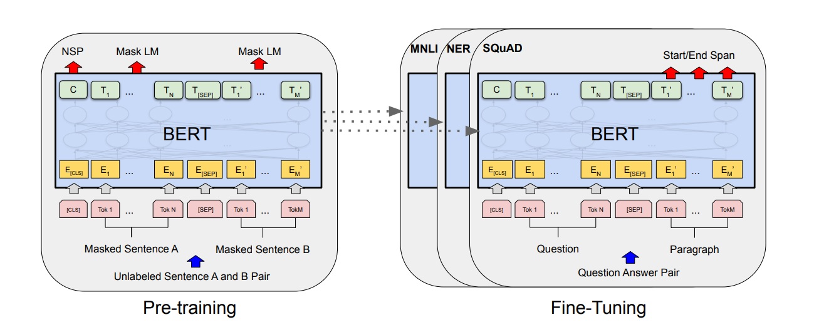
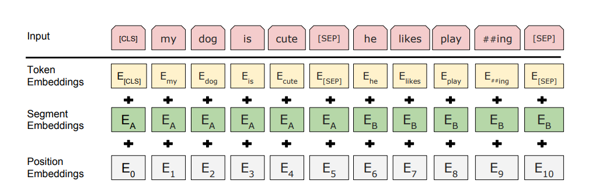
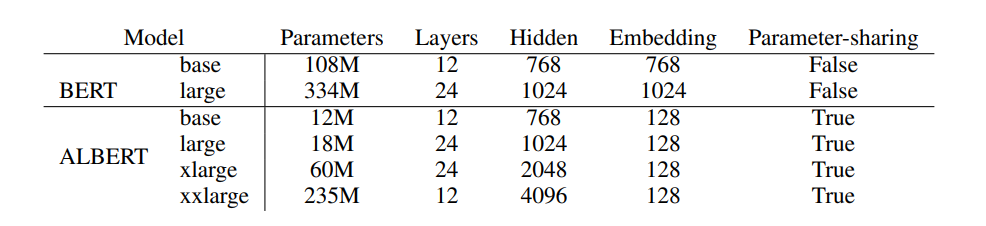

# Transformer系列论文
## 8.1 2019-BERT
- 用于语言理解的深度双向Transformer预训练 
(Pre-training of Deep Bidirectional Transformers for Language Understanding)
- BERT是一个跨不同任务的统一架构，分为两个步骤：预训练和微调。
- 在预训练阶段，通过不同的预训练任务在无标签数据上训练模型。对于微调，BERT模型首先使用预训练的参数进行初始化，所有的参数都使用来自下游任务的标记数据进行微调。每个下游任务都有单独的微调模型，即使它们是用相同的预训练参数初始化的。
- 下图是模型的一个示例：

### 8.1.1 模型结构
- BERT模型结构是一个多头双向Transformer编码器，我们记Transformer块的个数为 $L$，隐藏大小为 $H$，自注意力的头数为 $A$。
- 我们有两类主要的模型：
    - ${\rm{BERT}}_{\rm{BASE}}$：$L=20,H=768,A=12$，总参数量110M；
    - ${\rm{BERT}}_{\rm{LARGE}}$：$L=24,H=1024,A=16$，总参数量340M。

### 8.1.2 输入/输出表示
- 为了使BERT能够处理各种下游任务，我们的输入表示需要能够在一个token序列中明确地表示单个句子或一对句子。
- 我们使用有30000个token词汇表的WordPiece嵌入。每个序列的第一个标记总是一个特殊的分类标记([CLS])。它的最后的隐藏状态作为分类任务的聚合序列表示。
- 我们通过两种方式对句子进行区分。首先，我们用一个特殊的标记([SEP])将它们分开。其次，我们为每个标记添加一个可学习分隔嵌入，表示它属于句子A还是句子B。如前文示例图。
- 我们将输入嵌入记为 $E$，[CLS]的最后一层隐藏状态记为 $C\in\mathbb{R}^H$，第 $i$ 个输入token的最后一层隐藏状态记为 $T_i\in\mathbb{R}^H$。
- 对于给定的token，输入表示由三部分的和组成，分别是对应的token嵌入、分隔嵌入、位置嵌入。如图所示：

### 8.1.3 预训练BERT
- 我们使用两个无监督任务预训练BERT。
#### 任务1：掩码语言模型
- 标准的条件语言模型只能从左到右或从右到左进行训练，因为双向条件会使每个单词间接地"看到自己"。
- 为了训练一个深度的双向表示，我们随机对一些tokens进行掩码，然后预测那些被掩盖的tokens。与去噪自编码器不同的是，我们只预测掩码词，而不是重构整个输入，相当于是一个多分类问题。
- 在所有的实验中，每个序列我们随机掩码15%的tokens。
- 虽然我们可以获得双向预训练模型，但由于微调过程中不会出现[MASK]标记，在预训练和微调之间产生了不匹配。因此，实际上我们不总是用[MASK]替换被掩码的词。
- 训练集随机选择15%的tokens位置进行预测。如果选择了第 $i$ 个token，我们按照以下规则替换：
    - (1)80%的概率替换为[MASK]
    - (2)10%的概率替换为随机token
    - (3)10%的概率不变
- 然后使用交叉熵损失来预测原始token。

#### 任务2：预测下一个句子
- 问答(QA)和自然语言推理(NLI)等许多重要的下游任务都需要理解两句话之间的关系，而这不是通过语言建模直接捕获的。
- 为了训练理解句子关系的模型，我们预训练了一个可以从任何语料中生成下一个句子的预测任务。
- 具体来说，在选择句子对A和B作为样本时，50%的概率选择正确的(标记为IsNext)，50%的概率从语料库中随机选择(标记为NotNext)。

### 8.1.4 微调BERT
- Transformer中的自注意力机制允许BERT通过交换适当的输入和输出来建模许多下游任务。
- 对于涉及文本对的应用，一种常见的模式是在应用双向交叉注意力之前对文本对进行编码。BERT使用自注意力机制来统一这两个阶段，因为编码一个自注意力的concat文本对，能够包含两个句子之间的双向交叉注意力。
- 对于每个任务，我们只需将任务特定的输入和输出放入BERT中，然后端到端微调所有参数。
- 在输入端，预训练的句子A和句子B有以下几类：
    - (1)释义的句子对；
    - (2)假设-前提句子对；
    - (3)Q-A句子对；
    - (4)文本分类或序列标注中的退化文本。
- 在输出端，token表示被送入一个输出层，用于token层级的任务，如序列标注或问答。[CLS]表示被送入一个输出层，用于分类，如蕴含或情感分析。
- 与预训练相比，微调相对便宜。

## 8.2 2019-Fine-Tune BERT(Sun et al.)
- 如何微调BERT来进行文本分类 
(How to Fine-Tune BERT for Text Classification?)

### 8.2.1 文本分类的BERT
- ${\rm{BERT}}_{\rm{base}}$ 模型是一个Transformer编码器，包含12个Transformer块，12个自注意力头，隐藏单元大小为768。
- BERT接受不超过512个tokens的序列的输入，并输出该序列的表示。该序列有一个或两个片段，序列的第一个标记总是[CLS]，另一个特殊的标记[SEP]用于分离片段。
- 对于文本分类任务，BERT将第一个token[CLS]的最终隐藏状态 $h$ 作为整个序列的表示。在BERT的顶部添加一个简单的softmax分类器来预测标签 $c$ 的概率：
$$p(c|h)={\rm{softmax}}(Wh)$$
其中 $W$ 是任务特定的参数矩阵。
- 通过最大化正确标签的对数似然来联合微调BERT和 $W$ 中的所有参数。

### 8.2.2 方法
- 当我们将BERT适应于目标域中的NLP任务时，需要合适的微调策略。
- 本文从3个方面寻找合适的微调方法，包括微调策略、进一步预训练、多任务微调，方法之间的关系如图：

#### 微调策略
- 神经网络的不同层可以捕获不同层次的句法和语义信息。
- 为了使BERT适应目标任务，我们需要考虑几个因素：
    - (1)第一个因素是长文本的预处理，因为BERT的最大序列长度为512：
    - (2)层次选择，BERT基础模型有12层编码器，我们需要为文本分类任务选择最有效的层；
    - (3)过拟合问题，需要一个具有适当学习率的更好的优化器。
- 直观上，BERT模型的低层可能包含了更一般的信息。我们可以使用不同的学习率对它们进行微调。我们将参数 $\theta$ 拆分为 $\{\theta^1,\cdots,\theta^L\}$，其中 $\theta^l$ 包含BERT第 $l$ 层的参数。
- 然后根据下式更新参数：
$$\theta_t^l=\theta_{t-1}^l-\eta^l\cdot\nabla_{\theta^l}J(\theta)$$
其中 $\eta^l$ 表示第 $l$ 层的学习率。
- 我们使用衰减的学习率，将基础学习率设为 $\eta^L$，然后令 $\eta^{k-1}=\xi\cdot\eta^k$，其中，$\xi$ 为衰减因子，小于等于1，等于1时就是普通的SGD优化。

#### 进一步预训练
- BERT模型在通用领域语料库中进行预训练。对于特定领域的文本分类任务，其数据分布可能与BERT不同。
- 因此，我们可以进一步在特定领域的数据上，使用带掩码的语言模型预训练BERT和预测下一句任务。
- 可以采用三种预训练方式：
    - (1)任务内预训练，在目标任务的训练数据上进一步预训练BERT；
    - (2)领域内预训练，预训练数据来自目标任务同一领域的其他数据集，它们具有相似的数据分布。
    - (3)跨领域预训练，从相同领域和其他不同领域获取对目标任务的预训练数据。

#### 多任务微调
- 多任务学习也是从相关监督任务中获得知识的有效方法。我们也在多任务学习框架中使用微调BERT进行文本分类。
- 所有任务共享BERT层和嵌入层。唯一没有共享的层是最终的分类层，这意味着每个任务都有一个单独的分类器层。

## 8.3 2019-XLNet
- 面向语言理解的广义自回归预训练 
(XLNet: Generalized Autoregressive Pretraining for Language Understanding)

### 8.3.1 背景知识
- 给定文本序列 $\mathbf{x}=[x_1,\cdots,x_T]$，自回归(AR)语言建模通过最大化下述似然函数来进行预训练：
$$\mathop{\rm{max}}\limits_\theta{\quad}{\rm{log}}p_\theta(\mathbf{x})=\sum\limits_{t=1}^T{\rm{log}}p_{\theta}(x_t|\mathbf{x}_{<t})=\sum\limits_{t=1}^T{\rm{log}}\frac{{\rm{exp}}(h_\theta(\mathbf{x}_{1:t-1})^{\top}e(x_t))}{\sum_{x^\prime}{\rm{exp}}(h_\theta(\mathbf{x}_{1:t-1})^{\top}e(x^{\prime}))}$$
- 其中 $h_\theta(\mathbf{x}_{1:t-1})$ 是由RNNs或Transformer等神经模型产生的上下文表示，$e(x)$ 是$x$ 的嵌入。
- 相比之下，BERT基于去噪自编码器。具体而言，对于文本序列 $\mathbf{x}$，BERT首先通过随机掩码构造一个损坏版本 $\^{\mathbf{x}}$。掩码token记为 $\bar{\mathbf{x}}$。训练目标是从$\bar{\mathbf{x}}$ 中重构 $\^{\mathbf{x}}$：
$$\mathop{\rm{max}}\limits_\theta{\quad}{\rm{log}}p_\theta(\bar{\mathbf{x}}|\^{\mathbf{x}})\approx\sum\limits_{t=1}^Tm_t{\rm{log}}p_\theta(x_t|\^{\mathbf{x}})=\sum\limits_{t=1}^Tm_t{\rm{log}}\frac{{\rm{exp}}(H_\theta(\^{\mathbf{x}})_t^{\top}e(x_t))}{\sum_{x^\prime}{\rm{exp}}(H_\theta(\^{\mathbf{x}})_t^{\top}e(x^\prime))}$$
其中 $m_t=1$ 是指 $x_t$ 为掩码token，$H_\theta$ 是一个Transformer，将长度为 $T$ 的文本序列 $\mathbf{x}$ 映为一系列隐藏向量 $H_\theta(\mathbf{x})=[H_\theta(\mathbf{x})_1,H_\theta(\mathbf{x})_2,\cdots,H_\theta(\mathbf{x})_T]$。
- 两种预训练目标的优劣：
    - 独立性假设：BERT基于独立性假设，所有掩码tokens $\bar{\mathbf{x}}$ 是可分重构的，因此才可以对联合概率分布 $p(\bar{\mathbf{x}}|\^{\mathbf{x}})$ 进行因子分解。相比之下，AR语言建模目标直接对 $p_\theta(x)$ 进行因子分解，在没有独立性假设的情况下也成立。
    - 输入噪声：BERT的输入包含[MASK]等人工符号，这些符号在下游任务中从未出现，这会导致预训练-微调偏差。相比之下，AR语言建模不依赖于任何输入破坏，不受此问题的困扰。
    - 上下文依赖：AR表示 $h_\theta(\mathbf{x}_{1:t-1})$ 只在 $t$ 左侧的token的条件下，而BERT表示 $H_\theta(\mathbf{x}_{1:t-1})$ 需要两侧的上下文信息。因此，BERT能更好地捕获双向上下文信息。

### 8.3.2 置换语言建模目标
- AR语言建模和BERT具有各自独特的优势。我们提出了置换语言建模目标，该目标不仅保留了AR模型的优点，而且允许模型捕获双向上下文。
- 令 $\mathcal{Z}_T$ 是长度为 $T$ 的索引序列 $[1,2,\cdots,T]$ 的所有可能置换的集合。我们用 $z_t$ 和 $z_{<t}$ 表示置换 $z\in\mathcal{Z}_T$ 的第 $t$ 个元素和前 $t-1$ 个元素，我们提出的置换语言建模目标表示如下：
$$\mathop{\rm{max}}\limits_{\theta}{\quad}\mathbb{E}_{z{\sim}\mathcal{Z}_T}\left[\sum\limits_{t=1}^T{\rm{log}}p_{\theta}(x_{z_t}|\mathbf{x}_{z_{<t}})\right]$$
- 对于一个文本序列 $\mathbf{x}$，我们每次采样一个置换 $\mathbf{z}$，并根据置换来分解似然函数 $p_\theta(x)$。因为模型参数 $\theta$ 在所有的分解顺序中共享，所以 $x_t$ 能够得到所有 $x_i{\neq}x_t$ 的信息，因此能够捕获双向上下文信息。此外，由于该目标符合AR框架，自然避免了独立性假设和预训练-微调偏差。
- 我们保持原始序列的顺序，只置换因式分解的顺序。使用原始序列对应的位置编码，并依靠Transformers中适当的注意力掩码来实现分解顺序的置换。

### 8.3.3 架构：面向目标感知表示的双流自注意力
- 虽然置换语言建模目标满足我们想要的性质，但标准的Transformer参数化可能不起作用。为了解决这个问题，假设我们使用标准的Softmax分类来参数化 $p_\theta(X_{z_t}|\mathbf{x}_{z_{<t}})$：
$$p_\theta(X_{z_t}=x|\mathbf{x}_{z_{<t}})=\frac{{\rm{exp}}(e(x)^{\top}h_\theta(\mathbf{x}_{z_{<t}}))}{\sum_{x^\prime}{\rm{exp}}(e(x^\prime)^{\top}h_\theta(\mathbf{x}_{z_{<t}}))}$$
其中 $h_\theta(\mathbf{x}_{z_{<t}})$ 表示经过共享masked Transformer网络后产生的 $\mathbf{x}_{z_{<t}}$ 的隐藏表示。
- 注意到 $h_\theta(\mathbf{x}_{z_{<t}})$ 并不取决于它将预测哪个位置，即 $z_t$ 的值。因此，无论目标位置如何，都会预测出相同的分布，从而无法学习到有用的表示。为了避免这个问题，我们提出了重参数化技巧来感知目标位置：
$$p_\theta(X_{z_t}=x|\mathbf{x}_{z_{<t}})=\frac{{\rm{exp}}(e(x)^{\top}g_\theta(\mathbf{x}_{z_{<t}},z_t))}{\sum_{x^\prime}{\rm{exp}}(e(x^\prime)^{\top}g_\theta(\mathbf{x}_{z_{<t}},z_t))}$$
其中 $g_\theta(\mathbf{x}_{z_{<t}},z_t)$ 是以目标位置 $z_t$ 作为输入的新表示。

#### 双流自注意力
- 计算 $g_\theta(\mathbf{x}_{z_{<t}},z_t)$ 是一个非平凡的问题。
    - 为了预测token $x_{z_t}$，$g_\theta(\mathbf{x}_{z_{<t}},z_t)$ 应该只使用位置 $z_t$ 而不使用文本 $x_{z_t}$；
    - 为了预测其他的token $x_{z_j},j>t$，$g_\theta(\mathbf{x}_{z_{<t}},z_t)$ 应该编码文本 $x_{z_t}$ 来提供完整的文本信息。
- 这导致了一个矛盾，因此我们提出两类隐藏表示，来解决这个问题：
    - 文本表示 $h_\theta(\mathbf{x}_{z_{{\leq}t}})$，简记为 $h_{z_t}$，与Transformer中的标准隐藏状态类似。这种表示同时编码了语境和 $x_{z_t}$ 本身；
    - query表示 $g_\theta(\mathbf{x}_{z_{<t}},z_t)$，简记为 $g_{z_t}$，只获取上下文信息 $\mathbf{x}_{z_{<t}}$ 和位置 $z_t$，不获取内容信息 $x_{z_t}$。
- 在计算上，第一层query流使用可训练向量进行初始化，即 $g_i^{(0)}=w$ ，而内容流设置为对应的词嵌入，即 $h_i^{(0)}=e(x_i)$。对于每一个自注意力层 $m=1,\cdots,M$，通过共享权重来更新两种表示：
$$\begin{align*}
g_{z_t}^{(m)}&\leftarrow{\rm{Attention}}(Q=g_{z_t}^{(m-1)},KV=h_{z{<t}}^{(m-1)};\theta)\\
h_{z_t}^{(m)}&\leftarrow{\rm{Attention}}(Q=h_{z_t}^{(m-1)},KV=h_{z{{\neq}t}}^{(m-1)};\theta)
\end{align*}$$
其中 $Q,K,V$ 是注意力操作中的query、key和value。更新规则与标准的自注意力更新完全相同，因此在微调时，可以去掉query流，将内容流作为普通的Transformer(-XL)。
- 最后，我们可以使用最后一层query表示 $g_{z_t}^{(M)}$ 来计算之前定义的条件概率。
- 相对位置编码如下示意图：

#### 局部预测
- 虽然置换语言建模目标有很多好处，但由于置换的存在，优化变得更困难，收敛缓慢。为了降低优化难度，我们只预测因子分解顺序中的最后一个token。
- 形式上，我们将 $\mathbf{z}$ 分为非目标子序列 $z_{{\leq}c}$ 和目标子序列 $z_{>c}$，其中 $c$ 为切割点。目标是最大化以下对数似然：
$$\mathop{\rm{max}}\limits_\theta{\quad}\mathbb{E}_{z{\in}\mathcal{Z}_T}\left[{\rm{log}}p_\theta(\mathbf{x}_{z_{>c}}|\mathbf{x}_{z_{{\leq}c}})\right]=\mathbb{E}_{z{\in}\mathcal{Z}_T}\left[\sum\limits_{t=c+1}^{|\mathbf{z}|}{\rm{log}}p_\theta(x_{z_t}|\mathbf{x}_{z_{<t}})\right]$$
注意，$z_{>c}$ 被选为目标是因为它在当前分解的序列中拥有最长的上下文。
- 用一个超参数 $K$ 使得大约 $1/K$ 个tokens被选择用于预测；即 $|z|/(|z|-c){\approx}K$。对于未选择的tokens，不需要计算它们的query表示，从而节省了速度和内存。

### 8.3.4 融合Transformer-XL
- 由于我们的目标函数适用于AR框架，我们将最先进的AR语言模型Transformer-XL纳入到我们的预训练框架中。
- 我们在Transformer-XL中集成了两个重要的技术，相对位置编码方案和分段递归机制。前文讨论了相对位置编码技术，现在我们讨论如何将递归机制集成到所提出的置换中，并使模型能够重用以前片段中的隐藏状态。
- 假设我们有两个片段取自一个长序列 $s$：$\tilde{\mathbf{x}}=s_{1:T}$ 和 $\mathbf{x}=s_{T+1:2T}$。令 $\tilde{z}$ 和 $z$ 分别为 $[1,\cdots,T]$ 和 $[T+1,\cdots,2T]$ 的置换。然后，基于置换 $\tilde{z}$ 对第一个片段进行处理，对每一层 $m$ 缓存得到的内容表示 $\tilde{h}^{(m)}$。对于下一个片段 $\mathbf{x}$，按下式更新注意力：
$$h_{z_t}^{(m)}\leftarrow{\rm{Attention}}(Q=h_{z_t}^{(m-1)},KV=[\tilde{h}^{(m-1)},h_{z_{{\leq}t}}^{(m-1)}];\theta)$$
其中 $[\cdot,\cdot]$ 是序列维度的concat操作。
- 位置编码只依赖于原始序列中的实际位置。因此，一旦获得表示 $\tilde{h}^{(m)}$，上述注意力更新便与 $\tilde{z}$ 无关。这样就可以在不知道上一段分解顺序的情况下，进行缓存和重用。
- 在预期情况下，模型能学习并利用最后一个片段的所有因子分解顺序。query流可以用同样的方式计算。
- 递归机制如下示意图：

### 8.3.5 多段建模
- 许多下游任务具有多个输入片段，例如QA中的问题和上下文段落。我们现在讨论如何在自回归框架中预训练XLNet来建模多个片段。
- 在预训练阶段，遵循BERT，我们随机采样两段(要么来自同一语境,要么来自不同语境)，并将两段concat为一个序列来进行置换语言建模。我们只重用属于同一上下文的记忆。
- 我们的模型输入与BERT相同：
$$[{\rm{CLS,A,SEP,B,SEP}}]$$
其中'SEP'和'CLS'是两个特殊符号，'A'和'B'是两个文本段。
- 尽管我们采用两段数据的格式，但XLNet-Large没有使用下一个句子预测的目标，因为在消融研究中没有表现出改进。
#### 相对位置编码
- 在结构上，不同于BERT在每个位置的词嵌入中添加分隔嵌入，我们扩展了Transformer-XL的相对编码的思想，
对片段也进行编码。
- 给定序列中的一对位置 $i$ 和 $j$，如果 $i$ 和 $j$ 来自同一个片段，我们使用一个片段编码 $s_{ij}=s_+$，否则使用 $s_{ij}=s_-$，其中 $s_+$ 和 $s_-$ 是每个注意力头的可学习参数。
- 我们只考虑两个位置是否在同一片段内，而不是考虑它们来自哪个特定片段。这与相对编码的核心思想是一致的；即只对位置之间的关系进行建模。
- 当i关注j时，使用分段编码 $s_{ij}$ 来计算注意力权重：
$$a_{ij}=(q_i+b)^{\top}s_{ij}$$
其中 $q_i$ 是query向量，$b$ 是可学习的偏置向量。
- 最后，将 $a_{ij}$ 加入到注意力权重中。
- 使用相对分段编码有两个好处。首先，相对编码的归纳偏置提高了泛化性。其次，它使两个以上任务进行微调成为可能。

## 8.4 2020-ALBERT
- 用于语言表示的自监督学习的简化版Bert 
(ALBERT: A Lite BERT for Self-Supervised Learning of Language Representations)

### 8.4.1 模型结构
- ALBERT架构的主干与BERT类似，使用Transformer编码器。我们遵循BERT的符号，词汇嵌入大小为 $E$，编码器层数为 $L$，隐藏层大小为 $H$。我们将前馈/滤波大小设置为 $4H$，注意力头数设置为 $H/64$。

#### 因子化嵌入参数化
- 在BERT、XLNet、RoBERTa中，WordPiece嵌入尺寸 $E$ 与隐藏层大小 $H$ 相关：$E{\equiv}H$。
- 从建模的角度来看，WordPiece嵌入旨在学习上下文无关的表示，而隐藏层嵌入旨在学习上下文相关的表示。因此解除这个限制后，我们能根据需求更有效的利用模型参数，也就是说 $H{\gg}E$。
- 从实际应用的角度来看，自然语言处理通常要求词汇表大小 $V$ 较大。如果 $E{\equiv}H$，那么增加 $H$ 会增加嵌入矩阵的大小，其中嵌入矩阵的大小为 $V{\times}E$。很容易导致模型有数十亿的参数，其中大部分参数在训练时只会进行稀疏的更新。
- 因此，我们对嵌入矩阵进行因子分解，首先将其投影到大小为 $E$ 的低维嵌入空间，然后再将其投影到隐空间。通过这种分解，我们将嵌入参数从 $\mathcal{O}(V×H)$ 变为 $\mathcal{O}(V{\times}E+E{\times}H)$。当 $H{\gg}E$ 时，参数量的减少是显著的。
- 我们对所有的单词块使用相同的 $E$，因为它们在文档中分布均匀，不同的词使用不同的嵌入大小是重要的。

#### 跨层参数共享
- 我们提出跨层参数共享作为提高参数效率的另一种方式。实验中默认跨层共享所有参数。

#### 句间连贯损失
- 除了掩码语言建模(MLM)损失，BERT还使用了另一个损失，即下一句预测(NSP)。NSP是一种二分类损失，用于预测两个片段是否在原始文本中连续出现。
- NSP目标旨在提高下游任务的性能。然而，随后的研究发现NSP的影响是不可靠的，在去掉这一部分后，多个下游任务的表现有所改善。
- 我们猜测NSP无效的主要原因是其任务难度与MLM相比不足。因此我们使用一个句子顺序预测(SOP)损失，它专注于句子间连贯性的建模。来自同一文档的两个连续片段作为正例，同样的两个句子但交换顺序作为负例。

### 8.4.2 超参数设置
- 下表展示了BERT和ALBERT模型超参数设置的差异：

- ALBERT模型比对应的BERT模型具有更小的参数规模。