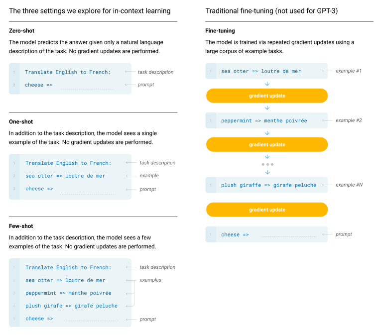
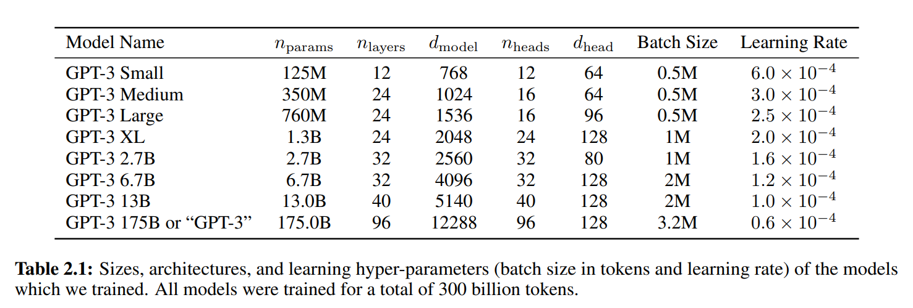
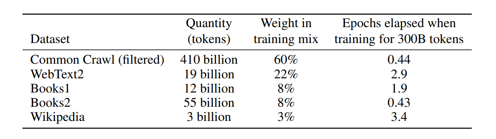
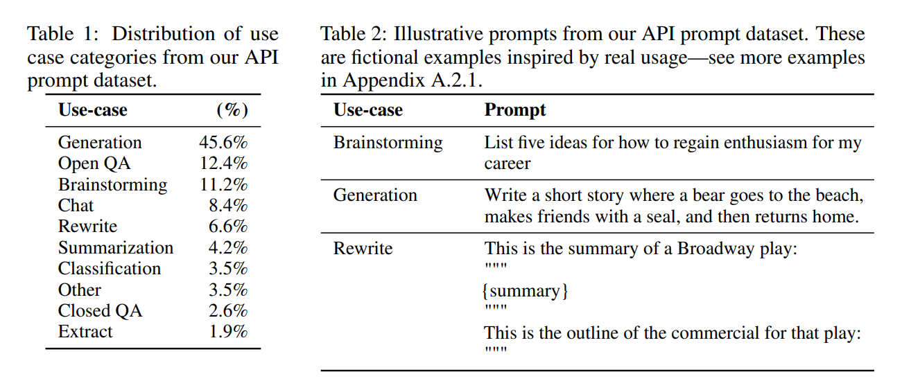

# GPT系列论文泛读
## 9.1 RLHF
- Augmenting Reinforcement Learning with Human Feedback 
(基于人工反馈的增强强化学习)

### 9.1.1 预备工作
#### 强化学习
- 我们假定任务环境是一个马尔可夫决策过程(MDP) $(S,A,T,\gamma,D,R)$，$S$ 是状态集合，$A$ 是动作集合，$T$ 是转移函数：
$$T: S{\times}A{\times}{S}\rightarrow\mathbb{R}$$ 
给定状态 $s_t$ 和动作 $a_t$，转移函数映为 $s_{t+1}$。$\gamma$ 是折扣因子，使未来的奖励函数指数降低。$D$ 是起始状态的分布，$R$ 是关于 $s_t,a_t,s_{t+1}$ 的奖励函数：
$$R: S{\times}A{\times}S\rightarrow\mathbb{R}$$
- 强化学习算法，通过最大化MDP过程的回报函数来学习一个策略 $\pi:S{\rightarrow}A$，回报函数为：
$${\rm{return}}=\sum\limits_{t=0}^TE[\gamma^tR(s_t,a_t,s_{t+1})]$$ 
- 本文主要使用SARSA算法，通过人类的强化信号来增强TAMER-based学习。

#### 交互式TAMER框架
- TAMER框架是一种通过人类反馈信号指导智能体学习的方法。它模拟人类行为价值来指导智能体的行动判断。通过实时回归建立人类行为价值函数 $\hat{H}$，确定最佳行动方式。
- 该框架假设人类的反馈能够完全地指示当前状态下某行为的优劣，建立一个人类强化函数来实时地进行回归：
$$\hat{H}: S{\times}A{\rightarrow}R$$
每个强化为状态-动作对产生一个标签。智能体通过下式来决定动作，从而学习到经验：
$$a={\rm{argmax}}_a[\hat{H}(s,a)]$$

### 9.1.2 连续TAMER+RL
- TAMER强化学习算法能够快速学习，但是在性能方面表现较差。本文将TAMER算法与SARSA算法结合，称为TAMER+RL算法，以期在长程学习中获得更好的策略。
#### 组合技术
有4种技巧能够提升算法的性能，分别为：
- 奖励塑造，通过将一个重构函数的输出添加到原始MDP奖励中来创建一个新的奖励进行学习：
$$R^{\prime}(s,a)=R(s,a)+(\beta{\times}\hat{H}(s,a))$$
- Q函数增强，在 $Q$ 函数的更新中额外使用 $\hat{H}$：
$$Q^{\prime}(s,a)=Q(s,a)+(\beta{\times}\hat{H}(s,a))$$
- 动作偏置，仅在动作选择中引入一个启发式函数：
$$Q^{\prime}(s,a)=Q(s,a)+(\beta{\times}\hat{H}(s,a))$$
- 控制共享，$\pi$ 重用探索策略，只影响动作选择，直接探索人类喜欢的状态-动作对：
$$P(a={\rm{argmax}}_a[\hat{H}(s,a)])={\rm{min}}(\beta,1)$$
否则使用基础的强化学习动作选择机制。
- 在上述式子中，$\beta$ 是超参数，实验中通过一个预定义的因子在每个episode后进行降低。
#### 连续学习实验
- 使用来自Knox和Stone的原始 $\hat{H}$ 表示法、任务设置、SARSA参数和训练记录，使用四种组合技术和一系列 $\beta$ 参数，在Mountain Car任务上复现实验。然后将这些TAMER+RL技术在第二个任务Cart Pole上进行测试。实验结果如下图：

 
#### 实验结果讨论
- 从实验结果可以得到，只影响行动选择的技术(action biasing和control sharing)比其他技术(reward shaping和Q augmentation)更有效。在两个不同的任务(Mountain Car和Cart Pole)中，action biasing和control sharing表现最好，Q augmentation有一些改进，而reward shaping的表现则不如人意。
- 直接影响行动选择的技术越多，其表现越好，而对Q函数的更新影响越大，则表现越差。因此，建议在结合人类引导和强化学习时，应该继续关注行动选择的技术，而保持行动价值模型的更新。

### 9.1.3 同时学习TAMER + RL
- 同时学习要求智能体同时从两个反馈模式中学习，一个是人类反馈，另一个是MDP奖励。在同时学习过程中，需要考虑保持智能体行为的一致性、对训练者的反应性、以及训练者对仅基于RL策略的反馈。
- 如果在学习的早期进行训练，可以获得最大的收益。需要注意的是，在训练的过程中保证良好的人机交互效果。
- 最后，文章介绍了一个决定人类影响的模块，用于平衡人类重视的训练和学习过程。并提出了未来工作的方向。
#### 确定 $\hat{H}$ 的即时影响
- 在同时学习模式下，人类训练者可以在学习过程的任意时刻进行干预。在状态-动作空间中，近期获得强化信号的区域应该提高训练者对其的影响，而未被反馈的区域则不应该增加训练者的影响。
- 我们通过强化学习中常用的资格迹(eligibility traces)来确定 $\hat{H}$ 的影响，称为资格模块。该模块的一般思想是，为每个状态动作特征赋一个归一化的资格迹，和时间步特征向量共同计算了近期程度。
- 令 $\mathop{e}\limits^{\rightarrow}$ 表示迹向量，$\mathop{f_n}\limits^{\rightarrow}$ 是归一化特征向量。归一化点积记为 $n(\mathop{e}\limits^{\rightarrow}\cdot\mathop{f_n}\limits^{\rightarrow})$，定义为：
$$n(\mathop{e}\limits^{\rightarrow}\cdot\mathop{f_n}\limits^{\rightarrow})=\mathop{e}\limits^{\rightarrow}\cdot(\mathop{f_n}\limits^{\rightarrow}/\|\mathop{f_n}\limits^{\rightarrow}\|_1)=(\mathop{e}\limits^{\rightarrow}\cdot\mathop{f_n}\limits^{\rightarrow})/(\|\mathop{f_n}\limits^{\rightarrow}\|_1)$$
- 令 $\beta$ 表示标量点积，我们有：
$$\beta=c_s(n(\mathop{e}\limits^{\rightarrow}\cdot\mathop{f_n}\limits^{\rightarrow}))=c_s(\mathop{e}\limits^{\rightarrow}\cdot\mathop{f_n}\limits^{\rightarrow})/(\|\mathop{f_n}\limits^{\rightarrow}\|_1)$$
- 对于给定的 $\mathop{e}\limits^{\rightarrow}$，当较大特征值对应较大的迹时，$\beta$ 较高，表明当前状态-动作对与最近训练的状态-动作对相似。而当较大的特征值对应较小的迹值时，$\beta$ 较小。
- 在训练过程中通过下式更新迹：
$$e_i:={\rm{min}}(1,e_i+(f_{n,i}{\times}a))$$
其中 $e_i$ 和 $f_{n,i}$ 是 $\mathop{e}\limits^{\rightarrow}$ 和 $\mathop{f_n}\limits^{\rightarrow}$ 的第 $i$ 个元素，$a$ 是一个常数因子，用来调节积累的速度。

#### 同时学习实验
- 本文介绍了在学习开始前或已经发生一些学习后，同时使用TAMER和RL的有效性实验。主要考虑了动作偏向和控制共享两种最佳组合技术。
- 对于资格模块，分别在动作偏向和控制共享中，将Mountain Car和Cart Pole的缩放参数 $c_s$ 分别设置为100和200，2和1，以达到每种方法中的有效 $\beta$ 值上限。积累因子 $a$ 为0.2。
- Mountain Car训练16个episode，或者在20个episode的SARSA-only后再训练12个episode，Cart Pole训练12个episode，或者在25个episode的SARSA-only后训练8个episode。
- 此外，实验时增加了启动和停止训练的按钮，人类训练师可以在特定的episode中操作来观察实验。

#### 结果和讨论
- 实验结果如下图：

- 结果表明action biasing和control sharing均优于SARSA。在Cart Pole上进行的control sharing实验中，与SARSA标准误差最接近的条件、即训练25次后开始训练，其奖励值仍然是SARSA的两倍。
- 在学习的开始阶段进行训练比在自主学习后进行训练更有效。
- 此外，作者还探讨了在训练之前的RL-only学习是否有帮助。通过对比4组的平均奖励，结果显示RL-only组中，有3个任务的表现比另一组强。
- 这些结果证明了使用TAMER+RL的资格模块同时训练的有效性。

### 9.1.4 总结
- TAMER+RL是一种结合了人类示范学习和强化学习的算法。在这个算法中，人类提供了环境中何时应该采取哪些动作的示例，而强化学习负责从示例中学习，并在示例不可用时进行探索。
- TAMER+RL算法通过将人类示范的信息转化为强化信号来加快学习过程。具体来说，TAMER+RL算法使用一个神经网络来表示学习代理，并通过人类示范的反馈数据进行监督学习。如果代理根据示例选择了正确的动作，则强化信号为正，否则是负的。在随后的强化学习过程中，代理将使用强化学习方法来更新自己的策略，并尝试最大化累积奖励。
- TAMER+RL算法的优点在于它可以有效利用人类示范的信息来加速学习和提高性能，同时也能够自适应地进行探索和学习。

## 9.2 2018-GPT1
- 通过生成式预训练提高语言理解能力 
(Improving Language Understanding by Generative Pre-Training)
### 9.2.1 模型架构
- 训练过程包括两个阶段。第一阶段是在大规模文本语料上学习大语言模型。然后是微调阶段，将模型适应于带有标签数据的判别性任务。
#### 无监督预训练
- 给定无监督语料库，tokens $\mathcal{U}=\{u_1,\cdots,u_n\}$，我们用一个标准的语言模型，最大化对数似然如下：
$$L_i(\mathcal{U})=\sum\limits_i{\rm{log}}P(u_i|u_{i-k},\cdots,u_{i-1};\Theta)$$
其中 $k$ 是文本窗口的大小，条件概率 $P$ 使用一个神经网络模型来建模，$\Theta$ 是模型参数，使用SGD来训练。
- 在实验中，我们使用多层Transformer解码器，解码器包括一个多头注意力算子，后接逐元素前馈层来输出一个目标分布：
$$\begin{align*}
h_0&=UW_e+W_p\\
h_l&={\text{transformer}}\_{\text{block}}(h_{l-1}),\quad{\forall}i{\in}[1,n]\\
P(u)&={\rm{softmax}}(h_nW_e^{\top})
\end{align*}$$
其中 $U=(u_{-k},\cdots,u_{-1})$ 是上下文向量，$n$ 是解码器的层数，$W_e$ 是token嵌入矩阵，$W_p$ 是位置嵌入矩阵。

#### 有监督微调
- 通过最大化对数似然训练模型后，我们将训练好的参数应用到有监督的目标任务上来进行微调。
- 我们假定标签数据集为 $\mathcal{C}$，每个实例由一个输入token序列组成，$x^1,\cdots,x^m$ 对应标签 $y$。将数据输入到预训练模型中，得到最后一层Transformer块的隐状态 $h_l^m$，然后通过一个加性输出层来预测标签 $y$：
$$P(y|x^1,\cdots,x^m)={\rm{softmax}}(h_l^mW_y)$$
- 通过最大化如下对数似然来进行优化：
$$L_2(\mathcal{C})=\sum\limits_{(x,y)}{\rm{log}}P(y|x^1,\cdots,x^m)$$
- 将语言模型的目标加入进来能够提高监督模型的泛化性，并且能够加速收敛：
$$L_3(\mathcal{C})=L_2(\mathcal{C})+\lambda{\cdot}L_1(\mathcal{C})$$

#### 面向任务的输入变换
- 对于文本分类等任务我们可以直接微调我们的模型。对于某些有结构化的输入的任务，如问答或文本蕴涵，由于预训练模型是在连续的文本序列上训练的，我们需要做一些修改才能将其应用到这些任务中。
- 之前的工作提出了基于迁移表示学习的任务架构。相反，我们使用一种遍历式方法，将结构化的输入转换为我们预训练模型可以处理的有序序列。避免对体系结构进行大范围的更改。
###### 文本蕴含
- 对于文本蕴含任务，我们将前提 $p$ 和假设 $h$ 的token序列concat起来，中间加入一个分隔符($\$$)来区分。
###### 相似性任务
- 对于相似性任务，被比较的两个句子没有内在的先后顺序。为了体现这一点，我们修改输入序列，使其包含两种可能的句子排序(中间带有分隔符)，并分别处理，得到两个序列表示 $h_l^m$，然后逐元素相加，再放入线性输出层。
###### QA和常识推理
- 给定文本文档 $z$，问题 $q$ 和一组可能的答案 $\{a_k\}$。我们将文档和问题与每个答案concat起来，并加入分隔符，得到 $[z;q;\$;a_k]$。
- 每一个都用模型单独处理，然后通过softmax分类器来得到可能答案的输出分布。

## 9.3 2019-GPT2
- 语言模型是无监督的多任务学习器 
(Language Models are Unsupervised Multitask Learners)
### 9.3.1 主要方法
- 方法的核心是语言模型。通常是一个无监督的分布估计框架，输入一组示例 $(x_1,x_2,\cdots,x_n)$，每个示例由可变长度的序列组成 $(s_1,s_2,\cdots,s_n)$。语言有自然的顺序，将符号上的联合概率分解为条件概率的乘积：
$$p(x)=\prod\limits_{i=1}^np(s_n|s_1,\cdots,s_{n-1})$$
这个方法比形式 $p(s_{n-k},\cdots,s_n|s_1,\cdots,s_{n-k-1})$ 更好处理。
- 学习单一任务可以用概率框架来估计条件分布 $p({\rm{output}}|{\rm{input}})$。而通用系统应该能够执行多任务，即使输入相同，也应该根据任务的不同来得到不同的输出，即 $p({\rm{output}}|{\rm{input}},{\rm{task}})$。
- 在多任务和元学习中，通常通过架构来实现，如任务特定的编码器和解码器。或在算法级别实现，如MAML中的内部和外部环优化框架。McCann等人将任务、输入和输出，全部作为符号序列。
- 初步实验证明，充分大的语言模型能够在这种情境下进行多任务学习，但学习速度要慢很多。

#### 训练集
- 我们希望建立尽可能大和多样化的数据集，以便在尽可能多的领域和上下文中收集任务的自然语言示范。
- 通过网页抓取可以获得多样化和几乎无限的文本。这些文档比当前的语言建模数据集大许多数量级，但它们存在显著的数据质量问题。
- 相反，我们创建了一个新的网页抓取，但更强调文档的质量。为了做到这一点，我们通过人来进行整理和过滤。手动过滤网页抓取是昂贵的，因此我们从Reddit(社交媒体平台)中筛选链接，观察用户觉得链接是否有趣、有教育意义或只是好玩来作为一个启发式指标。
- 生成的数据集WebText包含了这4500万条链接。我们使用了Dragnet和Newspaper内容提取器来从HTML获得响应并提取文本。
- WebText不包括2017年12月以后创建的链接，经过去重和一些启发式的清理后，包含的文档超过800万个，共计40GB。
- 我们从WebText中删除了所有的维基百科文档，因为它们是其他数据集的共同数据源。训练数据与测试评估任务重叠可能会导致分析更复杂。

#### 输入表示
- lowercasing, tokenization, 和out-of-vocabulary tokens这些预处理步骤具有局限性。
- 另外，在大规模数据集中单个字节的识别效果不如单词级别的语言模型。
- Byte Pair Encoding(BPE)是一种介于字符和单词级别的语言建模方法。在频繁出现的符号序列上处理单词级别的输入，而在不常见的符号序列上处理字符级别的输入。实现BPE的方法通常是在Unicode编码上操作，要模拟所有Unicode字符串需要超过130,000个词汇表。相比之下，字节级别的BPE只需要256个词汇表。
- 但是，直接应用BPE到字节序列会导致子优化合并，因为BPE使用贪心的基于频率的启发式方法来建立词汇表。BPE在很多情况下都包含了常见单词的多个变体，如dog、dog!、dog?等，导致词汇表空间不足，模型能力不足。
- 为避免这种情况，在任何字节序列上都不允许BPE横跨字符类别进行合并，并为空格增加了特例。这样可以显著提高压缩效率，在多个词汇标记上只造成了微小的单词分散。
- 这种输入表示允许我们将单词级LM的好处与字节级方法的一般性结合起来。由于我们的方法可以为任何Unicode字符串分配一个概率，这使得我们可以在任何数据集上评估我们的LM，而不管是预处理、tokenization还是vocab大小。

#### 模型
- 我们使用了基于Transformer的LM架构。该模型基本沿用了GPT1模型的细节，并做了少量修改。
- 层归一化被移动到每个子块的输入中，类似于一个预激活残差网络，并在最后的自注意力块后添加一个额外的层归一化。
- 考虑到模型深度上的残差累积，我们使用一个修改后的初始化方法。在初始化时通过一个因子 $1/\sqrt{N}$ 对残差层的权重进行缩放，其中 $N$ 为残差层的数量。
- 词汇表扩展到50257个词，上下文大小从512个标记增加到1024个标记，并使用更大的512的batchsize。

### 9.3.2 实验
- 在4个数据集上进行实验，部分实验结果如图：

## 9.4 2020-GPT3
- 语言模型是少样本学习 
(Language Models are Few-Shot Learners)

### 9.4.1 方法
- 主要的预训练方法与GPT2类似。
#### 微调(Fine-Tuning)
- 在有监督数据集中更新预训练模型的权重。微调的优势是能够提升模型的表现，缺点是需要为每个任务创建一个新的大数据集，可能会导致不良的分布外泛化，以及可能会利用训练数据的虚假特征，潜在地导致与人类表现不公平的比较。
- 在这项工作中，我们不对GPT-3进行微调，因为我们关注的是与任务无关的性能，但原则上可以对GPT-3进行微调，这是未来工作的一个有前途的方向。
#### 少样本学习(Few-Shot)
- Few-Shot指代模型在推理时只给定少量任务演示(即条件)，但不允许进行权重更新的情况。
- Few-Shot通过给出K个上下文和结果示例，然后给出一个最终的上下文示例，来期望模型提供结果。我们通常将K设定在10到100的范围内，因为这样适应于模型的上下文窗口(nctx = 2048)。
- Few-Shot的主要优点是大大降低了对特定任务数据的需求，并减少了从大而窄的微调数据集中学习过于狭窄分布的潜力。其主要缺点是目前这种方法的结果远远不及最先进的微调模型。此外，仍需要一小部分特定任务的数据。
#### 单样本学习(One-Shot)
- One-Shot与少样本学习类似，只允许一个示例，此外还要提供任务的自然语言描述，
#### 零样本学习(Zero-Shot)
- Zero-Shot与One-Shot相同，但不提供示例，仅给出自然语言命令来描述任务。这种方法提供了最大的便利性、鲁棒性和避免虚假相关性(除非它们广泛地出现在预训练数据的大语料库中)，但也是最具挑战性的设置。
- 在某些情况下，甚至人类也很难在没有先前示例的情况下理解任务格式，因此在某些情况下这种情境是“不公平的困难”的。尽管如此，对于某些设置来说，Zero-Shot最接近人类执行任务的方式。

### 9.4.2 模型架构
- 我们使用与GPT-2相同的模型和架构，包括其中描述的改良版初始化，预归一化和可逆tokenization，但我们在Transformer层中使用交替的密集和局部带状稀疏注意力机制。
- 我们训练了8种不同大小的模型，如下表：

其中 $n_{\rm{params}}$ 是可训练参数的总数，$n_{\rm{layers}}$ 是总层数，$d_{\rm{model}}$ 是每个bottleneck层的单元数(前馈层始终比bottleneck层大4倍，$d_{\rm{ff}}=4d_{\rm{model}})$，$d_{\rm{head}}$ 是多头注意力的头数。所有模型都使用 $n_{\rm{ctx}}=2048$ 个tokens的上下文窗口。

### 9.4.3 训练数据集
- 包括近一万亿个单词的Common Crawl数据集，规模足以训练我们最大的模型，以至于不会在相同的序列上重复训练两次。
- 未经筛选或轻度筛选的Common Crawl比经过筛选的数据集品质低。因此，我们采取了三个步骤来提高品质：
    - (1)下载并过滤了一个基于高质量参考语料库相似度的Common Crawl
    - (2)跨数据集和数据集内部进行文档级别的模糊去重，以防止冗余，保证验证集作为过拟合度量的完整性
    - (3)添加了已知的高质量参考语料库到训练集中，以增加Common Crawl的多样性。

- 在训练期间，更高质量的数据集采样更频繁。这个操作本质上造成了一定程度的过拟合，但换取了更高质量的训练数据。
- 大型模型在预训练时很可能意外看到了测试集或验证集，从而对下游任务产生污染。我们搜索并试图删除本文研究中所有在测试集出现的重叠部分。不幸的是，过滤中的一个错误导致我们忽略了一些重叠部分，而由于训练成本很高，重新训练模型并不可行。在未来我们将更积极地删除数据污染。

### 9.4.4 训练过程
- 更大的模型通常可以使用更大的batchsize，但需要使用更小的学习率。我们在训练过程中测量了梯度噪声大小，并使用它来指导我们选择batchsize。
- 为了训练更大的模型而不耗尽内存，我们在每个矩阵乘法中使用了模型并行，在网络层之间使用了模型并行。

### 9.4.5 模型评估
- 对于小样本学习，我们通过从任务的训练集中随机抽取 $K$ 个样本作为条件来评估验证集中的每个示例，并根据任务的不同情况用1到2行来描述限定条件。
- $K$ 的取值从0到 $n_{\rm{ctx}}=2048$，通常取10到100个示例。通常使用较大的K值，但并不总是更好，因此当有独立的测试集和验证集时，我们在验证集上尝试几个K值，在测试集上运行最佳值。
- 在选择题的任务中，我们提供K个上下文加正确选项的示例，然后提供一个仅有上下文的示例，比较每个预测结果的概率。对于大多数任务，我们比较pre-token likelihood，但在一些数据集(ARC、OpenBookQA和RACE)上，我们通过计算 $\frac{P({\rm{completion}}|{\rm{context}})}{P({\rm{completion}}|{\rm{answer}}\_{\rm{context}})}$ 来归一化每个任务的无条件概率，在验证集上衡量附加收益。答案上下文是字符串"Answer:"或"A:"，用于提示输出的应该是答案。
- 在涉及二元分类的任务中，我们赋予选项更具有语义意义的名称(例如"True"或"False"而不是0或1)，然后将任务视为选择题。
- 在自由形式的任务中，我们使用宽度为4，长度惩罚 $\alpha=0.6$ 的束搜索。使用F1相似度评分、BLEU或精确匹配来评估模型，具体取决于数据集的标准。

## 9.5 2022-Learning to summarize from human feedback
- 从人类反馈中学习摘要 
(Learning to summarize from human feedback)

### 9.5.1 方法论
我们从一个初始化策略开始，在数据集上通过监督学习进行微调。由3步组成，可以重复迭代。
- 步骤1，根据不同策略收集多个候选版本然后人工选取：每个Reddit post，我们通过多个策略收集多个摘要，包括当前策略、初始策略、原始参考摘要和各种baseline。将摘要对发送给人工评价者，来选择Reddit帖子的最佳摘要；
- 步骤2，根据人类选择结果学习一个奖励模型来给摘要打分：给定一个帖子和一个候选摘要，根据人工标注训练一个奖励模型来预测这个摘要的优劣；
- 步骤3，通过强化学习算法优化策略：我们将奖励模型的logit输出作为强化学习优化算法的奖励(例如PPO算法)。

### 9.5.2 数据集和任务
#### 数据集
- 本文使用TL;DR摘要数据集，包含约3百万reddit.com中各种话题的帖子及原始发布者编写的总结。
- 研究者使用一个白名单进行过滤，并且限制总结词汇在24到48个token之间，以保证概括长度不会影响质量。最终得到含有123169篇帖子的数据集，并为此保留约5%的验证集。
- 本文选择了TL;DR数据集而非CNN/DM数据集，因为后者可以用简单的提取式baseline得到很强的性能，而对于TL;DR，这种方法在人工评价中效果差。
- 最终发现，人类编写的概括对T5模型的学习很有帮助，因为T5模型已经在复制文章时超越了CNN/DM引用的摘要质量。
#### 任务
- 定义ground-truth模型，根据我们的判断生成不多于48个tokens的摘要。
- 雇用人工来进行标注，依靠详细的程序来确保标注人员和我们在任务上标注一致。

### 9.5.3 收集人类反馈
- 通过人类反馈对语言模型进行微调，模型学习的质量概念与人类标注者实际评估之间存在不匹配，导致模型生成的摘要在标注者看来质量很高，但在研究人员看来质量相对较低。
- 为了提高人类数据质量，我们交替进行人类标注过程和模型训练过程，其次，保持与标注者的密切关系：为他们提供详细的说明，回答他们的问题，并定期对他们的绩效进行反馈。
- 所有标注者都得到了训练，以确保与我们的判断达成高度一致，并在整个项目过程中不断监控标注者与研究者的一致性。
- 在一部分比较任务的子集中，标注者与研究者的一致性达到77%±2%，而研究者之间的一致性达到73%±4%。

### 9.5.4 模型结构
#### 预训练模型
- 预训练模型使用Transformer解码器，与GPT3相同，通过在大型文本预料中自回归预测下一个词来预训练。从数据集中的高质量摘要来得到baseline模型。
#### 监督baselines
- 接下来，我们通过监督学习对这些模型进行微调，从过滤后的TL;DR数据集中预测摘要。我们使用这些监督模型对初始摘要进行采样以收集比较，初始化策略和奖励模型，并作为评估的基准。
- 为了验证模型的性能，我们在CNN/DM数据集上进行验证，发现比SOTA模型的ROUGE分数略高。
#### 奖励模型
- 给定文本 $x$，让模型从人类标注中预测摘要 $y\in\{y_0,y_1\}$ 的好坏。如果人类标注选择 $y_i$，则RM损失为：
$$loss(r_\theta)=-E_{(x,y_0,y_1,i){\sim}D}[{\rm{log}}(\sigma(r_\theta(x,y_i)-r_\theta(x,y_{1-i})))]$$
其中 $r_\theta(x,y)$ 是通过参数为 $\theta$ 的奖励模型来预测的标量输出，集合 $D$ 表示人类的判断。
- 训练的最后我们进行均值为0的标准化。
#### 人类反馈策略
- 我们希望使用奖励模型通过人类判断来训练一个策略来输出高质量摘要，我们使用强化学习算法，将模型的输出作为奖励函数，使用PPO算法来优化。
- 我们初始化策略为Reddit TL;DR 上的微调模型。我们在奖励函数中增加一项惩罚项，为学到的RL策略 $\pi_\phi^{\rm{RL}}$ 和原始监督模型的策略 $\pi^{\rm{SFT}}$ 的KL散度。完整的奖励函数可以写为：
$$R(x,y)=r_\theta(x,y)-\beta{\rm{log}}[\pi_\phi^{\rm{RL}}(y|x)/\pi^{\rm{SFT}}(y|x)]$$
- 引入KL散度有两个目的。首先，它是一个熵函数，鼓励策略取去探索。另外，确保策略不会学习到与样本非常不同的输出。

## 9.6 2022-InstructGPT
- 训练语言模型以遵循带有人类反馈的指令 
(Training language models to follow instructions with human feedback)

### 9.6.1 方法论
我们的方法包括一个预训练语言模型，一个复合我们期望输出的提示分布，和一个人类标注团队，包括以下3步：
- 收集示范数据，训练一个监督策略：标注者在给出的提示分布下提供示例，然后通过监督学习微调预训练的GPT-3模型。
- 收集对比数据，训练奖励模型：对比多个模型输出，通过人类来标注标签，然后训练一个奖励模型来预测人类偏好。
- 使用PPO算法优化奖励模型的策略：我们将RM输出作为标量奖励，使用PPO算法微调有监督策略来优化奖励。

迭代最后两步不断优化策略。

### 9.6.2 数据集
- 使用OpenAI API的Prompt数据集，主要由较早版本InstructGPT模型上用户提交的文本Prompt组成。为避免模型学习到潜在敏感的客户细节，我们过滤了所有包含个人身份信息的Prompt。
- 模型的验证集和测试集不包含训练集的用户数据。最后，我们限制每个用户ID的Prompt数量为200个，并通过检查具有长公共前缀的Prompt来消除重复项。
- 为了训练首个InstructGPT模型，我们请求标记者自己编写prompts来进行第一次模型训练，这是因为这些prompt可以用于启动模型训练，而传统的GPT-3模型API通常无法提交此类prompts。
- 标记者们被要求编写三类prompts：
    - 简单的：没有要求，为了满足任务的多样性；
    - 少样本(FS)：要求标注者提供指令，以及多个query/response对；
    - 基于用户的：OpenAI API等待列表中的业务。
- 微调过程中使用三个不同的数据集：
    - (1)SFT数据集，使用标注者示例来训练SFT模型；
    - (2)RM数据集，使用标注者对模型输出进行排序来训练RM模型；
    - (3)PPO数据集，没有任何人工标签，用作RLHF微调的输入。 
- SFT数据集包含约13k个prompts(来自API和标注者)，RM数据集有33k个prompts(来自API和标注者)，PPO数据集有31k个prompts(仅来自API)。

### 9.6.3 任务
- 我们的训练任务有两个来源：
    - (1)由标注者编写的写作提示数据集；
    - (2)提交到我们的API上的早期InstructGPT模型的提示数据集。
- 这些提示非常多样化，包括生成、问答、对话、摘要、抽取和其他自然语言任务。我们的数据集96%以上是英语。
- 对于每个自然语言prompt，任务通常是通过自然语言指令直接指定的，也可以是通过给出例子间接给出，或者是给出开头来暗示续写。在每种情况下，我们要求标注者尽量推断编写提示的用户的意图，并要求他们跳过任务非常不清晰的部分。此外，我们的标注员还需要考虑隐含的意图，例如响应的真实性以及有偏见或有害语言的潜在输出。

### 9.6.4 人类数据收集
- 与早期GPT模型在摘要任务上收集人类偏好数据的工作相比，我们的输入涵盖了更广泛的任务范围，并且偶尔可能涉及有争议和敏感的内容。
- 我们的目标是选择一组不同人口统计学群体偏好的标注者，他们善于识别潜在的有害输出。因此，我们进行了一个筛选测试，以衡量标注者在这些问题上的表现。
- 在培训和评估过程中，我们的标准可能会发生冲突。在培训中，我们优先考虑对用户的帮助，在最终评估中，我们要求标注者优先考虑真实性和无害性。
- 我们与标注者密切合作，跟踪整个项目进程。我们有一个入职过程，培训标注者参与项目，为每个任务编写详细的说明，并在共享聊天室中回答标注者的问题。
- 作为一项初步研究，为了了解我们的模型在其他标注者偏好方面的泛化能力，我们聘请了一组不生产任何培训数据的标注者。这些标注者来自相同的供应商，但没有经过筛选测试。
- 尽管任务的复杂性，我们发现标注者间的一致性相当高：培训标注者之间的一致性为72.6±1.5％，而对于预留的标注者，这个数字为77.3±1.3％。

### 9.6.5 模型
我们使用GPT-3模型，用以下3种技术训练：
#### 监督微调(SFT)
- 我们使用监督学习微调GPT-3。训练16个epochs，使用cosine学习率衰减，dropout=0.2。根据验证集上的RM分数进行最终的SFT模型选择。我们发现SFT模型在1个epoch后的验证损失上过拟合，但更多epochs的训练对RM得分和人类偏好评分都有帮助。
#### 奖励模型(RM)
- 从去掉最终嵌入层的SFT模型开始，我们训练了一个模型来接收提示和响应，并输出标量奖励。在这篇论文中，我们只使用6B RM，因为这样可以节省大量计算量，并且我们发现175B RM的训练可能不稳定，因此不太适合用作RL中的价值函数。
- 为了加快比较收集速度，我们给标注者展示了K=4至K=9的响应。每个prompt会产生 ${K \choose 2}$ 个比较。
- 由于每个标注任务内的比较高度相关，如果将比较随机混合成一个数据集单次通过模型，会导致奖励模型出现过拟合现象。
- 相反，我们将每个prompt中的所有 ${K \choose 2}$ 个比较作为单个批次元素进行训练。这样更加高效，因为它只需要每次完整的前向传递。
- 奖励模型的损失函数为：
$${\rm{loss}}(\theta)=-\frac{1}{{K \choose 2}}E_{(x,y_w,y_l){\sim}D}[{\rm{log}}(\sigma(r_\theta(x,y_w)-r_\theta(x,y_l)))]$$
其中 $r_\theta(x,y)$ 是参数 $\theta$ 下的标量输出，$y_w$ 是更优的标签，$D$ 是人类比较数据集。
- 最后，由于RM损失对奖励是不变的，我们使用偏置对奖励模型进行0均值归一化。

#### 强化学习(RL)
- 使用PPO模型微调SFT模型。需要对随机客户的提示进行回应，得到基于奖励模型的奖励。
- 为了减轻奖励模型的过度优化，加入每个token的KL惩罚项。
- 我们还将预训练梯度混合到PPO梯度中进行实验。称这些模型为'PPO-ptx'。
- 我们在RL训练中最大化以下组合目标函数：
$${\rm{objective}}(\phi)=E_{(x,y){\sim}D_{\pi_\phi^{\rm{RL}}}}[r_\theta(x,y)-\beta{\rm{log}}(\pi_\phi^{\rm{RL}}(y|x)/\pi^{\rm{SFT}}(y|x))]+{\gamma}E_{x{\sim}D_{\rm{pretrain}}}[{\rm{log}}(\pi_\phi^{\rm{RL}}(x))]$$
其中 $\pi_\phi^{\rm{RL}}$ 是RL策略，$\pi^{\rm{SFT}}$ 是监督训练模型，$D_{\rm{pretrain}}$ 是预训练分布。KL项系数 $\beta$ 是预训练损失系数，$\gamma$ 控制KL惩罚项和预训练梯度的长度。"PPO" 模型中，$\gamma$ 设为0.

###### baselines
- 对PPO模型、SFT模型、GPT-3模型和GPT-3-prompted的性能进行比较。此外，作者还将InstructGPT模型与Fine-Tuning 175B GPT-3模型在FLAN和T0数据集上进行了比较。这两个数据集都包含各种各样的NLP任务，每个任务都有自然语言的指令。
- 分别在这两个数据集上进行了大约100万个样本的微调，并选择在验证集上获得最高奖励模型分数的模型参数。

#### 评估
- 评估语言模型的"对齐性"，将其定义为有用性、诚实性和无害性。
- 其中，有用性指模型应遵循指令，也可以从给定的提示中推断意图；诚实性是指模型输出的信息是否真实；无害性指的是模型输出不会对用户造成伤害。
- 为了衡量这三部分，文章提出了一系列测量标准，包括评估标注者对输出的偏好，采用真实性QA数据集进行衡量，以及使用RealToxicityPrompts和CrowS-Pairs数据集来测量模型的偏置和有害性。
###### API分布上评估
- 使用与训练数据相同来源的提示来评估模型，在使用API提供的提示进行评估时，选择未经过训练的客户的提示。
- 作者也评估了在API上提交给GPT-3模型的提示，这些提示通常不是"遵循说明"的风格，而是专门为GPT-3设计的。
- 针对每个模型，都计算了其输出相对于基准策略的偏好程度。
- 要求标注员用1-7 Likert量表来评判每个响应的整体质量，并为每个模型输出收集了一系列元数据。
###### 公共NLP数据集上评估
- 我们在两种类型的公共数据集上进行评估：一种是捕捉语言模型的安全性，尤其是真实性、有毒性和偏见，另一种是捕捉传统NLP任务的zero-shot性能，如问答、阅读理解和摘要。
- 我们还对RealToxicityPrompts数据集上的有毒性进行人工评估。

## 9.7 2022-Teaching models to express their uncertainty in words
- 教模型用文字表达其不确定性 
(Teaching models to express their uncertainty in words)

### 9.7.1 概述
- 文章介绍了一个新的校准测试套件——CalibratedMath，它由一系列基础数学问题组成，每个问题都需要模型输出一个数值答案以及答案的置信度。
- 测试套件包括各种类型和难度的问题，用于测试模型在分布变换下的校准泛化能力，并提供了一个有挑战性的测试。
- GPT-3学习使用语言表达校准的不确定性，通过微调来提升性能，实验中优于基线模型。

### 9.7.2 评估设置
#### 校准和三种概率
- 令 $M$ 是一个模型，$q$ 是一个问题，$a_M$ 是模型的答案，$p_M={\rm{Pr}}(a_M|q)$ 是 $a_M$ 正确的概率。那么如果满足下式，则称其完美校准：
$${\rm{Pr}}(a_M|p_M=p)=p$$
其中 $p{\in}[0,1]$。
- 我们在不同问题集合上测试校准，来评估不同分布下的校准生成。
- 我们考虑三种概率函数 $p_M$，如图所示：

- "answer logit"和"indirect logit" 基于tokens的对数概率，因此不能用在那些难计算似然函数输出的模型。
- 而"verbalized"可以应用于任意的模型，并且反应了人类对不确定性的表达，这使得模型可以决定何时以及如何提供不确定性信息。

#### CalibratedMath
- CalibratedMath 是一个测试套件，由21个数学任务组成，包括加法、乘法、四舍五入、等差数列和余数的计算。
- 针对每个任务，问题和答案均是通过编程生成。答案始终为整数，并且对于某些任务，存在多个正确答案。
- 这21个任务根据每个操作数的位数和数字格式进一步分为多个子任务。子任务的难易程度对于GPT-3来说是不同的。
- 本文主要研究机器学习中的标定方法在不同分布下的泛化能力。针对CalibratedMath的加减题目设计了"加减"训练集，其中每道题目有一个正确答案。评估集为"多选题"，包含有多个正确答案且有可能涉及乘除的题目。训练集与评估集存在分布差异，主要表现为以下两个方面：
    - 不同任务难度：对于多选题的正确率高达65%，对于加减类型问题仅有21%的正确率。因此，为了模型能够更好地校准，应该在多选题上分配更高的概率。
    - 不同内容：训练集和测试集在数学概念和答案数量上存在差异，从而导致了"标签分布"的偏移。

#### 度量
- 我们的目标是测量模型在表达关于零样本答案的不确定性时的校准水平。在我们所有的实验中，模型的零样本答案都是固定的。目标不在于改善模型的答案，而是改善对这些答案的不确定性表达的校准度。
- 校准度使用两个指标来衡量：
    - 均方误差(MSE)：对每个问题，模型 $M$ 给出答案 $a_M$ 和其答对的概率 $p_M$。MSE为，
    $$\mathbb{E}_q[(p_M-\mathbb{I}(a_M))^2]$$
    - 平均绝对偏差(MAD)：MAD基于有限的样本估计模型对概率方程的逼近程度。模型概率分为 $K$ 个区间，每个区间有相等的样本数量。因此，在样本更多的地方，区间的覆盖更密集。在每个区间 $b_i$ 中，我们计算正确答案的比例(${\rm{acc}}(b_i)$) 和分配给 $b_i$ 中答案的平均概率(${\rm{conf}}(b_i)$)，
    $$\frac{1}{K}\sum\limits_{i=1}^K|{\rm{acc}}(b_i)-{\rm{conf}}(b_i)|$$

### 9.7.3 实验设置
- 实验中，我们使用了175B参数的GPT-3模型，通过OpenAI API进行实验。我们尝试了较小的模型，但它们在算术问题上的性能太弱。
- 我们使用有监督学习来微调GPT-3。这种方法不如强化学习有效和灵活。然而，有监督学习使用OpenAI的API更容易实现。
#### 监督微调
- 要让GPT-3能够产生描述性概率，我们需要一个标注好的训练集。输入一个问题，跟着GPT-3的答案，标签就是所得到的置信度。
- 基本想法是，对于GPT-3可能会回答错误的问题，它的置信度应该会低一些。因此，我们将GPT-3对每种类型问题的实证准确率作为标签。
- 这种方法会导致不适宜的标签。例如，对于"10×10=100"，可能会输出一个低置信度标签，因为多数两位数乘法对于GPT-3来说很难。
- 对于子任务 $T$，$q$ 表示问题，$a_M$ 是GPT-3输出的答案，定义 $\hat{p}_T$ 为任务 $T$ 上问题答案对 $(q,a_M)$ 的准确率：
$$\hat{p}_T=\mathbb{E}_{q{\in}T}[\mathbb{I}(a_M)]$$
- 对于子任务 $T$，我们随机采样100个问题，然后用GPT-3生成零样本答案，然后计算 $\hat{p}_T$ 来构建每个样本的标签。
- 对于 "verbalized"，标签为 ${\lfloor}100*\hat{p}_T{\rfloor}$，我们使用5个单词来表示程度："lowest"，"low"，"medium"，"high"，"highest"。
- 在GPT-3模型上进行的有监督微调试验。其中包括100个问题的随机样本，对两种微调设置("verbalized"和"indirect logit")进行比较，并将其与"“zero-shot answer logit"进行比较，结果如下：

## 9.8