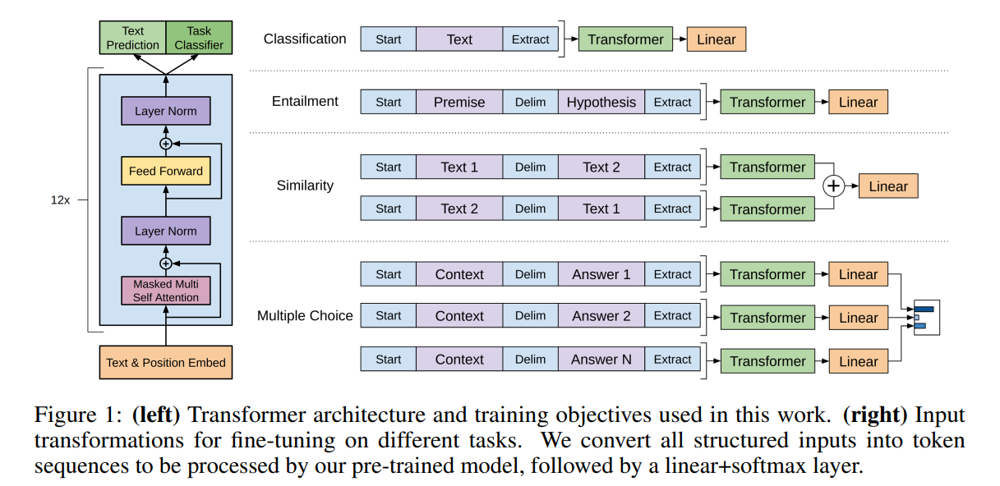
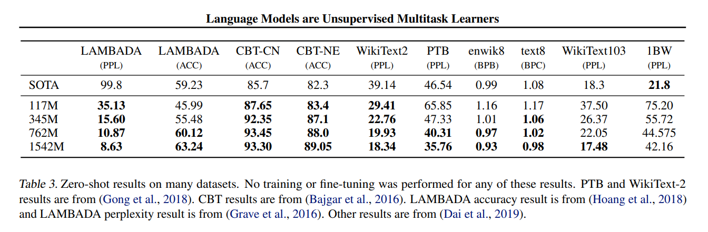

# GPT系列论文泛读
## 9.1 RLHF
- Augmenting Reinforcement Learning with Human Feedback 
(基于人工反馈的增强强化学习)

### 9.1.1 预备工作
#### 强化学习
- 我们假定任务环境是一个马尔可夫决策过程(MDP) $(S,A,T,\gamma,D,R)$，$S$ 是状态集合，$A$ 是动作集合，$T$ 是转移函数：
$$T: S{\times}A{\times}{S}\rightarrow\mathbb{R}$$ 
给定状态 $s_t$ 和动作 $a_t$，转移函数映为 $s_{t+1}$。$\gamma$ 是折扣因子，使未来的奖励函数指数降低。$D$ 是起始状态的分布，$R$ 是关于 $s_t,a_t,s_{t+1}$ 的奖励函数：
$$R: S{\times}A{\times}S\rightarrow\mathbb{R}$$
- 强化学习算法，通过最大化MDP过程的回报函数来学习一个策略 $\pi:S{\rightarrow}A$，回报函数为：
$${\rm{return}}=\sum\limits_{t=0}^TE[\gamma^tR(s_t,a_t,s_{t+1})]$$ 
- 本文主要使用SARSA算法，通过人类的强化信号来增强TAMER-based学习。

#### 交互式TAMER框架
- TAMER框架是一种通过人类反馈信号指导智能体学习的方法。它模拟人类行为价值来指导智能体的行动判断。通过实时回归建立人类行为价值函数 $\hat{H}$，确定最佳行动方式。
- 该框架假设人类的反馈能够完全地指示当前状态下某行为的优劣，建立一个人类强化函数来实时地进行回归：
$$\hat{H}: S{\times}A{\rightarrow}R$$
每个强化为状态-动作对产生一个标签。智能体通过下式来决定动作，从而学习到经验：
$$a={\rm{argmax}}_a[\hat{H}(s,a)]$$

### 9.1.2 连续TAMER+RL
- TAMER强化学习算法能够快速学习，但是在性能方面表现较差。本文将TAMER算法与SARSA算法结合，称为TAMER+RL算法，以期在长程学习中获得更好的策略。
#### 组合技术
有4种技巧能够提升算法的性能，分别为：
- 奖励塑造，通过将一个重构函数的输出添加到原始MDP奖励中来创建一个新的奖励进行学习：
$$R^{\prime}(s,a)=R(s,a)+(\beta{\times}\hat{H}(s,a))$$
- Q函数增强，在 $Q$ 函数的更新中额外使用 $\hat{H}$：
$$Q^{\prime}(s,a)=Q(s,a)+(\beta{\times}\hat{H}(s,a))$$
- 动作偏置，仅在动作选择中引入一个启发式函数：
$$Q^{\prime}(s,a)=Q(s,a)+(\beta{\times}\hat{H}(s,a))$$
- 控制共享，$\pi$ 重用探索策略，只影响动作选择，直接探索人类喜欢的状态-动作对：
$$P(a={\rm{argmax}}_a[\hat{H}(s,a)])={\rm{min}}(\beta,1)$$
否则使用基础的强化学习动作选择机制。
- 在上述式子中，$\beta$ 是超参数，实验中通过一个预定义的因子在每个episode后进行降低。
#### 连续学习实验
- 使用来自Knox和Stone的原始 $\hat{H}$ 表示法、任务设置、SARSA参数和训练记录，使用四种组合技术和一系列 $\beta$ 参数，在Mountain Car任务上复现实验。然后将这些TAMER+RL技术在第二个任务Cart Pole上进行测试。实验结果如下图：

 
#### 实验结果讨论
- 从实验结果可以得到，只影响行动选择的技术(action biasing和control sharing)比其他技术(reward shaping和Q augmentation)更有效。在两个不同的任务(Mountain Car和Cart Pole)中，action biasing和control sharing表现最好，Q augmentation有一些改进，而reward shaping的表现则不如人意。
- 直接影响行动选择的技术越多，其表现越好，而对Q函数的更新影响越大，则表现越差。因此，建议在结合人类引导和强化学习时，应该继续关注行动选择的技术，而保持行动价值模型的更新。

### 9.1.3 同时学习TAMER + RL
- 同时学习要求智能体同时从两个反馈模式中学习，一个是人类反馈，另一个是MDP奖励。在同时学习过程中，需要考虑保持智能体行为的一致性、对训练者的反应性、以及训练者对仅基于RL策略的反馈。
- 如果在学习的早期进行训练，可以获得最大的收益。需要注意的是，在训练的过程中保证良好的人机交互效果。
- 最后，文章介绍了一个决定人类影响的模块，用于平衡人类重视的训练和学习过程。并提出了未来工作的方向。
#### 确定 $\hat{H}$ 的即时影响
- 在同时学习模式下，人类训练者可以在学习过程的任意时刻进行干预。在状态-动作空间中，近期获得强化信号的区域应该提高训练者对其的影响，而未被反馈的区域则不应该增加训练者的影响。
- 我们通过强化学习中常用的资格迹(eligibility traces)来确定 $\hat{H}$ 的影响，称为资格模块。该模块的一般思想是，为每个状态动作特征赋一个归一化的资格迹，和时间步特征向量共同计算了近期程度。
- 令 $\mathop{e}\limits^{\rightarrow}$ 表示迹向量，$\mathop{f_n}\limits^{\rightarrow}$ 是归一化特征向量。归一化点积记为 $n(\mathop{e}\limits^{\rightarrow}\cdot\mathop{f_n}\limits^{\rightarrow})$，定义为：
$$n(\mathop{e}\limits^{\rightarrow}\cdot\mathop{f_n}\limits^{\rightarrow})=\mathop{e}\limits^{\rightarrow}\cdot(\mathop{f_n}\limits^{\rightarrow}/\|\mathop{f_n}\limits^{\rightarrow}\|_1)=(\mathop{e}\limits^{\rightarrow}\cdot\mathop{f_n}\limits^{\rightarrow})/(\|\mathop{f_n}\limits^{\rightarrow}\|_1)$$
- 令 $\beta$ 表示标量点积，我们有：
$$\beta=c_s(n(\mathop{e}\limits^{\rightarrow}\cdot\mathop{f_n}\limits^{\rightarrow}))=c_s(\mathop{e}\limits^{\rightarrow}\cdot\mathop{f_n}\limits^{\rightarrow})/(\|\mathop{f_n}\limits^{\rightarrow}\|_1)$$
- 对于给定的 $\mathop{e}\limits^{\rightarrow}$，当较大特征值对应较大的迹时，$\beta$ 较高，表明当前状态-动作对与最近训练的状态-动作对相似。而当较大的特征值对应较小的迹值时，$\beta$ 较小。
- 在训练过程中通过下式更新迹：
$$e_i:={\rm{min}}(1,e_i+(f_{n,i}{\times}a))$$
其中 $e_i$ 和 $f_{n,i}$ 是 $\mathop{e}\limits^{\rightarrow}$ 和 $\mathop{f_n}\limits^{\rightarrow}$ 的第 $i$ 个元素，$a$ 是一个常数因子，用来调节积累的速度。

#### 同时学习实验
- 本文介绍了在学习开始前或已经发生一些学习后，同时使用TAMER和RL的有效性实验。主要考虑了动作偏向和控制共享两种最佳组合技术。
- 对于资格模块，分别在动作偏向和控制共享中，将Mountain Car和Cart Pole的缩放参数 $c_s$ 分别设置为100和200，2和1，以达到每种方法中的有效 $\beta$ 值上限。积累因子 $a$ 为0.2。
- Mountain Car训练16个episode，或者在20个episode的SARSA-only后再训练12个episode，Cart Pole训练12个episode，或者在25个episode的SARSA-only后训练8个episode。
- 此外，实验时增加了启动和停止训练的按钮，人类训练师可以在特定的episode中操作来观察实验。

#### 结果和讨论
- 实验结果如下图：

- 结果表明action biasing和control sharing均优于SARSA。在Cart Pole上进行的control sharing实验中，与SARSA标准误差最接近的条件、即训练25次后开始训练，其奖励值仍然是SARSA的两倍。
- 在学习的开始阶段进行训练比在自主学习后进行训练更有效。
- 此外，作者还探讨了在训练之前的RL-only学习是否有帮助。通过对比4组的平均奖励，结果显示RL-only组中，有3个任务的表现比另一组强。
- 这些结果证明了使用TAMER+RL的资格模块同时训练的有效性。

### 9.1.4 总结
- TAMER+RL是一种结合了人类示范学习和强化学习的算法。在这个算法中，人类提供了环境中何时应该采取哪些动作的示例，而强化学习负责从示例中学习，并在示例不可用时进行探索。
- TAMER+RL算法通过将人类示范的信息转化为强化信号来加快学习过程。具体来说，TAMER+RL算法使用一个神经网络来表示学习代理，并通过人类示范的反馈数据进行监督学习。如果代理根据示例选择了正确的动作，则强化信号为正，否则是负的。在随后的强化学习过程中，代理将使用强化学习方法来更新自己的策略，并尝试最大化累积奖励。
- TAMER+RL算法的优点在于它可以有效利用人类示范的信息来加速学习和提高性能，同时也能够自适应地进行探索和学习。

## 9.2 2018-GPT1
- 通过生成式预训练提高语言理解能力 
(Improving Language Understanding by Generative Pre-Training)
### 9.2.1 模型架构
- 训练过程包括两个阶段。第一阶段是在大规模文本语料上学习大语言模型。然后是微调阶段，将模型适应于带有标签数据的判别性任务。
#### 无监督预训练
- 给定无监督语料库，tokens $\mathcal{U}=\{u_1,\cdots,u_n\}$，我们用一个标准的语言模型，最大化对数似然如下：
$$L_i(\mathcal{U})=\sum\limits_i{\rm{log}}P(u_i|u_{i-k},\cdots,u_{i-1};\Theta)$$
其中 $k$ 是文本窗口的大小，条件概率 $P$ 使用一个神经网络模型来建模，$\Theta$ 是模型参数，使用SGD来训练。
- 在实验中，我们使用多层Transformer解码器，解码器包括一个多头注意力算子，后接逐元素前馈层来输出一个目标分布：
$$\begin{align*}
h_0&=UW_e+W_p\\
h_l&={\text{transformer}}\_{\text{block}}(h_{l-1}),\quad{\forall}i{\in}[1,n]\\
P(u)&={\rm{softmax}}(h_nW_e^{\top})
\end{align*}$$
其中 $U=(u_{-k},\cdots,u_{-1})$ 是上下文向量，$n$ 是解码器的层数，$W_e$ 是token嵌入矩阵，$W_p$ 是位置嵌入矩阵。

#### 有监督微调
- 通过最大化对数似然训练模型后，我们将训练好的参数应用到有监督的目标任务上来进行微调。
- 我们假定标签数据集为 $\mathcal{C}$，每个实例由一个输入token序列组成，$x^1,\cdots,x^m$ 对应标签 $y$。将数据输入到预训练模型中，得到最后一层Transformer块的隐状态 $h_l^m$，然后通过一个加性输出层来预测标签 $y$：
$$P(y|x^1,\cdots,x^m)={\rm{softmax}}(h_l^mW_y)$$
- 通过最大化如下对数似然来进行优化：
$$L_2(\mathcal{C})=\sum\limits_{(x,y)}{\rm{log}}P(y|x^1,\cdots,x^m)$$
- 将语言模型的目标加入进来能够提高监督模型的泛化性，并且能够加速收敛：
$$L_3(\mathcal{C})=L_2(\mathcal{C})+\lambda{\cdot}L_1(\mathcal{C})$$

#### 面向任务的输入变换
- 对于文本分类等任务我们可以直接微调我们的模型。对于某些有结构化的输入的任务，如问答或文本蕴涵，由于预训练模型是在连续的文本序列上训练的，我们需要做一些修改才能将其应用到这些任务中。
- 之前的工作提出了基于迁移表示学习的任务架构。相反，我们使用一种遍历式方法，将结构化的输入转换为我们预训练模型可以处理的有序序列。避免对体系结构进行大范围的更改。
###### 文本蕴含
- 对于文本蕴含任务，我们将前提 $p$ 和假设 $h$ 的token序列concat起来，中间加入一个分隔符($\$$)来区分。
###### 相似性任务
- 对于相似性任务，被比较的两个句子没有内在的先后顺序。为了体现这一点，我们修改输入序列，使其包含两种可能的句子排序(中间带有分隔符)，并分别处理，得到两个序列表示 $h_l^m$，然后逐元素相加，再放入线性输出层。
###### QA和常识推理
- 给定文本文档 $z$，问题 $q$ 和一组可能的答案 $\{a_k\}$。我们将文档和问题与每个答案concat起来，并加入分隔符，得到 $[z;q;\$;a_k]$。
- 每一个都用模型单独处理，然后通过softmax分类器来得到可能答案的输出分布。

## 9.3 2019-GPT2
- 语言模型是无监督的多任务学习器 
(Language Models are Unsupervised Multitask Learners)
### 9.3.1 主要方法
- 方法的核心是语言模型。通常是一个无监督的分布估计框架，输入一组示例 $(x_1,x_2,\cdots,x_n)$，每个示例由可变长度的序列组成 $(s_1,s_2,\cdots,s_n)$。语言有自然的顺序，将符号上的联合概率分解为条件概率的乘积：
$$p(x)=\prod\limits_{i=1}^np(s_n|s_1,\cdots,s_{n-1})$$
这个方法比形式 $p(s_{n-k},\cdots,s_n|s_1,\cdots,s_{n-k-1})$ 更好处理。
- 学习单一任务可以用概率框架来估计条件分布 $p({\rm{output}}|{\rm{input}})$。而通用系统应该能够执行多任务，即使输入相同，也应该根据任务的不同来得到不同的输出，即 $p({\rm{output}}|{\rm{input}},{\rm{task}})$。
- 在多任务和元学习中，通常通过架构来实现，如任务特定的编码器和解码器。或在算法级别实现，如MAML中的内部和外部环优化框架。McCann等人将任务、输入和输出，全部作为符号序列。
- 初步实验证明，充分大的语言模型能够在这种情境下进行多任务学习，但学习速度要慢很多。

#### 训练集
- 我们希望建立尽可能大和多样化的数据集，以便在尽可能多的领域和上下文中收集任务的自然语言示范。
- 通过网页抓取可以获得多样化和几乎无限的文本。这些文档比当前的语言建模数据集大许多数量级，但它们存在显著的数据质量问题。
- 相反，我们创建了一个新的网页抓取，但更强调文档的质量。为了做到这一点，我们通过人来进行整理和过滤。手动过滤网页抓取是昂贵的，因此我们从Reddit(社交媒体平台)中筛选链接，观察用户觉得链接是否有趣、有教育意义或只是好玩来作为一个启发式指标。
- 生成的数据集WebText包含了这4500万条链接。我们使用了Dragnet和Newspaper内容提取器来从HTML获得响应并提取文本。
- WebText不包括2017年12月以后创建的链接，经过去重和一些启发式的清理后，包含的文档超过800万个，共计40GB。
- 我们从WebText中删除了所有的维基百科文档，因为它们是其他数据集的共同数据源。训练数据与测试评估任务重叠可能会导致分析更复杂。

#### 输入表示
- lowercasing, tokenization, 和out-of-vocabulary tokens这些预处理步骤具有局限性。
- 另外，在大规模数据集中单个字节的识别效果不如单词级别的语言模型。
- Byte Pair Encoding(BPE)是一种介于字符和单词级别的语言建模方法。在频繁出现的符号序列上处理单词级别的输入，而在不常见的符号序列上处理字符级别的输入。实现BPE的方法通常是在Unicode编码上操作，要模拟所有Unicode字符串需要超过130,000个词汇表。相比之下，字节级别的BPE只需要256个词汇表。
- 但是，直接应用BPE到字节序列会导致子优化合并，因为BPE使用贪心的基于频率的启发式方法来建立词汇表。BPE在很多情况下都包含了常见单词的多个变体，如dog、dog!、dog?等，导致词汇表空间不足，模型能力不足。
- 为避免这种情况，在任何字节序列上都不允许BPE横跨字符类别进行合并，并为空格增加了特例。这样可以显著提高压缩效率，在多个词汇标记上只造成了微小的单词分散。
- 这种输入表示允许我们将单词级LM的好处与字节级方法的一般性结合起来。由于我们的方法可以为任何Unicode字符串分配一个概率，这使得我们可以在任何数据集上评估我们的LM，而不管是预处理、tokenization还是vocab大小。

#### 模型
- 我们使用了基于Transformer的LM架构。该模型基本沿用了GPT1模型的细节，并做了少量修改。
- 层归一化被移动到每个子块的输入中，类似于一个预激活残差网络，并在最后的自注意力块后添加一个额外的层归一化。
- 考虑到模型深度上的残差累积，我们使用一个修改后的初始化方法。在初始化时通过一个因子 $1/\sqrt{N}$ 对残差层的权重进行缩放，其中 $N$ 为残差层的数量。
- 词汇表扩展到50257个词，上下文大小从512个标记增加到1024个标记，并使用更大的512的batchsize。

### 9.3.2 实验
- 在4个数据集上进行实验，部分实验结果如图：

## 9.4 2020-GPT3
- 语言模型是少样本学习 
(Language Models are Few-Shot Learners)

## 9.5 