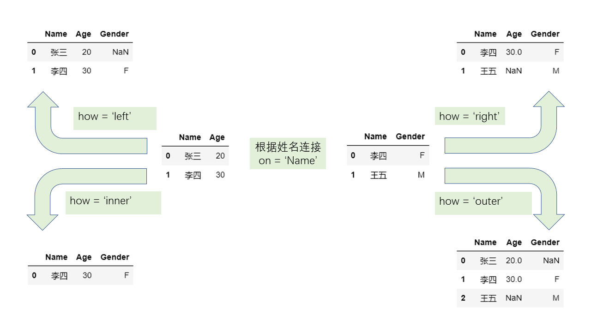

# Chapter05 连接
## 5.1 关系型连接
### 5.1.1 连接的基本概念
- 把两张相关的表按照某一个或某一组键连接起来是一种常见操作，键用 `on` 参数表示。
- `pandas` 中的关系型连接函数 `merge` 和 `join` 中提供了 `how` 参数来代表连接形式，分为左连接 `left` 、右连接 `right` 、内连接 `inner` 、外连接 `outer`。
- 左连接即以左表的键为准，如果右表中的键于左表存在，那么就添加到左表，否则则处理为缺失值，右连接类似处理。内连接只负责合并两边同时出现的键，而外连接则会在内连接的基础上包含只在左边出现以及只在右边出现的值，因此外连接又叫全连接。

- 对于重复的键，只要是两边同时出现的值，就以笛卡尔积的方式加入，如果单边出现则根据连接形式进行处理。

### 5.1.2 值连接
- 由 merge 函数实现基于值的连接。
```python
df1 = pd.DataFrame({'Name':['San Zhang','Si Li'],
                    'Age':[20,30]})
df2 = pd.DataFrame({'Name':['Si Li','Wu Wang'],
                    'Gender':['F','M']})
df1.merge(df2, on='Name', how='left')
df1.merge(df2, on='Name', how='right')
df1.merge(df2, on='Name', how='inner')
df1.merge(df2, on='Name', how='outer')
```
- 如果两个表中想要连接的列不具备相同的列名，可以通过 `left_on` 和 `right_on` 指定。
```python
df1 = pd.DataFrame({'df1_name':['San Zhang','Si Li'],
                    'Age':[20,30]})
df2 = pd.DataFrame({'df2_name':['Si Li','Wu Wang'],
                    'Gender':['F','M']})
df1.merge(df2, left_on='df1_name', right_on='df2_name', how='left')
```
```markup
    df1_name  Age df2_name Gender
0  San Zhang   20      NaN    NaN
1      Si Li   30    Si Li      F
```
- 如果两个表中的列出现了重复的列名，那么可以通过 `suffixes` 参数指定。
```python
df1 = pd.DataFrame({'Name':['San Zhang'],'Grade':[70]})
df2 = pd.DataFrame({'Name':['San Zhang'],'Grade':[80]})
df1.merge(df2, on='Name', how='left', suffixes=['_Chinese','_Math'])
```
```markup
        Name  Grade_Chinese  Grade_Math
0  San Zhang             70          80
```
- 在某些时候出现重复元素是麻烦的，例如两位同学来自不同的班级，但是姓名相同，这种时候就要指定 `on` 参数为多个列使得正确连接。
```python
df1 = pd.DataFrame({'Name':['San Zhang', 'San Zhang'],
                    'Age':[20, 21],
                    'Class':['one', 'two']})
df2 = pd.DataFrame({'Name':['San Zhang', 'San Zhang'],
                    'Gender':['F', 'M'],
                    'Class':['two', 'one']})
df1.merge(df2, on='Name', how='left')                       # 错误的结果
df1.merge(df2, on=['Name', 'Class'], how='left')            # 正确的结果
```
### 5.1.3 索引连接
- 将索引当作键进行连接，通过 `join` 函数，它的参数选择要少于 `merge` ，除了必须的 `on` 和 `how` 之外，可以对重复的列指定左右后缀 `lsuffix` 和 `rsuffix` 。其中， `on` 参数指索引名，单层索引时省略参数表示按照当前索引连接。
```python
df1 = pd.DataFrame({'Age':[20,30]},
                    index=pd.Series(
                    ['San Zhang','Si Li'],name='Name'))
df2 = pd.DataFrame({'Gender':['F','M']},
                    index=pd.Series(
                    ['Si Li','Wu Wang'],name='Name'))
df1.join(df2, how='left')
```
```markup
           Age Gender
Name                 
San Zhang   20    NaN
Si Li       30      F
```
```python
df1 = pd.DataFrame({'Grade':[70]},
                    index=pd.Series(['San Zhang'],
                    name='Name'))
df2 = pd.DataFrame({'Grade':[80]},
                    index=pd.Series(['San Zhang'],
                    name='Name'))
df1.join(df2, how='left', lsuffix='_Chinese', rsuffix='_Math')
```
```markup
           Grade_Chinese  Grade_Math
Name                                
San Zhang             70          80
```
```python
df1 = pd.DataFrame({'Age':[20,21]},
                    index=pd.MultiIndex.from_arrays(
                    [['San Zhang', 'San Zhang'],['one', 'two']],
                    names=('Name','Class')))
df2 = pd.DataFrame({'Gender':['F', 'M']},
                    index=pd.MultiIndex.from_arrays(
                    [['San Zhang', 'San Zhang'],['two', 'one']],
                    names=('Name','Class')))
df1.join(df2)
```
```markup
                 Age Gender
Name      Class            
San Zhang one     20      M
          two     21      F
```

## 5.2 方向连接
### 5.2.1 concat函数
- 将两个表或者多个表按照纵向或者横向拼接。在 `concat` 中，最常用的有三个参数，它们是 `axis`, `join`, `keys` ，分别表示拼接方向，连接形式，以及在新表中指示来自于哪一张旧表的名字。
```python
df1 = pd.DataFrame({'Name':['San Zhang','Si Li'],
                    'Age':[20,30]})
df2 = pd.DataFrame({'Name':['Wu Wang'], 'Age':[40]})
pd.concat([df1, df2])
```
```markup
        Name  Age
0  San Zhang   20
1      Si Li   30
0    Wu Wang   40
```
```python
df2 = pd.DataFrame({'Grade':[80, 90]})
df3 = pd.DataFrame({'Gender':['M', 'F']})
pd.concat([df1, df2, df3], 1)
```
```markup
        Name  Age  Grade Gender
0  San Zhang   20     80      M
1      Si Li   30     90      F
```
- 虽然说 `concat` 不是处理关系型合并的函数，但是它仍然是关于索引进行连接的。纵向拼接会根据列索引对其，默认状态下 `join=outer` ，表示保留所有的列，并将不存在的值设为缺失； `join=inner` ，表示保留两个表都出现过的列。横向拼接则根据行索引对齐， `join` 参数可以类似设置。
```python
df2 = pd.DataFrame({'Name':['Wu Wang'], 'Gender':['M']})
pd.concat([df1, df2])
```
```markup
        Name   Age Gender
0  San Zhang  20.0    NaN
1      Si Li  30.0    NaN
0    Wu Wang   NaN      M
```
```python
df2 = pd.DataFrame({'Grade':[80, 90]}, index=[1, 2])
pd.concat([df1, df2], 1)
```
```markup
        Name   Age  Grade
0  San Zhang  20.0    NaN
1      Si Li  30.0   80.0
2        NaN   NaN   90.0
```
```python
pd.concat([df1, df2], axis=1, join='inner')
```
```markup
    Name  Age  Grade
1  Si Li   30     80
```
- 因此，当确认要使用多表直接的方向合并时，尤其是横向的合并，可以先用 `reset_index` 方法恢复默认整数索引再进行合并，防止出现由索引的误对齐和重复索引的笛卡尔积带来的错误结果。
- `keys` 参数的使用场景在于多个表合并后，用户仍然想要知道新表中的数据来自于哪个原表，这时可以通过 `keys` 参数产生多级索引进行标记。
```python
df1 = pd.DataFrame({'Name':['San Zhang','Si Li'],
                    'Age':[20,21]})
df2 = pd.DataFrame({'Name':['Wu Wang'],'Age':[21]})
pd.concat([df1, df2], keys=['one', 'two'])
```
```markup
            Name  Age
one 0  San Zhang   20
    1      Si Li   21
two 0    Wu Wang   21
```
### 5.2.2 序列与表的合并
- 利用 `concat` 可以实现多个表之间的方向拼接，如果想要把一个序列追加到表的行末或者列末，则可以分别使用 `append` 和 `assign` 方法。
- 在 `append` 中，如果原表是默认整数序列的索引，那么可以使用 `ignore_index=True` 对新序列对应的索引自动标号，否则必须对 `Series` 指定 `name` 属性。
```python
s = pd.Series(['Wu Wang', 21], index = df1.columns)
df1.append(s, ignore_index=True)
# 或者指定name属性
# s.name = 2
# df1.append(s)
```
```markup
        Name  Age
0  San Zhang   20
1      Si Li   21
2    Wu Wang   21
```
- 对于 `assign` 而言，虽然可以利用其添加新的列，但一般通过 `df['new_col'] = ...` 的形式就可以等价地添加新列。同时，使用 `[]` 修改的缺点是它会直接在原表上进行改动，而 `assign` 返回的是一个临时副本。
```python
s = pd.Series([80, 90])
df1.assign(Grade=s)                                         # 生成临时副本
```
```markup
        Name  Age  Grade
0  San Zhang   20     80
1      Si Li   21     90
```
```python
df1['Grade'] = s
print(df1)
```
```markup
        Name  Age  Grade
0  San Zhang   20     80
1      Si Li   21     90
```

## 5.3 类连接操作
### 5.3.1 比较
- `compare` 能够比较两个表或者序列的不同处并将其汇总展示。
```python
df1 = pd.DataFrame({'Name':['San Zhang', 'Si Li', 'Wu Wang'],
                        'Age':[20, 21 ,21],
                        'Class':['one', 'two', 'three']})
df2 = pd.DataFrame({'Name':['San Zhang', 'Li Si', 'Wu Wang'],
                        'Age':[20, 21 ,21],
                        'Class':['one', 'two', 'Three']})
df1.compare(df2)
```
```markup
    Name         Class       
    self  other   self  other
1  Si Li  Li Si    NaN    NaN
2    NaN    NaN  three  Three
```
- 如果想要完整显示表中所有元素的比较情况，可以设置 `keep_shape=True`。
```python
df1.compare(df2, keep_shape=True)
```
```markup
    Name         Age        Class       
    self  other self other   self  other
0    NaN    NaN  NaN   NaN    NaN    NaN
1  Si Li  Li Si  NaN   NaN    NaN    NaN
2    NaN    NaN  NaN   NaN  three  Three
```
### 5.3.2 组合
- `combine` 函数能够让两张表按照一定的规则进行组合，在进行规则比较时会自动进行列索引的对齐。对于传入的函数而言，每一次操作中输入的参数是来自两个表的同名 Series ，依次传入的列是两个表列名的并集。
```python
def choose_min(s1, s2):
    s2 = s2.reindex_like(s1)
    res = s1.where(s1<s2, s2)
    res = res.mask(s1.isna())                               # isna表示是否为缺失值，返回布尔序列
    return res
df1 = pd.DataFrame({'A':[1,2], 'B':[3,4], 'C':[5,6]})
df2 = pd.DataFrame({'B':[5,6], 'C':[7,8], 'D':[9,10]}, index=[1,2])
# 依次传入 A,B,C,D 四组序列，每组为左右表的两个序列
df1.combine(df2, choose_min)
```
```markup
    A    B    C   D
0 NaN  NaN  NaN NaN
1 NaN  4.0  6.0 NaN
2 NaN  NaN  NaN 
```
- 此外，设置 `overtwrite` 参数为 `False` 可以保留 被调用表 中未出现在传入的参数表中的列，而不会设置未缺失值。
```python
df1.combine(df2, choose_min, overwrite=False)
```
```markup
     A    B    C   D
0  1.0  NaN  NaN NaN
1  2.0  4.0  6.0 NaN
2  NaN  NaN  NaN NaN
```
-  `combine_first` 方法，在对两张表组合时，若第二张表中的值在第一张表中对应索引位置的值不是缺失状态，那么就使用第一张表的值填充。
```python
df1 = pd.DataFrame({'A':[1,2], 'B':[3,np.nan]})
df2 = pd.DataFrame({'A':[5,6], 'B':[7,8]}, index=[1,2])
df1.combine_first(df2)
```
```markup
     A    B
0  1.0  3.0
1  2.0  7.0
2  6.0  8.0
```