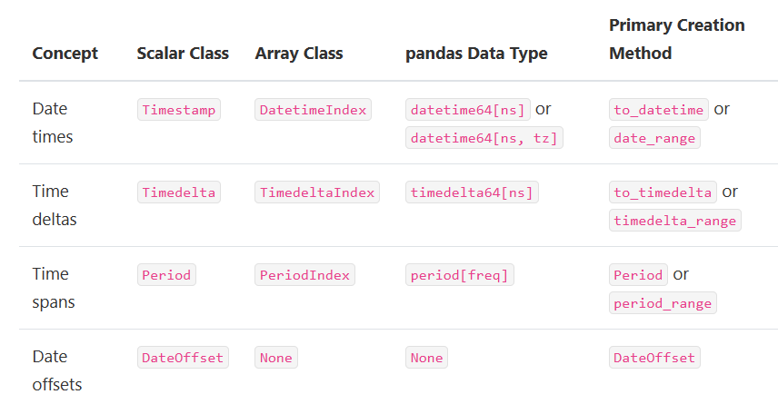

# Chapter09 时序数据
## 9.1 时序中的基本对象
- 时间概念
    - 时间戳(Date times)：`Timestamp` 类型，表示时间点。
    - 时间差(Time deltas)：`Timestamp` 做差得到，`Timedelta` 类型，表示时间差。
    - 时间段(Time spans)：`Period` 类型，表示一段时间。
    - 日期偏置(Date offsets)：`DateOffset` 类型，表示某时间点偏置一段时间。


## 9.2 时间戳
### 9.2.1 Timestamp的构造与属性
- 单个时间戳的生成利用 `pd.Timestamp` 实现。
```python
import numpy as np
import pandas as pd
ts = pd.Timestamp('2020/1/1')
# Timestamp('2020-01-01 00:00:00')
ts = pd.Timestamp('2020-1-1 08:10:30')
# Timestamp('2020-01-01 08:10:30')
```
- 通过 `year`, `month`, `day`, `hour`, `min`, `second` 可以获取具体的数值。
```python
ts.year                                                     # 2020
ts.month                                                    # 1
ts.day                                                      # 1
ts.hour                                                     # 8
ts.minute                                                   # 10
ts.second                                                   # 30
```
- `pd.Timestamp.max` 和 `pd.Timestamp.min` 可以获取时间戳表示的范围。
```python
pd.Timestamp.max
# Timestamp('2262-04-11 23:47:16.854775807')
pd.Timestamp.min
# Timestamp('1677-09-21 00:12:43.145225')
pd.Timestamp.max.year - pd.Timestamp.min.year
# 585
```
### 9.2.2 Datetime序列的生成
- 一组时间戳可以组成时间序列，可以用 `to_datetime` 和 `date_range` 来生成。其中， `to_datetime` 能够把一列时间戳格式的对象转换成为 `datetime64[ns]` 类型的时间序列。
```python
pd.to_datetime(['2020-1-1', '2020-1-3', '2020-1-6'])
```
```markup
DatetimeIndex(['2020-01-01', '2020-01-03', '2020-01-06'], dtype='datetime64[ns]', freq=None)
```
```python
df = pd.read_csv('data/learn_pandas.csv')
s = pd.to_datetime(df.Test_Date)
s.head()
```
```markup
0   2019-10-05
1   2019-09-04
2   2019-09-12
3   2020-01-03
4   2019-11-06
Name: Test_Date, dtype: datetime64[ns]
```
- 在极少数情况，时间戳的格式不满足转换时，可以强制使用 `format` 进行匹配。
```python
temp = pd.to_datetime(['2020\\1\\1','2020\\1\\3'],format='%Y\\%m\\%d')
temp
```
```markup
DatetimeIndex(['2020-01-01', '2020-01-03'], dtype='datetime64[ns]', freq=None)
```
- 注意上面由于传入的是列表，而非 `pandas` 内部的 `Series` ，因此返回的是 `DatetimeIndex` ，如果想要转为 `datetime64[ns]` 的序列，需要显式用 `Series` 转化。
```python
pd.Series(temp).head()
```
```markup
0   2020-01-01
1   2020-01-03
dtype: datetime64[ns]
```
- 还存在一种把表的多列时间属性拼接转为时间序列的 `to_datetime` 操作，此时的列名必须和以下给定的时间关键词列名一致。
```python
df_date_cols = pd.DataFrame({'year': [2020, 2020],
                             'month': [1, 1],
                             'day': [1, 2],
                             'hour': [10, 20],
                             'minute': [30, 50],
                             'second': [20, 40]})
pd.to_datetime(df_date_cols)
```
```markup
0   2020-01-01 10:30:20
1   2020-01-02 20:50:40
dtype: datetime64[ns]
```
- `date_range` 是一种生成连续间隔时间的一种方法，其重要的参数为 `start`, `end`, `freq`, `periods` ，它们分别表示开始时间，结束时间，时间间隔，时间戳个数。其中，四个中的三个参数决定了，那么剩下的一个就随之确定了。这里要注意，开始或结束日期如果作为端点则它会被包含。
```python
pd.date_range('2020-1-1','2020-1-21', freq='10D')           # 包含
```
```markup
DatetimeIndex(['2020-01-01', '2020-01-11', '2020-01-21'], dtype='datetime64[ns]', freq='10D')
```
```python
pd.date_range('2020-1-1','2020-2-28', freq='10D')
```
```markup
DatetimeIndex(['2020-01-01', '2020-01-11', '2020-01-21', '2020-01-31',
               '2020-02-10', '2020-02-20'],
              dtype='datetime64[ns]', freq='10D')
```
```python
pd.date_range('2020-1-1',
              '2020-2-28', periods=6)
```
```markup
DatetimeIndex(['2020-01-01 00:00:00', '2020-01-12 14:24:00',
               '2020-01-24 04:48:00', '2020-02-04 19:12:00',
               '2020-02-16 09:36:00', '2020-02-28 00:00:00'],
              dtype='datetime64[ns]', freq=None)
```
- 改变序列采样频率的方法 `asfreq` ，它能够根据给定的 `freq` 对序列进行类似于 `reindex` 的操作。
```python
s = pd.Series(np.random.rand(5),
            index=pd.to_datetime([
                '2020-1-%d'%i for i in range(1,10,2)]))
s
```
```markup
2020-01-01    0.836578
2020-01-03    0.678419
2020-01-05    0.711897
2020-01-07    0.487429
2020-01-09    0.604705
dtype: float64
```
```python
s.asfreq('D').head()
```
```markup
2020-01-01    0.836578
2020-01-02         NaN
2020-01-03    0.678419
2020-01-04         NaN
2020-01-05    0.711897
Freq: D, dtype: float64
```
```python
s.asfreq('12H').head()
```
```markup
2020-01-01 00:00:00    0.836578
2020-01-01 12:00:00         NaN
2020-01-02 00:00:00         NaN
2020-01-02 12:00:00         NaN
2020-01-03 00:00:00    0.678419
Freq: 12H, dtype: float64
```
### 9.2.3 dt对象
- 时序类型的序列上定义了 `dt` 对象来完成许多时间序列的相关操作。大致分为三类操作：取出时间相关的属性、判断时间戳是否满足条件、取整操作。
#### 取出时间相关的属性
- 第一类操作的常用属性包括： `date`, `time`, `year`, `month`, `day`, `hour`, `minute`, `second`, `microsecond`, `nanosecond`, `dayofweek`, `dayofyear`, `weekofyear`, `daysinmonth`, `quarter` ，其中 `daysinmonth`, `quarter` 分别表示该月一共有几天和季度。
```python
s = pd.Series(pd.date_range('2020-1-1','2020-1-3', freq='D'))
s.dt.date                                                   # 具体日期
s.dt.time                                                   # 具体时间
# 年/月/日/小时/分钟/秒/微秒/纳秒
s.dt.year/s.dt.month/s.dt.day/s.dt.hour/s.dt.minute/s.dt.second/s.dt.microsecond/s.dt.nanosecond
s.dt.dayofweek                                              # 一周中第几天，从0开始，周一为0、周二为1，以此类推
s.dt.dayofyear                                              # 一年中第几天，从1开始
s.dt.weekofyear                                             # 一年中第几周，从1开始
s.dt.daysinmonth                                            # 该月共几天
s.dt.quarter                                                # 第几季度
```
- 可以通过 `month_name`, `day_name` 返回英文的月名和星期名，注意它们是方法而不是属性。
```python
s.dt.month_name()
s.dt.day_name()
```
#### 判断时间戳是否满足条件
- 第二类判断操作主要用于测试是否为月/季/年的第一天或者最后一天，返回 `bool` 值。
```python
s.dt.is_year_start                                          # 还可选 is_quarter/month_start
s.dt.is_year_end                                            # 还可选 is_quarter/month_end
```
#### 取整操作
- 第三类的取整操作包含 `round`, `ceil`, `floor` ，它们的公共参数为 `freq` ，常用的包括 `H`, `min`, `S` (小时、分钟、秒)。
```python
s = pd.Series(pd.date_range('2020-1-1 20:35:00',
                            '2020-1-1 22:35:00',
                            freq='45min'))
s.dt.round('1H')                                            # 按小时四舍五入
s.dt.ceil('1H')                                             # 按小时向上取整
s.dt.floor('1H')                                            # 按小时向下取整
```
### 9.2.4 时间戳的切片与索引
- 一般而言，时间戳序列作为索引使用。如果想要选出某个子时间戳序列，第一类方法是利用 `dt` 对象和布尔条件联合使用，另一种方式是利用切片，后者常用于连续时间戳。
```python
s = pd.Series(np.random.randint(2,size=366),
              index=pd.date_range(
                      '2020-01-01','2020-12-31'))
idx = pd.Series(s.index).dt
s.head()
```
```markup
2020-01-01    1
2020-01-02    1
2020-01-03    0
2020-01-04    1
2020-01-05    0
Freq: D, dtype: int32
```
```python
s[(idx.is_month_start|idx.is_month_end).values]             # 每月的第一天或者最后一天
s[idx.dayofweek.isin([5,6]).values]                         # 双休日
s['2020-01-01']                                             # 取出单日值
s['2020-07']                                                # 取出七月
s['2020-05':'2020-7-15']                                    # 取出5月初至7月15日
```
## 9.3 时间差
### 9.3.1 Timedelta的生成
- 通过 `pd.Timestamp` 做差得到，或通过 `pd.Timedelta` 来构造。
```python
pd.Timestamp('20200102 08:00:00')-pd.Timestamp('20200101 07:35:00')
```
```markup
Timedelta('1 days 00:25:00')
```
```python
pd.Timedelta(days=1, minutes=25)
```
```markup
Timedelta('1 days 00:25:00')
```
```python
pd.Timedelta('1 days 25 minutes')
```
```markup
Timedelta('1 days 00:25:00')
```
- 生成时间差序列的主要方式是 `pd.to_timedelta` ，其类型为 `timedelta64[ns]` 。
```python
s = pd.to_timedelta(df.Time_Record)
s.head()
```
```markup
0   0 days 00:04:34
1   0 days 00:04:20
2   0 days 00:05:22
3   0 days 00:04:08
4   0 days 00:05:22
Name: Time_Record, dtype: timedelta64[ns]
```
- 与 `date_range` 一样，时间差序列也可以用 `timedelta_range` 来生成，它们两者具有一致的参数。
```python
pd.timedelta_range('0s', '1000s', freq='6min')
```
```markup
TimedeltaIndex(['0 days 00:00:00', '0 days 00:06:00', '0 days 00:12:00'], dtype='timedelta64[ns]', freq='6T')
```
```python
pd.timedelta_range('0s', '1000s', periods=3)
```
```markup
TimedeltaIndex(['0 days 00:00:00', '0 days 00:08:20', '0 days 00:16:40'], dtype='timedelta64[ns]', freq=None)
```
- 对于 `Timedelta` 序列，同样也定义了 `dt` 对象，上面主要定义了的属性包括 `days`, `seconds`, `mircroseconds`, `nanoseconds` ，它们分别返回了对应的时间差特征。需要注意的是，这里的 `seconds` 不是指单纯的秒，而是对天数取余后剩余的秒数。
```python
s.dt.seconds.head()
```
```markup
0    274
1    260
2    322
3    248
4    322
Name: Time_Record, dtype: int64
```
- 如果不想对天数取余而直接对应秒数，可以使用 `total_seconds` 。
```python
s.dt.total_seconds().head()
```
```markup
0    274.0
1    260.0
2    322.0
3    248.0
4    322.0
Name: Time_Record, dtype: float64
```
- 与时间戳序列类似，取整函数也是可以在 `dt` 对象上使用的。
```python
pd.to_timedelta(df.Time_Record).dt.round('min').head()
```
```markup
0   0 days 00:05:00
1   0 days 00:04:00
2   0 days 00:05:00
3   0 days 00:04:00
4   0 days 00:05:00
Name: Time_Record, dtype: timedelta64[ns]
```
### 9.3.2 Timedelta的运算
- 时间差支持的常用运算有三类：与标量的乘法运算、与时间戳的加减法运算、与时间差的加减法与除法运算。
```python
td1 = pd.Timedelta(days=1)
td2 = pd.Timedelta(days=3)
ts = pd.Timestamp('20200101')
td1 * 2
td2 - td1
ts + td1
ts - td1
```
- 这些运算都可以移植到时间差的序列上。
```python
td1 = pd.timedelta_range(start='1 days', periods=5)
td2 = pd.timedelta_range(start='12 hours',
                         freq='2H',
                         periods=5)
ts = pd.date_range('20200101', '20200105')
td1 * 5
td1 * pd.Series(list(range(5)))                             # 逐个相乘
td1 - td2
td1 + pd.Timestamp('20200101')
td1 + ts                                                    # 逐个相加
```
## 9.4 日期偏置
### 9.4.1 Offset对象
- 日期偏置是一种和日历相关的特殊时间差。`Offset` 对象在 `pd.offsets` 中被定义。当使用 `+` 时获取离其最近的下一个日期，当使用 `-` 时获取离其最近的上一个日期。
```python
# 求2020年9月第一个周一的日期
pd.Timestamp('20200831') + pd.offsets.WeekOfMonth(week=0,weekday=0)
# Timestamp('2020-09-07 00:00:00')
# 求2020年9月7日后的第30个工作日是哪一天
pd.Timestamp('20200907') + pd.offsets.BDay(30)
# Timestamp('2020-10-19 00:00:00')
# 求2020年9月7日前的第一个月底
pd.Timestamp('20200907') - pd.offsets.MonthEnd()
# Timestamp('2020-08-31 00:00:00')
```
- 特殊的 `Offset` 对象 `CDay` ，其中的 `holidays`, `weekmask` 参数能够分别对自定义的日期和星期进行过滤，前者传入了需要过滤的日期列表，后者传入的是三个字母的星期缩写构成的星期字符串，其作用是只保留字符串中出现的星期。

```python
my_filter = pd.offsets.CDay(n=1, weekmask='Wed Fri', holidays=['20200109'])
# n 表示增加一天 CDay
dr = pd.date_range('20200108', '20200111')
dr.to_series().dt.dayofweek
```
```markup
2020-01-08    2
2020-01-09    3
2020-01-10    4
2020-01-11    5
Freq: D, dtype: int64
```

```python
[i + my_filter for i in dr]
# dr 中的第一天为 20200108 ，n=1 所以从下一天开始，但由于下一天 20200109 被排除了，并且 20200110 是合法的周五需要保留，因此转为 20200110。后续相同。
```
```markup
[Timestamp('2020-01-10 00:00:00'),
 Timestamp('2020-01-10 00:00:00'),
 Timestamp('2020-01-15 00:00:00'),
 Timestamp('2020-01-15 00:00:00')]
```
### 9.4.2 偏置字符串
- 前面提到了关于 `date_range` 的 `freq` 取值可用 `Offset` 对象，同时在 `pandas` 中几乎每一个 `Offset` 对象绑定了日期偏置字符串( `frequencies strings`/`offset aliases` )，可以指定 `Offset` 对应的字符串来替代使用。
```python
# 月初
pd.date_range('20200101','20200331', freq='MS')
pd.date_range('20200101','20200331',
              freq=pd.offsets.MonthBegin())
```
```markup
DatetimeIndex(['2020-01-01', '2020-02-01', '2020-03-01'], dtype='datetime64[ns]', freq='MS')
```
```python
# 月末
pd.date_range('20200101','20200331', freq='M')
pd.date_range('20200101','20200331',
              freq=pd.offsets.MonthEnd())
```
```markup
DatetimeIndex(['2020-01-31', '2020-02-29', '2020-03-31'], dtype='datetime64[ns]', freq='M')
```
```python
# 工作日
pd.date_range('20200101','20200110', freq='B')
pd.date_range('20200101','20200110', freq=pd.offsets.BDay())
```
```markup
DatetimeIndex(['2020-01-01', '2020-01-02', '2020-01-03', '2020-01-06',
               '2020-01-07', '2020-01-08', '2020-01-09', '2020-01-10'],
              dtype='datetime64[ns]', freq='B')
```
```python
# 周一
pd.date_range('20200101','20200201', freq='W-MON')
pd.date_range('20200101','20200201',
              freq=pd.offsets.CDay(weekmask='Mon'))
```
```markup
DatetimeIndex(['2020-01-06', '2020-01-13', '2020-01-20', '2020-01-27'], dtype='datetime64[ns]', freq='W-MON')
```
```python
# 每月第一个周一
pd.date_range('20200101','20200201',
              freq='WOM-1MON')
pd.date_range('20200101','20200201',
              freq=pd.offsets.WeekOfMonth(week=0,weekday=0))
```
```markup
DatetimeIndex(['2020-01-06'], dtype='datetime64[ns]', freq='WOM-1MON')
```

## 9.5 时序中的滑窗与分组
### 9.5.1 滑动窗口
- 利用 `rolling` 对象得到滑动窗口。
```python
idx = pd.date_range('20200101', '20201231', freq='B')
np.random.seed(2020)
data = np.random.randint(-1,2,len(idx)).cumsum()            # 随机游动构造模拟序列
s = pd.Series(data,index=idx)
r = s.rolling('30D')                                        # 得到rolling对象
```
- 对于 `shift` 函数而言，作用在 `datetime64` 为索引的序列上时，可以指定 `freq` 单位进行滑动。
```python
s.shift(freq='50D').head()
```
```markup
2020-02-20   -1
2020-02-21   -2
2020-02-22   -1
2020-02-25   -1
2020-02-26   -2
dtype: int32
```
### 9.5.2 重采样
- 重采样对象 `resample` 是针对时间序列的分组计算而设计的分组对象，和第四章中分组对象 `groupby` 的用法类似。
```python
# 对s重采样10天为间隔，再计算均值、极差
s.resample('10D').mean()
s.resample('10D').apply(lambda x:x.max()-x.min()).head()
```
- 在 `resample` 中要特别注意组边界值的处理情况，默认情况下起始值的计算方法是从最小值时间戳对应日期的午夜 `00:00:00` 开始增加 `freq` ，直到不超过该最小时间戳的最大时间戳，由此对应的时间戳为起始值，然后每次累加 `freq` 参数作为分割结点进行分组，区间情况为左闭右开。
```python
# 构造样例
idx = pd.date_range('20200101 8:26:35', '20200101 9:31:58', freq='77s')
data = np.random.randint(-1,2,len(idx)).cumsum()
s = pd.Series(data,index=idx)
s.head()
```
```markup
2020-01-01 08:26:35   -1
2020-01-01 08:27:52   -1
2020-01-01 08:29:09   -2
2020-01-01 08:30:26   -3
2020-01-01 08:31:43   -4
Freq: 77S, dtype: int32
```
- 下面对应的第一个组起始值为 `08:24:00` ，其是从当天0点增加72个 `freq=7 min` 得到的，如果再增加一个 `freq` 则超出了序列的最小时间戳 `08:26:35` 。
```python
s.resample('7min').mean().head()
```
```markup
2020-01-01 08:24:00   -1.750000
2020-01-01 08:31:00   -2.600000
2020-01-01 08:38:00   -2.166667
2020-01-01 08:45:00    0.200000
2020-01-01 08:52:00    2.833333
Freq: 7T, dtype: float64
```
- 有时候，用户希望从序列的最小时间戳开始依次增加 `freq` 进行分组，此时可以指定 `origin` 参数为 `start` 。
```python
s.resample('7min', origin='start').mean().head()
```
```markup
2020-01-01 08:26:35   -2.333333
2020-01-01 08:33:35   -2.400000
2020-01-01 08:40:35   -1.333333
2020-01-01 08:47:35    1.200000
2020-01-01 08:54:35    3.166667
Freq: 7T, dtype: float64
```
- 在返回值中，要注意索引一般是取组的第一个时间戳，但 `M`, `A`, `Q`, `BM`, `BA`, `BQ`, `W` 这七个是取对应区间的最后一个时间戳。
```python
s = pd.Series(np.random.randint(2,size=366),
              index=pd.date_range('2020-01-01',
                                  '2020-12-31'))
s.resample('M').mean().head()
```
```markup
2020-01-31    0.451613
2020-02-29    0.448276
2020-03-31    0.516129
2020-04-30    0.566667
2020-05-31    0.451613
Freq: M, dtype: float64
```
```python
s.resample('MS').mean().head()                              # 结果一样，但索引不同
```
```markup
2020-01-01    0.451613
2020-02-01    0.448276
2020-03-01    0.516129
2020-04-01    0.566667
2020-05-01    0.451613
Freq: MS, dtype: float64
```